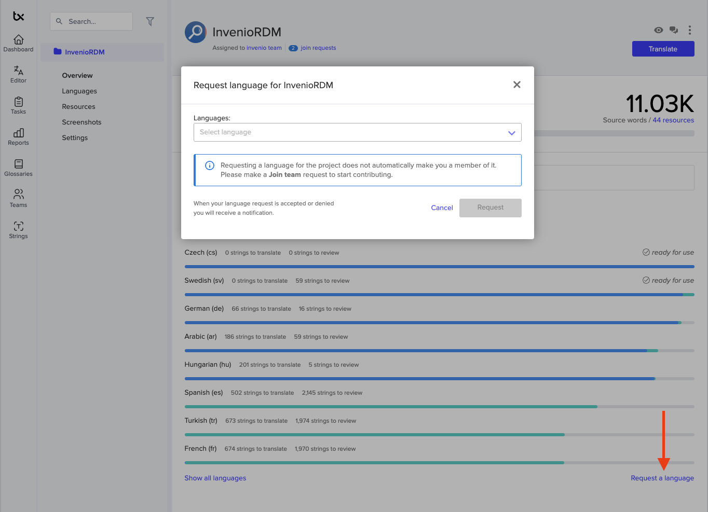
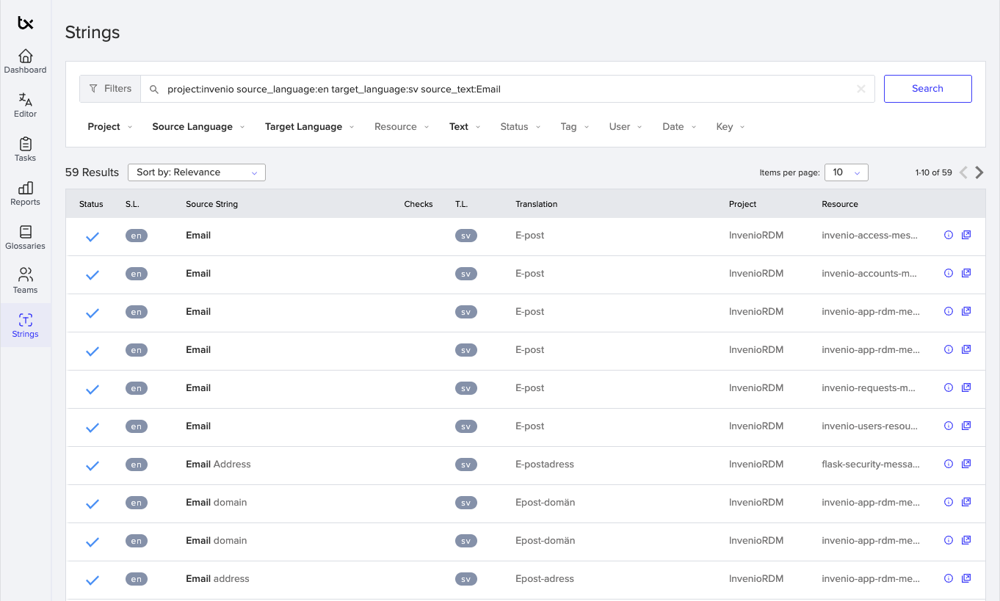

# Getting involved as a Translator

The translation of texts that are visible in the UI of InvenioRDM is integrated with the [Transifex](https://www.transifex.com/) platform.

!!! note "**Trust-chain approval**"
     Access requests are approved once a current translator / partner vouches for you in [Discord `#rdm-translations`](https://discord.gg/Ya7qSG43Br).

If you wish to contribute by translating your desired language, please follow these steps:

## Step 1 - Get a Transifex account

Sign up for a free Open Source Transifex account at <https://explore.transifex.com/inveniosoftware/invenio/> (any other Transifex account will do as well).

For more details, check out the [Transifex Getting Started Guide](https://help.transifex.com/en/articles/6248698-getting-started-as-a-translator).

## Step 2 - Join the inveniosoftware team

!!! Danger "Required Discord introduction"
    To process language and team-join requests, first introduce yourself in [Discord translations channel](https://discord.gg/Ya7qSG43Br) and include your Transifex username, target language(s), and the organization you represent.
    Requests that do not include this information are not reviewed.

1. **Introduce yourself on Discord first**

    Post your Transifex username, target language(s), **and the organization you work with** in [Discord `#rdm-translations`](https://discord.gg/Ya7qSG43Br). A member of the team will confirm they can vouch for you.

2. Ask to join the inveniosoftware team: <https://explore.transifex.com/inveniosoftware/invenio/>.

    Your request will be accepted once the Discord step above is complete.

For more details, check out the [“Joining a translation team” section](https://help.transifex.com/en/articles/6248698-getting-started-as-a-translator#h_48ba92e523) of the Transifex guide.

## Step 3 - Find your language

Check for the existing [languages](https://app.transifex.com/inveniosoftware/invenio/languages/).

- **If your desired language is not on the list**, click **Request language** and search for the language you need.
  
  - Ping the team again on Discord so they can approve the request.
- **If your desired language already exists**, choose the language and click [Join team](https://help.transifex.com/en/articles/6248698-getting-started-as-a-translator#h_48ba92e523)

## Step 4 - Learn about your translation team

- Check with the InvenioRDM translation team via [Discord `#rdm-translations`](https://discord.gg/Ya7qSG43Br)
    - to get sorted within your language team.
    - to find out whether you need the [reviewer](https://help.transifex.com/en/articles/6223416-understanding-user-roles#h_f9a67da2da) status.

## Step 5 - Get familiar with Transifex

- Get started by:
    - [Using Transifex](https://help.transifex.com/en/articles/6318216-translating-with-the-web-editor).
    - [Helpful tools in Transifex](https://help.transifex.com/en/articles/6318944-other-tools-in-the-editor).
    - [html-context in Transifex](https://help.transifex.com/en/articles/6223256-html).
    - [Pluralized strings in Transifex](https://help.transifex.com/en/articles/6231958-working-with-plurals-and-genders).

## Step 6 - Check out workflows, experiences and advices

There are some workflows to be aware of and we collected some advice and experiences that you might find useful:

- Every change you make should be reviewed by another member of your language team. You might need to press the `Unreview` button after changing a reviewed item.
- For each item you translate/review you can add comments including mentioning other members using `@name`.
- Several words/sentences appear in different places and packages. To create consistency, try to use the same translations. You might find the [transifex-inveniosoftware-Search Strings](https://app.transifex.com/inveniosoftware/search/) and its filters helpful.
  
- Gender-neutral language: if the language you are translating uses different words for male, female, etc.
    - try to use a neutral way.
    - try to stick to one translation style.
- Sometimes it is hard to translate a sentence without seeing its context. If you cannot find it in the InvenioRDM UI (e.g., in the [InvenioRDM-demo](https://InvenioRDM.web.cern.ch/)) contact the InvenioRDM translation team in [Discord `#rdm-translations`](https://discord.gg/Ya7qSG43Br). They can point you and show you some tricks.

## Submitting Translations for Pages Outside Transifex

For certain static pages, like [help pages](https://github.com/inveniosoftware/invenio-app-rdm/tree/master/invenio_app_rdm/theme/templates/semantic-ui/invenio_app_rdm/help), translating directly via Transifex is impractical due to the extensive use of `_()` functions required for each string. For these specific cases, we use language-specific HTML files (e.g., `page.sv.html` for Swedish or `page.de.html` for German) for these static content-heavy pages.

If you are working on translations for these static pages, submit your translations as Pull Requests directly to [invenio-app-rdm](https://github.com/inveniosoftware/invenio-app-rdm) on GitHub.
Here is a full list of pages that are translated this way:

- [Help](https://github.com/inveniosoftware/invenio-app-rdm/blob/master/invenio_app_rdm/theme/templates/semantic-ui/invenio_app_rdm/help/search.en.html)
- [Statistics](https://github.com/inveniosoftware/invenio-app-rdm/blob/master/invenio_app_rdm/theme/templates/semantic-ui/invenio_app_rdm/help/statistics.en.html)
- [Versioning](https://github.com/inveniosoftware/invenio-app-rdm/blob/master/invenio_app_rdm/theme/templates/semantic-ui/invenio_app_rdm/help/versioning.en.html)

Once your Pull Request is merged, the changes will be reflected in the next release of InvenioRDM.

## Troubleshooting

If you have any questions or suggestions, reach out to the InvenioRDM translation team via [Discord `#rdm-translations`](https://discord.gg/Ya7qSG43Br).
