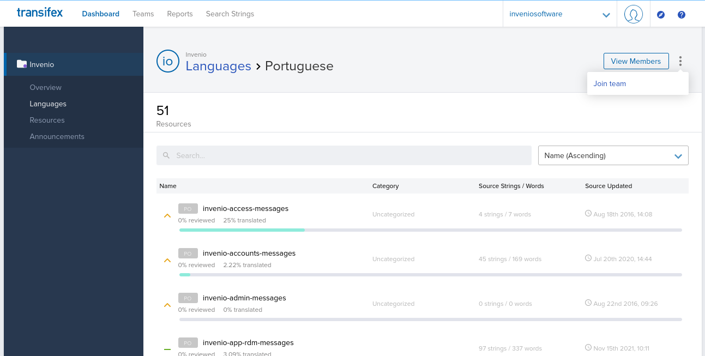

# Getting involved as a Translator

The translation of texts that are visible in the UI of InvenioRDM, is integrated with the [Transifex](https://www.transifex.com/) platform.

If you wish to contribute on translating your desired language. Please follow these steps:

## Step 1 - Get a Transifex account

Sign up for a free Open Source Transifex account at [https://www.transifex.com/signup/open-source/](https://www.transifex.com/signup/open-source/) (any other Transifex account will do as well).

For more details, check out the [Transifex Getting Started Guide](https://docs.transifex.com/getting-started-1/translators).

## Step 2 - Join the inveniosoftware team

Ask to join the inveniosoftware team: [https://www.transifex.com/inveniosoftware/invenio/dashboard/](https://www.transifex.com/inveniosoftware/invenio/dashboard/).
Then get in contact with the InvenioRDM translation team via [Discord `#rdm-translations`](https://discord.gg/Ya7qSG43Br). They will need to accept you in the inveniosoftware team.

For more details, check out the [Joining a translation team section of the Transifex Getting Started Guide](https://docs.transifex.com/getting-started-1/translators#joining-a-translation-team).

## Step 3 - Find your language

Check for the existing [languages](https://www.transifex.com/inveniosoftware/invenio/languages/).

- If your desired language is not on the list, Click the **Request language** button and search for the language you need.

    - Check with the InvenioRDM translation team via [Discord `#rdm-translations`](https://discord.gg/Ya7qSG43Br). They will need to accept the request. When it is accepted you will be able to join the team as described in the next line.
- If your desired language already exists. Choose the language and click on the **Join team** button.

## Step 4 - Learn about your translation team

- Check with the InvenioRDM translation team via [Discord `#rdm-translations`](https://discord.gg/Ya7qSG43Br)
    - to get sorted within your language team.
    - to find out whether you need the [reviewer](https://docs.transifex.com/teams/understanding-user-roles#reviewers) status.

## Step 5 - Get familiar with Transifex

- Get started by:
    - [Using Transifex](https://docs.transifex.com/translation/translating-with-the-web-editor).
    - [Helpful tools in Transifex](https://docs.transifex.com/translation/tools-in-the-editor).
    - [html-context in Transifex](https://docs.transifex.com/translation/html-files).
    - [Pluralized strings in Transifex](https://docs.transifex.com/localization-tips-workflows/plurals-and-genders#how-pluralized-strings-are-handled-by-transifex).

## Step 6 - Check out workflows, experiences and advices

There are some workflows to be aware of and we collected some advices and experiences that you might find useful:

- Every change you make, should be reviewed by another member of your language team. You might need to press the `Unreview`-Button after changing a reviewed item.
- For each item you translate/review you can add comments including mentioning other members using `@name`.
- Several words/sentences appear in different places and packages. To create consistency, try to use the same translations. You might find the [transifex-inveniosoftware-Search Strings](https://www.transifex.com/inveniosoftware/search/) and its Filters helpful.

- Gender-neutral language: if the language you are translating uses different words for male, female, etc.
    - try to use a neutral way.
    - try to stick to one translation style.
- Sometimes it is hard to translate a sentence without seeing its context. If you cannot find it in the InvenioRDM UI (e.g., in the [InvenioRDM-demo](https://InvenioRDM.web.cern.ch/)) contact the InvenioRDM translation team in [Discord `#rdm-translations`](https://discord.gg/Ya7qSG43Br). They can point you and show you some tricks.

## Troubleshooting

If you have any questions, suggestions. Reach out to the InvenioRDM translation team via [Discord `#rdm-translations`](https://discord.gg/Ya7qSG43Br).
