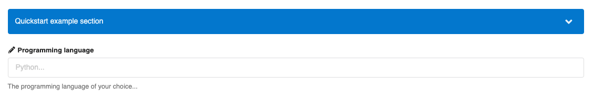

# Custom fields

While InvenioRDM's [metadata schema](../../reference/metadata.md) covers a wide range of information, there might still be cases where you need to include domain or system specific information in your records. In this chapter, the following example use case will be used to demonstrate the configuration. The full configuration of the above example is provided in the [full example](#full-example) section.

_At CERN, I want to choose the experiment to which the record belong to, assuming experiments come from a controlled vocabulary. In addition, I want to be able to filter the search results by experiment._

!!! warning

    Before jumping into adding custom fields, take a close look at the existing set of fields in the metadata schema, and especially the [metadata schema](/reference/metadata/#subjects-0-n), which can be extended with terms from external vocabularies that might already exist and facilitate your needs.

## Quickstart, how does it look?

To add a _programming language_ field, you would need to configure the type of
field and how it should be displayed. The configuration would look like:

```python
from invenio_records_resources.services.custom_fields import TextCF

RDM_CUSTOM_FIELDS = [
    TextCF(name="programming_language")
]

RDM_CUSTOM_FIELDS_UI = [
    {
        "section": _("Quickstart example section"),
        "fields": [
            dict(
                field="programming_language",
                ui_widget="Input",
                props=dict(
                    label="Programming language",
                    placeholder="Python...",
                    icon="pencil",
                    description="The programming language of your choice...",
                )
            ),
        ]
    }
]
```

This will create a new section in the bottom of the record's upload page and will look like:



## Configure a custom field

In order to add custom fields to your instance you have to configure in your `invenio.cfg` the following variables:

- `RDM_NAMESPACES` - Used to add context to your fields and avoid name clashes.
- `RDM_CUSTOM_FIELDS` - Defines the name, type, and validation rules of your fields.
- `RDM_CUSTOM_FIELDS_UI` - Defines how the fields are displayed in the uploads form UI.

### Defining custom fields

```python
from invenio_vocabularies.services.custom_fields import VocabularyCF

RDM_CUSTOM_FIELDS = [
    VocabularyCF(
        name="cern:experiment",  # name of the field
        vocabulary_id="cernexperiments",  # as defined in the vocabularies.yaml file
        dump_options=True,  # if values should be dumped or not, important for the UI
        multiple=False, # if the field accepts a list of values (True) or single value (False)
    ),
]
```

#### Namespaces

Because each defined field requires a unique name, you might end up in a situation where fields with different semantic meanings but similar naming might clash. To avoid this issue and in order to provide additional semantic context to a group of fields, there is an optional (but recommended) **namespacing** mechanism.

The `RDM_NAMESPACES` config variable accepts key-value pairs of namespace prefixes and optional contextual information for the namespace (URL), for example:

```python
RDM_NAMESPACES = {
    # CodeMeta
    "code": "https://codemeta.github.io/terms/",
    # CERN
    "cern": None,
}
```

The keys of this config would be used to prefix field names. These prefixed names will be validated against the namespaces configuration, and raise an error in case the namespace doesn't exist. Here is an example of how it might look like:

```python
from invenio_records_resources.services.custom_fields import KeywordCF, TextCF

RDM_CUSTOM_FIELDS = [
    # cern
    TextCF(
        name="cern:experiment_description_html",
        field_cls=SanitizedHTML,
    ),
    # CodeMeta
    KeywordCF(name="code:programming_language", multiple=True),
]
```

#### Customizing validation and error messages

In the [reference](#reference) section there is a full list of the available custom field types. Moreover, they can be customized to adapt them to your needs:

- The `field_cls` parameter allows you to change the Marshmallow field that will be used to validate the input data. For example, for a `TextCF` you could use `SanitizedUnicode` (default), or `SanitizedHTML`, or your own Marshmallow field implementation.
- The `field_args` parameters allows you to customize the behaviour of the previous (`field_cls`, or default) Marshmallow field class.

For example, to make a field required, customize error messages, or pass a custom validation function the python config would look like:

```python
from invenio_records_resources.services.custom_fields import TextCF
from marshmallow import validate

RDM_CUSTOM_FIELDS = [
    TextCF(
        name="cern:experiment_url",
        field_args={
            "validate": validate.URL(),  # must be an implementation of Marshmallow.validate.Validator
            "required": True,
            "error_messages": {
                "required": "You must provide the experiment homepage URL. "
            }
        },
        multiple=False,
    ),
]
```

Below you see how it looks like in the upload form:

##### Custom error message when the field is required


##### Custom validation function to validate the new field


### Displaying fields

Now that you have defined your custom fields and configured their type and validation rules, you need to configure how you want them to be displayed on the upload form.

#### Upload (deposit) form

Custom fields are displayed at the end of the upload form and are organized into sections. Each section has a title, and an ordered list of the fields it includes.

- `section` - Title of the section.
- `fields` - Ordered list of fields to be included in the section.

Each field is an object that corresponds to an already defined field from the `RDM_CUSTOM_FIELDS` config.

- `field` - The name of the field.
- `ui_widget` - The React form compoment to be used for the field.
- `props` - Parameters to be passed diectly to the React compoment.

```python
# for the above configured fields `cern:experiment`, `cern:experiment_description_html`, `cern:experiment_url`
RDM_CUSTOM_FIELDS_UI = [
    {
        "section": _("CERN Experiment"),
        "fields": [
            dict(
                field="cern:experiment",
                ui_widget="Dropdown",
                props=dict(
                    label="CERN Experiment",
                    placeholder="ATLAS",
                    icon="lab",
                    description="You should fill this field with one of the experiments e.g LHC, ATLAS etc.",
                    search=False,  # True for autocomplete dropdowns
                    multiple=False,   # True for list of values
                    clearable=True,
                )
            ),
            dict(
                field="cern:experiment_description_html",
                ui_widget="RichInput",
                props=dict(
                    label="Experiment description",
                    placeholder="This experiment aims to...",
                    icon="pencil",
                    description="You should fill this field with the experiment description.",
                )
            ),
            dict(
                field="cern:experiment_url",
                ui_widget="Input",
                props=dict(
                    label="Experiment URL",
                    placeholder="https://your.experiment.url",
                    icon="linkify",
                    description="URL of the experiment to which the record belongs to.",
                    required=True,
                )
            ),
        ]
    }
]
```

The upload form will then look like below:


#### Landing page

The custom fields will be displayed in the _additional details_ section. Each custom fields section will be one different tab, containing all the corresponding fields. However, every institution has their own UI design and it is already possible to override the default display by overriding the Jinja templates of these pages.


It would be situated at the bottom of it:


In case you want to change how a specific field is displayed in the _additional details_ section, you can use the _template_ prop available in the `RDM_CUSTOM_FIELDS_UI` config.

```python
RDM_CUSTOM_FIELDS_UI = [
    {
        "section": _("Quickstart example section"),
        "fields": [
            dict(
                field="programming_language",
                ui_widget="Input",
                template="/my_template.html"
                props=dict(
                    label="Programming language",
                    placeholder="Python...",
                    icon="pencil",
                    description="The programming language of your choice...",
                )
            ),
        ]
    }
]
```

The template path should be relative to your `my-site/templates` folder. Inside your temmplate you will have available the following variables:

- `field_value`: the value of the field, as it is stored in the record after the UI serialization i.e what is returned from the `ui_field` method when you [define your custom field](#define-your-custom_field).
- `field_cfg`: the UI configuration for that specific field as it is defined in the `RDM_CUSTOM_FIELDS_UI` config.

For the example above that will look like:

```python
# my-site/templates/my_template.html
{{field_value}}
# e.g Python #

{{field_cfg}}
#  {
#      field="programming_language",
#      ui_widget="Input",
#      template="/my_template.html"
#      props=dict(
#          label="Programming language",
#          placeholder="Python...",
#          icon="pencil",
#          description="The programming language of your choice...",
#      )
#  }
```

### Search

In order to make the custom field available in the record search as a facet/filter, you need to add it to the corresponding variables. The configuration order will be respected when displaying them in the search page.

```python
from invenio_rdm_records.config import RDM_FACETS, RDM_SEARCH

RDM_FACETS = {
    **RDM_FACETS,
    "experiment": {
        "facet": CFTermsFacet(  # backend facet
            field="cern:experiment.id",  # id is the keyword field of a vocabulary
            label=_("CERN Experiment"),
        ),
        "ui": {  # ui display
            "field": CFTermsFacet.field("cern:experiment.id"),
        },
    },
}

RDM_SEARCH = {
    **RDM_SEARCH,
    "facets": RDM_SEARCH["facets"] + ["experiment"]
}
```

and in the record search page the new facet will be added in the bottom as below:


### Applying your config

After configuring your custom fields, you have to update the corresponding search mappings. Otherwise those records will fail to be indexed, and facets/search will not work on them. This is easily done via the `invenio custom-fields ...` command in the following manner:

```bash
# for creating all custom field mappings for records
invenio rdm-records custom-fields init

# for creating any missing custom field mappings for records
invenio rdm-records custom-fields init -f field_name -f field_name
```

!!! info

    Note that if the custom fields are configured **before** the InvenioRDM instance has been setup, this is when the `invenio-cli services setup` command has never been run, the custom fields will be added by it and no command needs to be run.

!!!info

    Note that if any of the custom fields is configured as `required` in `RDM_CUSTOM_FIELDS` then you should run `invenio-cli services setup --no-demo-records` as otherwise the demo records will fail to be populated due to validation errors. For that reason, you can first define your custom fields, run the setup command and then mark which ones are required.

## Reference

This section lists the field types and UI widgets that are available out of the box in InvenioRDM.

### Field types

- `KeywordCF` for strings that need to be searchable as "exact match" (e.g. search filters/facets).
- `TextCF` for strings that need to be searchable, if you need to search as "exact match" (e.g. search filters/facets) pass `use_as_filter=True` as parameter.
- `VocabularyCF` for controlled vocabularies. Note that there is only support for generic vocabularies (e.g. _names_, _awards_, etc. cannot be linked to a custom field).
- `ISODateStringCF` date strings in ISO format (`YYYY-MM-DD`).
- `EDTFDateStringCF` date string in extended date time format, i.e. _DATE_ or _DATE/DATE_ where _DATE_ is `YYYY` or `YYYY-MM` or `YYYY-MM-DD`.
- `BooleanCF` for boolean values (True/False).
- `IntegerCF` for integer numbers.
- `DoubleCF` for integer and floating point numbers.

### UI widgets

- `Input` for one line text input.
- `MultiInput` for multi value text input, similar to the _subjects_ field.
- `TextArea` for long text descriptions.
- `RichInput` fot long text descriptions with HTML formatting.
- `Dropdown` for a value (or list of) from a controlled vocabularies. It is important to configure the `dump_options=True` in the `VocabularyCF`.
- `AutocompleteDropdown` for a value (or list of) from a controlled vocabularies. It is important to configure the `dump_options=False` in the `VocabularyCF`. This widget will provide suggestions to autocomplete the user input. Similar to _subjects_, _languages_, _names_, etc.

You can see a detailed view of all the available widgets at the [UI widgets](../../reference/widgets.md) reference section.

## Full example

The full configuration of the above example is provided below.

```python
from invenio_records_resources.services.custom_fields import TextCF
from invenio_rdm_records.config import RDM_FACETS, RDM_SEARCH
from invenio_vocabularies.services.custom_fields import VocabularyCF
from invenio_records_resources.services.records.facets import (
    CFTermsFacet,
)

RDM_NAMESPACES = {
    # CodeMeta
    "code": "https://codemeta.github.io/terms/",
    # CERN
    "cern": None,
}

RDM_CUSTOM_FIELDS = [
    # cern
    VocabularyCF(
        name="cern:experiment",  # name of the field
        vocabulary_id="cernexperiments",  # as defined in the vocabularies.yaml file
        dump_options=True,  # if values should be dumped or not, important if for the UI
        multiple=False, # list of values (True) or single value (False)
    ),
    TextCF(
        name="cern:experiment_description_html",
        field_cls=SanitizedHTML,
    ),
    TextCF(
        name="cern:experiment_url",
        field_args={
            "validate": validate.URL(),  # must be an implementation of Marshmallow.validate.Validator
            "required": True,
            "error_messages": {
                "required": "You must provide the experiment homepage URL. "
            }
        },
        multiple=False,
    ),
]

RDM_CUSTOM_FIELDS_UI = [
    {
        "section": _("CERN Experiment"),
        "fields": [
            dict(
                field="cern:experiment",
                ui_widget="Dropdown",
                props=dict(
                    label="CERN Experiment",
                    placeholder="ATLAS",
                    icon="lab",
                    description="You should fill this field with one of the experiments e.g LHC, ATLAS etc.",
                    search=False,  # True for autocomplete dropdowns
                    multiple=False,   # True for list of values
                    clearable=True,
                )
            ),
            dict(
                field="cern:experiment_description_html",
                ui_widget="RichInput",
                props=dict(
                    label="Experiment description",
                    placeholder="This experiment aims to...",
                    icon="pencil",
                    description="You should fill this field with the experiment description.",
                )
            ),
            dict(
                field="cern:experiment_url",
                ui_widget="Input",
                props=dict(
                    label="Experiment URL",
                    placeholder="https://your.experiment.url",
                    icon="linkify",
                    description="URL of the experiment to which the record belongs to.",
                    required=True,
                )
            ),
        ]
    }
]

RDM_FACETS = {
    **RDM_FACETS,
    "experiment": {
        "facet": CFTermsFacet(  # backend facet
            field="cern:experiment.id",  # id is the keyword field of a vocabulary
            label=_("CERN Experiment"),
        ),
        "ui": {  # ui display
            "field": CFTermsFacet.field("cern:experiment.id"),
        },
    },
}

RDM_SEARCH = {
    **RDM_SEARCH,
    "facets": RDM_SEARCH["facets"] + ["experiment"]
}
```
