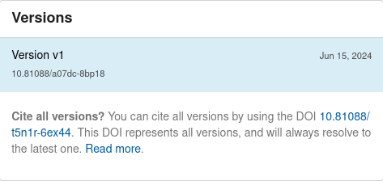

# DOI registration

!!! info

    The DOI registration feature requires that you have a contract with [DataCite](https://datacite.org/feemodel.html). In addition, you will also need a [DataCite test account](https://support.datacite.org/docs/getting-a-test-account) to test the feature.

## Configure

#### Enable DOI registration

You enable the DOI minting feature in your ``invenio.cfg`` file:

```python
DATACITE_ENABLED = True
```

#### Credentials and prefix

Before you continue, make sure you first have a [DataCite test account](https://support.datacite.org/docs/getting-a-test-account).

You need to provide the account credentials and the DOI prefix for the DataCite repository account in your ``invenio.cfg`` file:

```python
DATACITE_USERNAME = "..." # Your username
DATACITE_PASSWORD = "..."  # Your password
DATACITE_PREFIX = "10.1234"  # Your prefix
```

!!! tip

    Never commit or store credentials in a source code repository.

#### Mode: Test or production

InvenioRDM by default uses the [DataCite Test Environment](https://support.datacite.org/docs/testing-guide) to avoid accidentally
registering DOIs during test. In test mode InvenioRDM will use the following DataCite test systems:

- DOI Fabrica (https://doi.test.datacite.org).
- REST API (https://api.test.datacite.org).

To enable production mode, set the following configuration variable in ``invenio.cfg``:

```python
DATACITE_TEST_MODE = False
```

In production mode, InvenioRDM will use the following DataCite systems:

- DOI Fabrica (https://doi.datacite.org).
- REST API (https://api.datacite.org).


!!! tip "Did you know?"

    You can write your own persistent identifier plugin in InvenioRDM to support other types of persistent identifiers.

#### Generated DOI

By default, InvenioRDM generates a DOI using the prefix and internal persistent
identifier. You can change the generated DOI string by editing your ``invenio.cfg``.

```python
DATACITE_FORMAT = "{prefix}/inveniordm.{id}"
```

!!! tip

    Before branding your DOIs, please read about
    [Cool DOIs](https://doi.org/10.5438/55e5-t5c0) and why it might not be a
    good idea.

#### Parent or Concept DOIs

_Introduced in InvenioRDM v12_

By default InvenioRDM will create two DOIs when an initial record is
published, and create one DOI each time a new version of the record is
published. The first DOI is the version DOI, which represents the specific
record that is published. The second DOI is the parent DOI, which represents
the concept of the record and will always resolve to the latest version.
This feature has been implemented in Zenodo for many years, and the concept DOI enables
researchers to cite something that won't change when they make changes to their
records.



The parent DOI is optional and can be disabled by setting the following in
invenio.cfg:

```python
RDM_PARENT_PERSISTENT_IDENTIFIERS={}
```


#### OAI-PMH

The OAI-PMH server's metadata format ``oai_datacite`` that allows you to harvest record from InvenioRDM in DataCite XML needs to be configured with your DataCite data center symbol. This is only required if you want your records to be harvestable in DataCite XML format.

```python
DATACITE_DATACENTER_SYMBOL = "CERN.INVENIORDM"
```

### Versioning and externally managed DOI

By default, InvenioRDM allows versioning for any DOI type - internally or externally managed. Internally managed DOI is a DOI which is given thanks to InvenioRDM feature which allows us to configure the DOI registration on DataCite (check #Enable DOI registration). The external DOIs are not minted by our instance and in some cases repository manager decides to disallow versioning of records identified by external DOI. To disable versioning for external DOIs you need to set:

```python
RDM_ALLOW_EXTERNAL_DOI_VERSIONING = False
```

#### Configuring DOI Behavior

You can change how DOIs work in InvenioRDM by adding modified configuration variables to `invenio.cfg`. For example, if you want to make DOIs *optional* you can add the following block to invenio.cfg

```python
RDM_PERSISTENT_IDENTIFIERS = {
    # DOI automatically removed if DATACITE_ENABLED is False.
    "doi": {
        "providers": ["datacite", "external"],
        "required": False,
        "label": _("DOI"),
        "validator": idutils.is_doi,
        "normalizer": idutils.normalize_doi,
        "is_enabled": providers.DataCitePIDProvider.is_enabled,
    },
    "oai": {
        "providers": ["oai"],
        "required": True,
        "label": _("OAI"),
        "is_enabled": providers.OAIPIDProvider.is_enabled,
    },
}
```
You [can view the default configuration in invenio-rdm-records](https://github.com/inveniosoftware/invenio-rdm-records/blob/e64dd0b81757a391584e63d162d5e6caf6780637/invenio_rdm_records/config.py#L322)

## Known issues

- **Restricted records:** Once a DOI is created, it cannot be fully removed from DataCite. Starting with v12, InvenioRDM will not register DOIs for restricted records. It will also hide a DOI from the DataCite Search if a record is changed from public to restricted. However that DOI will still resolve and metadata may be available to DataCite members.
