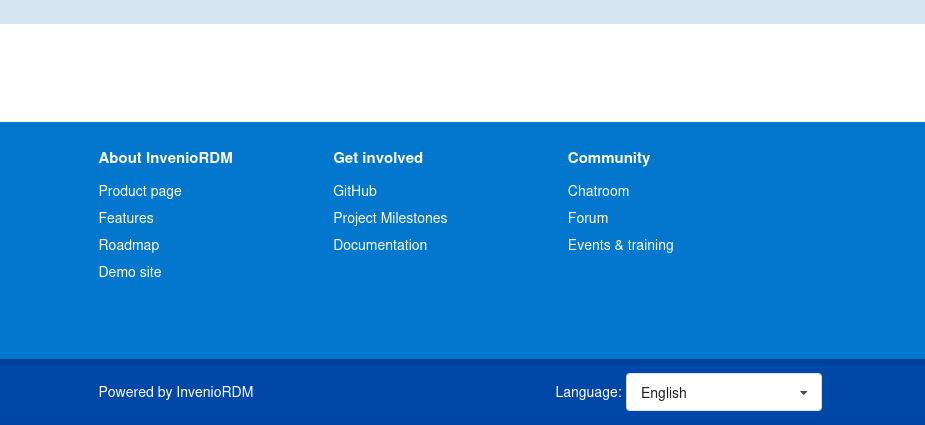

# Internationalisation (i18n) and Localisation (l10n)

InvenioRDM, by default, comes with an English user interface. You can turn on
additional languages and change the default one in your InvenioRDM instance.

## Add Another Language

### Step 1 - Adjust your invenio.cfg file

In your `my-site/invenio.cfg` change:

``` diff
# Invenio-I18N
# ============
# See https://invenio-i18n.readthedocs.io/en/latest/configuration.html

# Other supported languages (do not include BABEL_DEFAULT_LOCALE in list).
I18N_LANGUAGES = [
-   # ('de', _('German')),
    # ('tr', _('Turkish')),
]

# Invenio-I18N
# ============
# See https://invenio-i18n.readthedocs.io/en/latest/configuration.html

# Other supported languages (do not include BABEL_DEFAULT_LOCALE in list).
I18N_LANGUAGES = [
+   ('de', _('German')),
    # ('tr', _('Turkish')),
]
```

!!! info "Letter Code"
    The following letter code structure is supported: two letters like, `de` or
    `tr` and four letters, like `de_AT`, `de_DE` or `zh_CN`.

!!! info "Default and Additional Languages"
    Make sure **not** to include the default language (`BABEL_DEFAULT_LOCALE`) in
    the list of addtional languages (`I18N_LANGUAGES`). Both variables are set
    within `my-site/invenio.cfg`.

### Step 2 - Start or Re-run the server

If you have a running local install:

```shell
<Ctrl+C>
invenio-cli run
```

!!! info "Re-run when invenio.cfg changes"
    All changes to `invenio.cfg` **MUST** be accompanied by a restart like the
    above to be picked up. This only restarts the server; it does not destroy
    any data.

Otherwise, follow the [Build, setup and
run](../install/build-setup-run.md)-instructions.

### Step 3 - Change the Language in your Application

In your browser, open your invenioRDM application (local install:
[https://127.0.0.1:5000](https://127.0.0.1:5000); container install:
[https://127.0.0.1](https://127.0.0.1)) or refresh the open application page.

In the footer you find a drop down menu, where you can switch between different
languages.



!!! warning "That evil cache"
    If you do not see the dropdown-menu in the footer, check in an incognito
    window; the browser might shows you a cached page.

!!! info "Available Languages"
    InvenioRDM provides several languages, for example, Arabic (`ar`), Chinese
    (`zh_CN`), German (`de`), and Spanish (`es`). If your letter code does not
    work, test with German (`de`). If you want your language to be included,
    see: [Contribution](../contribute/translators-guide.md)

## Change the Default Language

### Step 1 - Adjust your invenio.cfg file

In your `my-site/invenio.cfg` change:

``` diff
# Flask-Babel
# ===========
# See https://flask-babel.tkte.ch/#configuration

# Default locale (language)
- BABEL_DEFAULT_LOCALE = 'en'

# Flask-Babel
# ===========
# See https://flask-babel.tkte.ch/#configuration

# Default locale (language)
+ BABEL_DEFAULT_LOCALE = 'de'
```

!!! info "Letter Code"
    The following letter code structure is supported: two letters like, `de` or
    `tr` and four letters, like `de_AT`, `de_DE` or `zh_CN`.

!!! info "Default and Additional Languages"
    Make sure **not** to include the default language (`BABEL_DEFAULT_LOCALE`) in
    the list of addtional languages (`I18N_LANGUAGES`). Both variables are set
    within `my-site/invenio.cfg`.

### Step 2 - Start your instance

If you have a running local install:

```shell
<Ctrl+C>
invenio-cli run
```

!!! info "Re-run when invenio.cfg changes"
    All changes to `invenio.cfg` **MUST** be accompanied by a restart like the
    above to be picked up. This only restarts the server; it does not destroy
    any data.

Otherwise, follow the [Build, setup and
run](../install/build-setup-run.md)-instructions.

### Step 3 - See your Language in the Application

In your browser, open your invenioRDM application (local install:
[https://127.0.0.1:5000](https://127.0.0.1:5000); container install:
[https://127.0.0.1](https://127.0.0.1)) or refresh the open application page.

InvenioRDM's user interface should now, by default, use the language you set
via the `invenio.cfg`-file.

!!! warning "That evil cache"
    If your user interface doesn't talk to you in the expected language, check
    in an incognito window; the browser might shows you a cached page.

!!! info "Available Languages"
    InvenioRDM provides several languages, for example, Arabic (`ar`), Chinese
    (`zh_CN`), German (`de`), and Spanish (`es`). If your letter code does not
    work, test it with German. If you want your language to be included, see:
    [Contribution](../contribute/translators-guide.md)

## Troubleshooting

- There are English texts showing up in your user interface: If the application
  cannot find a translation, it will fall back to English. You can help filling
  these gaps by [becoming a translator](../contribute/translators-guide.md).
- Strings appear in many places in your instance and different techniques are
  involved to handle them. We are working on documentation for translations of
    - (customized) vocabularies
    - static pages
    - (customized) emails
- Ask for knowledge in [Discord `#rdm-translations`](https://discord.gg/Ya7qSG43Br).

