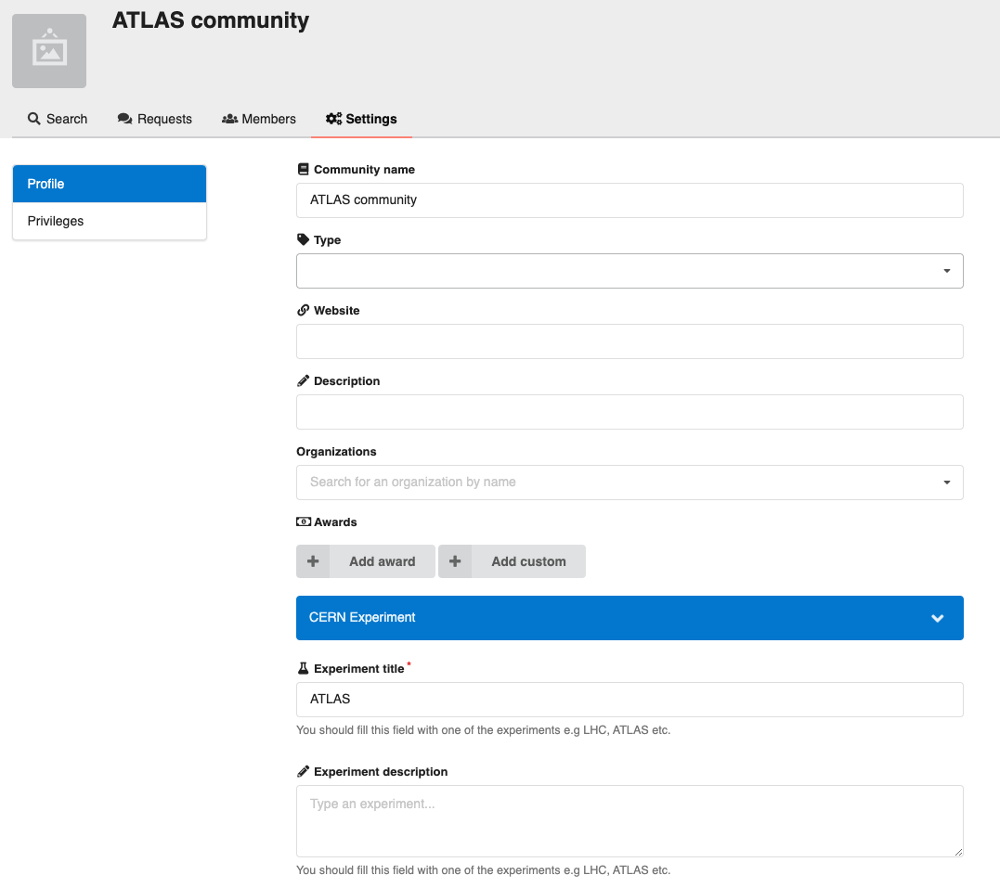

# Communities custom fields

*Introduced in InvenioRDM v10*

Communities custom fields can be configured in a very similar manner than [records](./records.md).
The only difference is the prefix of the configuration variables and the place where they are
displayed.

## Quickstart, how does it look?

To add a _community external URL_ field, you will need to configure the type of
field and how it should be displayed. The configuration will look like:

```python
from invenio_records_resources.services.custom_fields import TextCF

COMMUNITIES_CUSTOM_FIELDS = [
    TextCF(name="external_url")
]

COMMUNITIES_CUSTOM_FIELDS_UI = [
    {
        "section": _("Additional information"),
        "fields": [
            dict(
                field="external_url",
                ui_widget="Input",
                props=dict(
                    label="External URL",
                    placeholder="https://your.community.url",
                    icon="pencil",
                    description="The external URL of your community or project.",
                )
            ),
        ]
    }
]
```

## Configuration

In order to add custom fields to your instance, you can use the following configuration variables:

- `COMMUNITIES_NAMESPACES` - Defines fields namespaces to avoid name clashes. However, if this variable is not filled in, `RDM_NAMESPACES` will be used. Therefore, allowing for global namespacing across custom fields.
- `COMMUNITIES_CUSTOM_FIELDS` - Defines the name, type, and validation rules of your fields.
- `COMMUNITIES_CUSTOM_FIELDS_UI` - Defines how the fields are displayed in the UI.

### Initialize

As for [records](./records.md#initialize), you will need to initialize the custom fields to
make them searchable. The only difference is the CLI command:

```bash
cd my-site

# initialize all custom fields to make them searchable
pipenv run invenio communities custom-fields init
```

## Displaying fields

Now that you have defined and initialized your custom fields and configured their type and validation rules, you need to configure how you want them to be displayed on the community settings/profile page.

Custom fields are displayed at the bottom of the page, similar to the image below:



!!! warning "Custom fields in the community page"

    With InvenioRDM v10, communities custom fields are not displayed in the community profile page, but they are searchable.
    This feature will be implemented in one of the following InvenioRDM releases.
