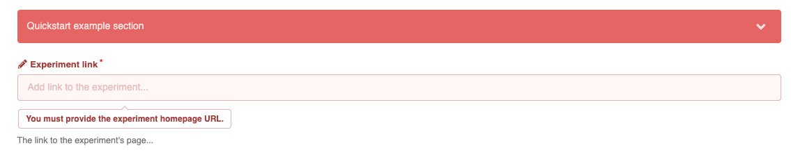
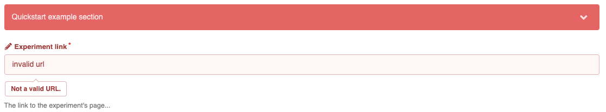
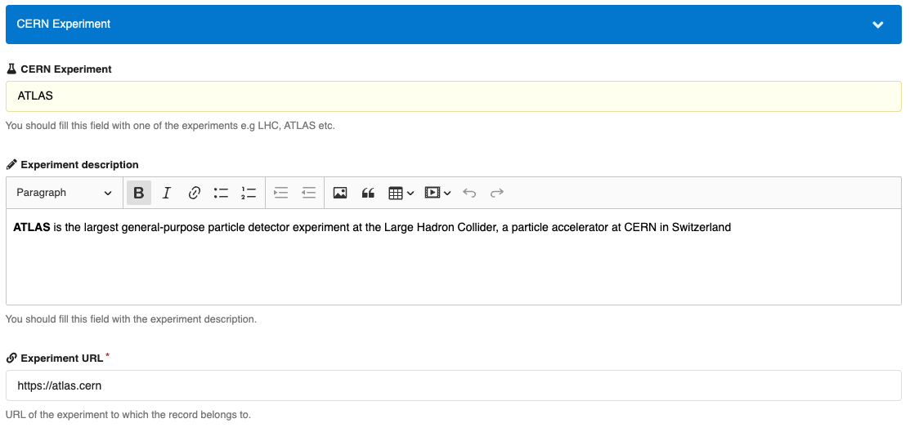
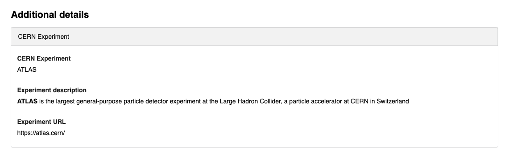
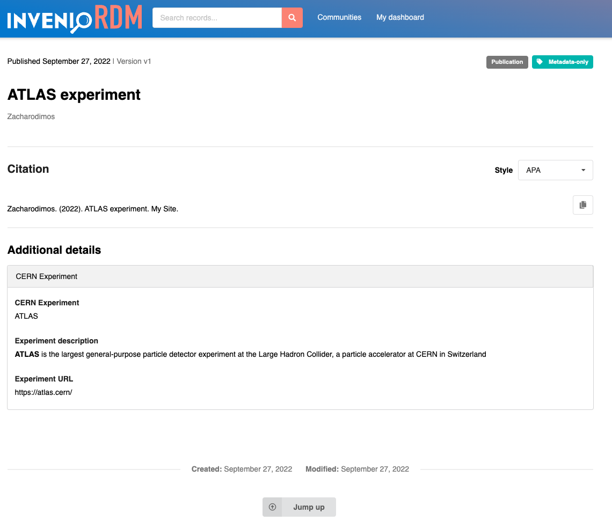
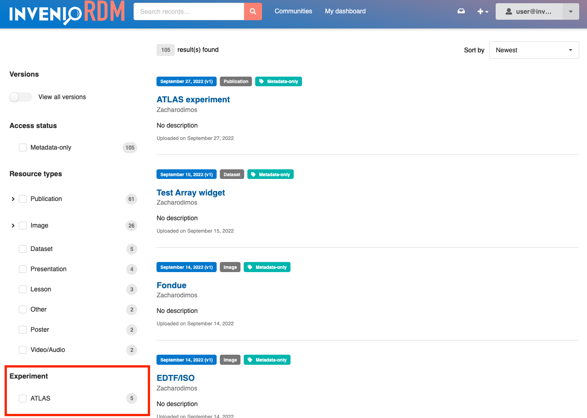

# Records custom fields

While the InvenioRDM's [metadata schema](../../../reference/metadata.md) includes a wide range of bibliographic fields, there might still be cases where you need to include domain or system specific information in your records. This can be achieved using custom fields.
To demonstrate how to take advantage of custom fields, we will use the following example:

_At CERN, I want to input or select the experiment information of the research preprint that I am uploading. In addition, when searching for other preprints, I want to filter the search results by experiment name._

!!! warning

    Before jumping into adding custom fields, take a close look at the [optional fields](../optional_fields.md) as well as the default set of fields in the metadata schema. For example, the [subjects field](../../../reference/metadata.md#subjects-0-n) can be extended with terms from external vocabularies instead of creating custom fields.

## Configuration

In order to add custom fields to your instance, you can use the following configuration variables:

- `RDM_NAMESPACES` - Defines fields namespaces to avoid name clashes.
- `RDM_CUSTOM_FIELDS` - Defines the name, type, and validation rules of your fields.
- `RDM_CUSTOM_FIELDS_UI` - Defines how the fields are displayed in the uploads form UI.

### Namespacing

Because each defined field requires a unique name, you might end up in a situation where fields with different semantic meanings but similar naming might clash. To avoid this issue and in order to provide additional semantic context to a group of fields, there is an optional (but recommended) **namespacing** mechanism.

The `RDM_NAMESPACES` config variable accepts key-value pairs of namespace prefixes and optional contextual information for the namespace (URL). In your `invenio.cfg`:

```python
RDM_NAMESPACES = {
    # CERN
    "cern": "https://greybook.cern.ch/",
}
```

The keys of this config will be used to prefix field names. These prefixed names will be validated against the namespaces configuration, and raise an error in case the namespace doesn't exist.

### Declaring custom fields

You can configure custom field by listing them in the `invenio.cfg`:

```python
from invenio_records_resources.services.custom_fields import TextCF
from invenio_vocabularies.services.custom_fields import VocabularyCF
from marshmallow_utils.fields import SanitizedHTML

RDM_CUSTOM_FIELDS = [
    VocabularyCF(  # the type of custom field, VocabularyCF is a controlled vocabulary
        name="cern:experiment",  # name of the field, namespaced by `cern`
        vocabulary_id="cernexperiments",  # controlled vocabulary id defined in the vocabularies.yaml file
        dump_options=True,  # True when the list of all possible values will be visible in the dropdown UI component, typically for small vocabularies
        multiple=False, # if the field accepts a list of values (True) or single value (False)
    ),
    TextCF(  # a text input field that will allow HTML tags
        name="cern:experiment_description_html",
        field_cls=SanitizedHTML,
    ),
]
```

### Defining a custom vocabulary

For a VocabularyCF field to work, you need a custom vocabulary for it to search from. First you'll want to edit `app_data/vocabularies.yaml` to add the name of the vocabulary

```yaml
cernexperiments:
  pid-type: cexp
  data-file: vocabularies/cern_experiments.jsonl
```

You can read more about [all the vocabulary options](../../vocabularies/index.md) in that documentation section.

For our example, you'll then want to make a file `app_data/vocabularies/cern_experiments.jsonl` with content

```json
{"id": "ATLAS", "title": {"en": "ATLAS"}}
{"id": "LHC", "title": {"en": "Large Hadron Collider"}}
```

If you've already set up your services, you can create this vocabulary with

```
pipenv run invenio rdm-records fixtures
```

You can see then see the vocabulary at `/api/vocabularies/cernexperiments`

### Customizing validation and error messages

In the [reference](#reference) section, you can find the complete list of available custom field types. You can also customize each field type:

- The `field_cls` parameter allows you to change the Marshmallow field that will be used to validate the input data. For example, for a `TextCF` you could use `SanitizedUnicode` (default), or `SanitizedHTML` (to allow only safe HTML tags), or your own Marshmallow field implementation.
- The `field_args` parameters allows you to customize the behavior of the previous (`field_cls`, or default) Marshmallow field class.

For example, to make a field required, customize error messages, or pass a custom validation function, you can customize the `TextCF` in your `invenio.cfg` as the following:

```python
from invenio_records_resources.services.custom_fields import TextCF
from marshmallow import validate

RDM_CUSTOM_FIELDS = [
    TextCF(
        name="cern:experiment_url",
        field_args={
            "validate": validate.URL(),  # must be an implementation of Marshmallow.validate.Validator
            "required": True,
            "error_messages": {
                "required": "You must provide the experiment homepage URL."
            }
        },
        multiple=False,
    ),
]
```

**Custom error message when the field is required**



**Custom validation function to validate the new field**



### Initialize

When you have completed the configuration of the custom fields, you will need to run the CLI commands below to make the fields searchable.
Failing to do so will result in an error when indexing records and you won't be able to search values for the custom fields.
In a shell, run:

```bash
cd my-site

# initialize all custom fields to make them searchable
pipenv run invenio rdm-records custom-fields init
```

When you want to make a new specific field searchable:

```bash
# initialize specific custom fields to make them searchable
pipenv run invenio rdm-records custom-fields init -f cern:experiment -f <field_name>
```

!!! tip

    The CLI commands above are automatically executed when you setup a new instance with `invenio-cli services setup`.
    If you have added the custom fields configuration **before running the setup**, you don't need to run the commands above.

!!! info

    If you have added the custom fields configuration, **with some `required` fields**, before running the first setup, it will fail.
    This is because the demo data created during the setup do not contain the custom fields and the required value will be empty. As a workaround:

    1. define all custom fields without using the required parameter
    2. run the setup command
    3. put back the required parameter in the config

    If, instead, you don't need to populate your instance with demo data, simply run `invenio-cli services setup --no-demo-records`.

## Displaying fields

Now that you have defined and initialized your custom fields and configured their type and validation rules, you need to configure how you want them to be displayed on the upload form and landing page using the following properties:

- `section` - Title of the section.
- `hide_from_landing_page` - Controls whether the custom field section is displayed in the landing page.
- `hide_from_upload_form` - Controls whether the custom field section is displayed in the upload form.
- `fields` - Ordered list of fields to be included in the section.

Each field can then be configured using the following properties:

- `field` - The name of the custom field.
- `template` - The jinja template used to render a field in the landing page.
- `ui_widget` - The React form component to be used for the field.
- `props` - Parameters to be injected in the React component.

### Upload (deposit) form

Custom fields are displayed at the bottom of the upload form and are organized into sections. Each section has a title and the ordered list of the fields that it includes.

Title of the section can be configured using the property `section`, while the list of fields the property `fields`. Note that each field is an object that corresponds to an already defined field from the `RDM_CUSTOM_FIELDS` config.

```python
# for the above configured fields `cern:experiment`, `cern:experiment_description_html`, `cern:experiment_url`
RDM_CUSTOM_FIELDS_UI = [
    {
        "section": _("CERN Experiment"),
        "fields": [
            dict(
                field="cern:experiment",
                ui_widget="Dropdown",
                props=dict(
                    label="CERN Experiment",
                    placeholder="ATLAS",
                    icon="lab",
                    description="You should fill this field with one of the experiments e.g LHC, ATLAS etc.",
                    search=False,  # True for autocomplete dropdowns with search functionality
                    multiple=False,   # True for selecting multiple values
                    clearable=True,
                )
            ),
            dict(
                field="cern:experiment_description_html",
                ui_widget="RichInput",
                props=dict(
                    label="Experiment description",
                    placeholder="This experiment aims to...",
                    icon="pencil",
                    description="You should fill this field with the experiment description.",
                )
            ),
            dict(
                field="cern:experiment_url",
                ui_widget="Input",
                props=dict(
                    label="Experiment URL",
                    placeholder="https://your.experiment.url",
                    icon="linkify",
                    description="URL of the experiment to which the record belongs to.",
                    required=True,
                )
            ),
        ]
    }
]
```

The upload form will then look like below:



### Landing page

In the record landing page, by default, the custom fields will be displayed in the *additional details* section at the bottom of the page. Each custom fields section correspond to a tab item, containing the configured fields. This can be disabled using the `hidden` attribute in the section's configuration.

The additional details section:



The landing page with the configured custom fields:



However, it is possible to change this default layout by overriding the Jinja templates of the landing page.

You can change how a specific field is displayed in the _additional details_ section via the _template_ parameter:

```python
RDM_CUSTOM_FIELDS_UI = [
    {
        "section": _("Quickstart example section"),
        "fields": [
            dict(
                field="programming_language",
                ui_widget="Input",
                template="/my_template.html"
                props=dict(
                    label="Programming language",
                    placeholder="Python...",
                    icon="pencil",
                    description="The programming language of your choice...",
                )
            ),
        ]
    }
]
```

You should add the `my_template.html` file in the `my-site/templates` folder in your instance. In your custom template, the following variables are injected and can be used:

- `field_value`: the value of the field, as it is stored in the record after the UI serialization i.e. what is returned from the `ui_field` method when you [define your custom field](../../../develop/howtos/custom_fields.md).
- `field_cfg`: the UI configuration for that specific field as it is defined in the `RDM_CUSTOM_FIELDS_UI` config.

See the example in the [How-to](../../../develop/howtos/custom_fields.md).

### Search

For custom fields that are keywords or vocabularies, you can add your custom field to the search page as a facet/filter:

#### Vocabularies

```python
from invenio_rdm_records.config import RDM_FACETS, RDM_SEARCH
from invenio_records_resources.services.records.facets import CFTermsFacet

RDM_FACETS = {
    **RDM_FACETS,
    "experiment": {
        "facet": CFTermsFacet(  # backend facet
            field="cern:experiment.id",  # id is the keyword field of a vocabulary
            label=_("CERN Experiment"),
        ),
        "ui": {  # ui display
            "field": CFTermsFacet.field("cern:experiment.id"),
        },
    },
}

RDM_SEARCH = {
    **RDM_SEARCH,
    "facets": RDM_SEARCH["facets"] + ["experiment"]
}
```

In the search page, the new facet will be added in the bottom as below:



#### Text fields

To showcase this configuration let's take the experiment-example, but this time not as a vocabulary of experiments but a "free text input".

**Keyword**

If the custom field will contain text values that only need to be searched as "exact match" (e.g. names or other short text values), then using a keyword is the correct option. On the other hand, if the values are long (e.g. a description or abstract) or need to be searchable (e.g. finding _trees_ when searching for _tree_, i.e. not an "exact match") then using a `TextCF` is preferable.

```python
RDM_CUSTOM_FIELDS = [
    KeywordCF(name="cern:experiment"),
    ...
]

from invenio_rdm_records.config import RDM_FACETS, RDM_SEARCH
from invenio_records_resources.services.records.facets import CFTermsFacet

RDM_FACETS = {
    **RDM_FACETS,
    "experiment": {
        "facet": CFTermsFacet(  # backend facet
            field="cern:experiment",
            label=_("CERN Experiment"),
        ),
        "ui": {  # ui display
            "field": CFTermsFacet.field("cern:experiment"),
        },
    },
}

RDM_SEARCH = {
    **RDM_SEARCH,
    "facets": RDM_SEARCH["facets"] + ["experiment"]
}
```

**Text**

For a text field to work also as a facet/filter in the search, it needs to be defined as such via the `use_as_filter` flag.
Note that it is not recommended to have filter over very long text values (more than 250 characters) since it could noticeably affect the search engine's performance.

```python
RDM_CUSTOM_FIELDS = [
    TextCF(name="cern:experiment", use_as_filter=True),
    ...
]
```

What will happen under the hood is that the text will be indexed both as text search, but also as exact match. The latter is required to support filtering by its values.
In addition, when configuring the facet, the field needs to be suffixed by `keyword`:

```python
from invenio_rdm_records.config import RDM_FACETS, RDM_SEARCH
from invenio_records_resources.services.records.facets import CFTermsFacet

RDM_FACETS = {
    **RDM_FACETS,
    "experiment": {
        "facet": CFTermsFacet(  # backend facet
            field="cern:experiment.keyword",
            label=_("CERN Experiment"),
        ),
        "ui": {  # ui display
            "field": CFTermsFacet.field("cern:experiment"),
        },
    },
}

RDM_SEARCH = {
    **RDM_SEARCH,
    "facets": RDM_SEARCH["facets"] + ["experiment"]
}
```

## Reference

This section lists the field types and UI widgets that are available in InvenioRDM.

### Field types

- `KeywordCF` for text that needs to be searchable **only** as "exact match" (e.g. search filters/facets).
- `TextCF` for normal text, if you need to search as "exact match" (e.g. search filters/facets) pass `use_as_filter=True` as parameter.
- `VocabularyCF` for controlled vocabularies. Note that it supports only generic vocabularies. That is, _names_, _awards_, etc. cannot be linked to a custom field.
- `ISODateStringCF` date strings in ISO format (`YYYY-MM-DD`).
- `EDTFDateStringCF` date string in extended date time format, i.e. _DATE_ or _DATE/DATE_ where _DATE_ is `YYYY` or `YYYY-MM` or `YYYY-MM-DD`.
- `BooleanCF` for boolean values (True/False).
- `IntegerCF` for integer numbers.
- `DoubleCF` for integer and floating point numbers.

### UI widgets

- `Input` for one line text input.
- `MultiInput` for multi value text input, similar to the _subjects_ field.
- `TextArea` for long text descriptions.
- `RichInput` fot long text descriptions with WYSIWYG editor.
- `Dropdown` for a value from a controlled vocabulary or a list of controlled vocabularies. The corresponding `VocabularyCF` must have the parameter `dump_options=True`.
- `AutocompleteDropdown` for a value from a controlled vocabulary or a list of controlled vocabularies. The corresponding `VocabularyCF` must have the parameter `dump_options=False`. This widget will provide suggestions to autocomplete the user input. Similar to _subjects_, _languages_, _names_, etc.

You can see a detailed view of all the available widgets at the [UI widgets](../../../reference/custom_fields/widgets.md) reference section.
