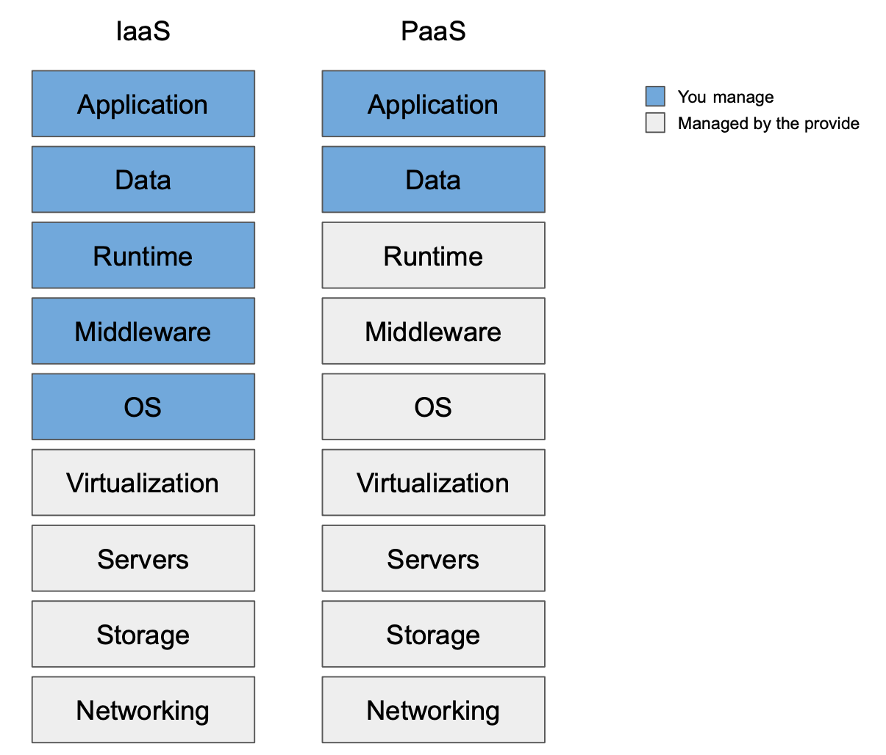

# Deployment

This guide is meant to give a high-level overview of deployment techniques and tips
when planning how to deploy InvenioRDM.

!!! info "Read the infrastructure architecture first!"
    This section assumes you have a good understanding of the different
    services that are needed to run an InvenioRDM application, and how they
    interact with each other. This information can be found in the
    [infrastructure architecture](../develop/architecture/infrastructure.md).

## Deployment models

There is no one-size-fits all deployment strategy for InvenioRDM. Therefore,
it is hard to recommend how to deploy.
Moreover, there are many aspects to take into account:
your knowledge in DevOps/Platform engineering, your
organization's infrastructure, resources, constraints or policies, the
technology you want to invest in and maintain, pricing, etc.

!!! info "The mentioned technologies are just examples"
    Along this chapter many technologies will be named. However, note that
    those are mere examples based on our experience at CERN or from some of
    the InvenioRDM partners, with all certainty there are many other
    alternatives for each case.

Two popular deployment models are:

-  Platform as a Service (PaaS): using this model you will be in charge of the
application and the data it handles. This more commonly known as _containers_,
meaning that you will be in charge of packaging your instance's InvenioRDM
application in a container image. For example, using the `Dockerfile` that is
created when you bootstrapped your instance. At CERN we deploy our instances on
[OpenShift](https://www.redhat.com/en/technologies/cloud-computing/openshift)
using the [Invenio Helm Charts](https://github.com/inveniosoftware/helm-invenio).
These charts help you to deploy your instance on top of
[Kubernetes](https://kubernetes.io) clusters too. If maintaining the actual
PaaS technology is not something you desire, you can make use of cloud
providers such as [Amazon Web Services](https://aws.amazon.com/),
[Google Cloud](https://cloud.google.com/), [Microsoft Azure](https://azure.microsoft.com/).

- Infrastructure as a Service (IaaS): using this model you will be in charge of
the stack from the operative system up. This is more commonly known as _virtual machines_,
meaning that you will be in charge of configuring the operative system, Python, the web
server, etc. At CERN we have been running Invenio v3 instances using [OpenStack](https://www.openstack.org)
to manage the VMs, and [Puppet](https://www.puppet.com) for IaC (Infrastructure as Code).
Other common IaC technologies are [Ansible](https://www.ansible.com) and [Terraform](https://www.terraform.io).

You could also keep going down in the layers to get more and more control of
your deployment, for example, using bare metal machines. However, that is out of the
scope of this documentation.

!!! warning "Docker compose is not recommended"
    The provided docker-compose files in InvenioRDM can give you a good idea of what
    you need to deploy, including the underlying services.

    However, such configuration is **NOT** meant to be used in production as-is:
    it requires knowledge and experience on how to run it reliably, safely stores
    files with backups, managing software and infrastructure upgrades, understand
    potential performance limitations (a single machine probably might not handle all
    your traffic and it would be a single point of failure), etc.

    **Use at your own risk.**

## Services

When deploying InvenioRDM, you can choose to install, securely configure and
maintain yourself the services (such as the database, the search engine, etc.)
services, or use third party providers. For example, the three cloud providers
mentioned above (AWS, GC, and Azure) can provide most of the services. If you
choose to deploy them yourself you will need to deep-dive and get experienced
in the following topics:

- Persist your data, and enable periodic backups. This includes the relational
database, the search indices and the files.
- Queue persistence (RabbitMQ) to avoid losing tasks in case the service fails.
- High availability, many of the services can be deployed redundantly. Note
that most of the cloud providers offer this option or have an established SLA.
- Secrets handling. Most of the services require credentials to connect. It is
a good practice to keep them in a secure place, for example [Ansible Vault](https://www.redhat.com/sysadmin/introduction-ansible-vault).
- Security. This is a broad topic, and one of the most important. It is also
highly dependent on your deployment model. Take into account exposing only
the minimal amount of services needed and safeguard the access to your infrastructure.

If you choose to deploy them using PaaS, images for the services can be
found for example in [DockerHub](https://hub.docker.com). For more information
on how to deploy each service, refer to their official documentation.

## InvenioRDM Python app

Independently of your deployment model choice, you will need to run the Flask
Python application. However, the server bundled with Flask is not meant for
production usage, it is there only to help with the development.
Therefore, you will need some sort of WSGI HTTP server.
Common choices are [Gunicorn](https://gunicorn.org) and [uWSGI](http://projects.unbit.it/uwsgi).

The latter, is the one we use at CERN and it is bundled in the Dockerfile.
You can find more information in the [InvenioRDM Docker images](../maintenance/docker-images.md) section.

### Versioning

During the lifetime of your project or service, you will develop new features specific to
your instance or need to upgrade to a newer version of InvenioRDM. This
means that your application code will change and versioning will help you to
control which code is actually deployed. At CERN, we use GitHub tags/release
for each version (e.g. v1.0.0).

If you are using containers for the deployment, you can automate the image
build with for example [GitHub actions](https://github.com/features/actions)
(or any other CI tool). In addition, some PaaS platforms have the capabilities
to detect when a new image for a certain tag (e.g. `production`) has changed
and re-deploy it automatically.

## Monitoring

After your application is deployed and running, monitoring it at many levels
will provide you the observability needed to be aware of what is happening
in your infrastructure.

Once you have configured where the different services output their logs,
they can be aggregated and used to create dashboards for visualization, for example in
[Loki](https://grafana.com/oss/loki/) or [OpenSearch Dashboards](https://opensearch.org/docs/latest/dashboards/index/).

In a IaaS deployments, it might be useful to aggregate also the system logs to
monitor the resources consumption. This metrics can be aggregated using
[Prometheus](https://prometheus.io) and visualized in [Grafana](https://grafana.com).

In some cases it is possible to have application specific monitoring. For
example, using [Flower](https://flower.readthedocs.io/en/latest/) to monitor
the InvenioRDM asynchronous workers. Many of these can also be plugged in to Prometheus.

In an IaaS deployment, independently of the monitoring and logs aggregation
tool of your choice, it is a good practice to store the logs in the
servers using log rotation.

### Alerting

Once the monitoring is in place, the next step is getting alerts for code exceptions and
when certain metrics reach a configured threshold.

For the InvenioRDM Python application, [Sentry](https://sentry.io/welcome/) provides a
great level of details (variables' values, stacktraces, etc.) when exceptions happen:
this is extremely helpful when it comes to understanding errors that happen in
production. If you have to invest in one alerting tool, **we really recommend this one!**

In the Grafana ecosystem, [OnCall](https://grafana.com/products/oncall). Alternatively, many
messaging apps can be configured with [webhooks to Grafana](https://grafana.com/docs/grafana/latest/alerting/manage-notifications/webhook-notifier/).

## Security

To secure your instance, make sure that:

- You have [correctly configured](../install/configuration.md) your InvenioRDM instance.
- You have valid HTTPS certificates.
- Your instance and services are up-to-date.
- Secure file uploads: we should be really careful with what we allow users to upload in our instances,
  since we are serving them back and they could contain malicious code. Some effective methods to avoid these vulnerabilities are:

    - White listing MIMETypes, for example here
    - Sanitizing MIMETypes so they do not get executed on the browser, for example sanitizing HTML files to plain text.
    - Serve your files from a different domain with a static server where there are no sessions or anything to be compromised.

This list is not meant to be exhaustive: please refer to well-known literature and best practices on how to make your infrastructure secure.

## Load testing

It might be interesting to understand what is the load that your system will sustain,
to size your infrastructure accordingly. That can be tested for example with [locust](https://locust.io)
or [k6](https://k6.io).

## Troubleshooting

The first step to troubleshooting a problem would be to try to understand in
which layer or service of the system is the problem. That can be checked using
the monitoring and dashboard technologies mentioned above, or the log files
directly.

If the problem is in the InvenioRDM Python application, you can get more details
in Sentry. Afterwards, you can try to reproduce it and debug in a local
installation.

For more information see the [how to debug section](../develop/getting-started/debugging.md).
