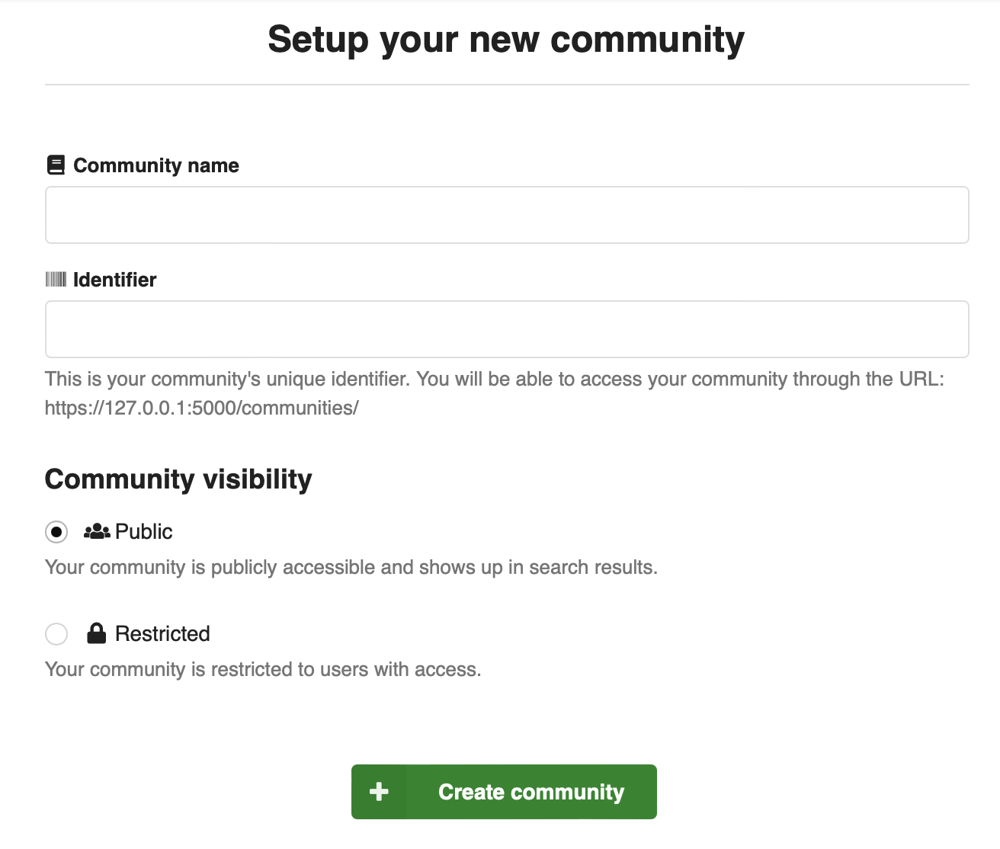

# Communities

**Intended audience**

This guide is intended for maintainers and developers of InvenioRDM itself.

**Scope**

The guide provides a high-level architectural overview of the communities 
module for InvenioRDM.

## Community visibility

Communities visibility can be set to either:

- *public* - any user can see the community
- *restricted* - only community members can see the community

Both public and restricted communities can contain restricted records, and thus
not all records in a public community may be visible to everyone. A restricted
community on the other hand may only contain restricted records.

## Community roles

An InvenioRDM instance defines a set of community roles that apply globally to all
communities to ensure a consistent user experience across all communities.

A community role translates into a set of permissions. The roles are
configurable to ensure that they can be tailored to the needs of an instance,
as well as allow for customizations. For example, one instance may use
"curator" and another may use "editor" as a role because it suits 
their use case better.

By default the following community roles are defined:

- Owner: Can perform all actions.
- Managers: Can manage community members (except owners).
- Curators: Can accept/decline inclusion requests and edit records.
- Readers: Can view restricted records in the community.

The _owner_ role must exist, although it can be named differently .

## Member types

A community has two member types:

- Users
- Groups

Groups are by default added to a community, whereas users are invited to a
community (i.e. requires the user to confirm their membership). This is
because groups may not have a person to address the invitation request to.
Users are not added directly for privacy reasons.

## Memberships and invitations

A user or group can be a member of a community. Each membership is associated
with a community role and a visibility:

- Community
- Member
- Role
- Visibility

The "visibility" property defines a value public or hidden, to determine if a
community membership is visible to everyone or only to other members of the
community. For privacy reasons only members themselves, and administrators
(system identity), are allowed to set their visibility to public. Nevertheless,
owners and managers can set the visibility of all members to _hidden_.

Invitations to join a community are stored in the same table using two extra
properties:

- Active
- Request

The property "active" is meant to only be used for invitations. For
instance, it's not meant to temporarily deactivate an existing membership, in
which case the membership should simply be deleted instead.

The property "request" links to the associated request sent to the user being
invited.

As a result of the data model, a user can only be invited once to a community.

### Business rules

The memberships business rules can be complex. They are essentially
divided into permissions and pre-conditions.

**A community must always have an owner**

A community must always have an owner so that someone can manage the community.
A community should be removed if there is only one owner and it wants to leave.

**No self role change**

A member cannot change their own role. This prevents owners and managers from losing
their access as they'll have to ask another manager/owner to perform the
change.

**Visibility can be changed by members themselves**

For privacy reasons only members themselves can set their visibility to public.

**Visibility cannot be changed to public by managers/owners**

To allow owners/managers to manage how the community looks they can decide
to hide certain members from a community.

**Users can leave a community**

All users are allowed to leave a community if they so desire. If a user
is a member of group that's associated with a community, then however they
have to be removed from that group (possibly in an external system) to be fully
removed from a community.

**System identity can do everything**

We allow the system identity to perform all actions independently of other
permissions, to ensure that we can support data migration uses cases where
there is a need to load data from another system where, for example, users may
have already given their consent.

### Members Command and Query Responsibility Segregation (CQRS)

All state changing commands such as add, invite, update and delete
performs only the required changes, but does not return any results.

Instead, to retrieve the list of members, the caller must perform a query to one
of the search endpoints.

The reason for this design is that the data required for the views
(such as the user's name/affiliation etc.) is denormalized into the search
index. Search indexes are only eventually consistent, thus this information
might not be available to be returned as a result. Also, it ensures that all
queries are done on the search index.

Note that all state changes are done directly in the database in order to
ensure relevant integrity checks are within the transaction boundary.
