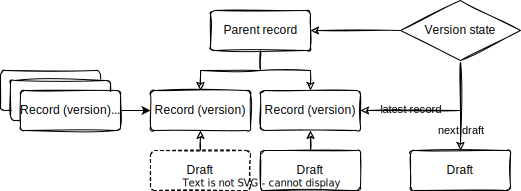
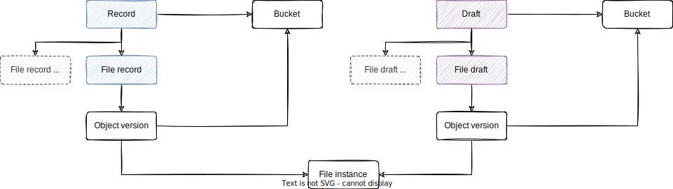

# Records

**Intended audience**

This guide is intended for maintainers and developers of InvenioRDM itself.

**Scope**

The guide provides a high-level architectural overview of the bibliographic
records for InvenioRDM.

## Purpose

The record data model is the one of the most important models in the
architecture as it is used to store bibliographic metadata for the primary
resources (articles, datasets, presentations, videos, ...) we host in our
repositories.

## Data model

The record data model is used to describe **a resource**. Examples of resources
include journal articles, datasets, posters, videos, images, software and
more. Some properties of resources:

- A resource may exist in one or more versions.
- A resource version has its own persistent identifiers and bibliographic
  metadata (e.g. title, publication date, or creator list may be different
  between versions).
- All versions of a resource should be accessible and editable.

The diagram below depicts the core of the record data model.

- **Parent record**: An entity representing the resource and all its versions.
  Properties common to all versions of a resource are stored on the parent
  record.
- **Record (version)**: A record holds the metadata for a single version of a
  resource.
- **Draft**: A draft is a temporary record used for supporting e.g. long
  running editing sessions that allow users to save their partial changes.
- **Record (version) revision**: A record (version) revision is used to track
  all changes to a record version over time.
- **Version state**: The version state is used to track which record and draft
  is the latest version.

!!! Tip "Version vs revision"

    The terminology version and revision can be somewhat confusing at first.
    A revision represents *a change* to a single version of a resource (main
    purpose is tracking changes). A record version represents a version of a
    resource and is often associated with changed files and metadata.

    We have added ``(version)`` above to make it clear the relationship between
    revision and version.

### Parent record

A parent record stores all properties that are common for all record versions.
This includes:

- Access information:
    - Ownership
    - Grants
    - Secret links
- Community relations
- Review

### Record (version)

A record stores bibliographic and administrative metadata for a single version
of the resource. The record is what is accessible through search and record
landing pages, and thus we also use the term that the record is **published**.

### Draft

A draft is a temporary version of a record used to gather all related objects
and save partial changes prior to being published.

There's three different types of drafts:

- **New draft**: The initial draft when no record versions have been published.
- **Edit draft**: A draft of a published record version (used when editing an
  already published record)
- **Next draft**: A draft without a published record version that is not the
  initial draft.

These three different states are important because a new version of a record
can be created at the same time as multiple older versions are being edited.

An important property of a draft is that they are temporary. Thus, they get
removed when they are either published or deleted/discarded.

### Record (version) revision

Every time a record is created or updated, a copy of the record is written as
a _record revision_. The revisions are tracked per record version and only
when the corresponding version draft is published. This ensures that only
published changes are tracked.

### Version state

The version state holds the following attributes:

- parent record
- latest draft
- latest index
- next draft

The version state is used to keep track of what is considered the latest record
version. Technically the parent-record relationship is modelled as tree with
unordered child nodes. This means there is **no order** on record versions.

One record version is designated as the latest version tracked by this
state so that it's possible to show only the latest version of a record. It
also keeps track of which is the latest draft/next draft if they exist.

Lastly, an integer index is incremented every time a new record version is
created.

The reason that we do not define an order on record versions is because
multiple different orders may be relevant. A version history may not
necessarily be linear, so it can make sense to order by version number,
publication date or order in which the record version was created.

## Files

A single version of a resource may have one or more files associated. The
diagram below depicts how files are modelled:

- **Bucket**: A record and draft each have an associated bucket. A bucket can
  be thought of as a folder in a directory structure. The record and draft each
  have their own bucket, so it's clear which files belong to a published record
  and which have not yet been published.
- **File record/file draft**: A file record/draft exists for every logical file
  and stores metadata about the file. It can be both technical metadata such as
  file size, checksum, and/or MIME type, but it can also store metadata
  associated with the file such as image width/height, scientific metadata etc.
- **Object version**: An object version represents an object inside a bucket,
  and allows for versioning of the file inside the bucket. It's a logical
  representation of a file.
- **File instance**: A file instance represents a physical file. Multiple
  object versions may link to the same file instance. This enables
  deduplication and thereby supports optimizing disk storage usage.

## Community relations

A parent record can be part of one or more communities. Being part of community
means that the community has ownership of the parent record.

### Relationship

The relationship between communities and the parent records are defined using
the following many-to-many relation:

- Community
- Parent record
- Request

The request property is used to link to a request that documents how a record
was added to the community. This is not meant for audit logging purposes, but
as help to curators of the community.

### Record versions

Record ownership is defined on the parent record and it's a parent record
that's a member of a community, hence all versions of a record are owned by
a community.

### Multiple communities

A parent record can be owned by one or more users and/or one or more
communities. This  also means that everything that an uploader can do as owner,
the community owners can also do with the record. E.g. a community owner could
transfer/remove ownership of the record to another entity.

### Default record branding

A record owned by one or more communities may optionally define with which
community the record is branded with by default. This is a property on the
parent record.

The property only defines the **default** branding when a record
**is part of multiple communities** and in cases were we cannot automatically
decide a community branding. Examples where we cannot determine a community
header automatically includes:

- A record landing page is accessed through a global search
- A record landing page is accessed through the DOI.

Note, the default branding property is largely a property that an instance can
decide or not to use during rendering of a landing page.

## Reviews

A new draft *can* have an associated review. Edit drafts and next drafts
*cannot* have an associated review.

A review is a relation to a request. Multiple request types are supported
(i.e. multiple types of reviews), but each request type must be explicitly
allowed to be used as

### Record states

The request itself follows the documented request states and transitions as
documented under [requests](requests.md#statuses).

The draft goes through its own states as shown below:

The initial draft can be one of the following states:

- Draft: The draft is yet to be published.
- Draft with review: The draft is yet to be submitted for review
- In review: The draft is in review.
- Review declined: The review was declined.
- Review expired: The review expired by the system.
- Published: A record has been created for the draft.
