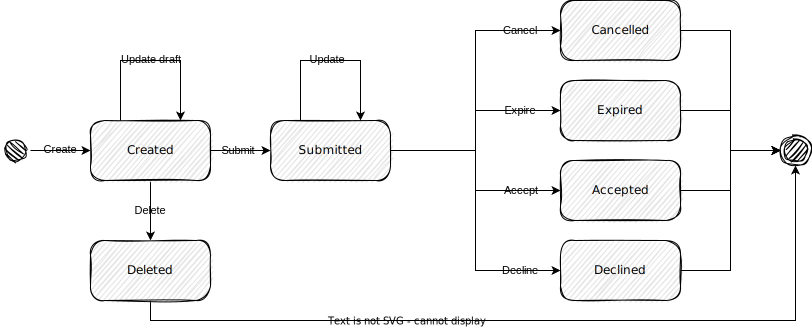

# Requests

**Intended audience**

This guide is intended for maintainers and developers of InvenioRDM itself.

**Scope**

The guide provides a high-level architectural overview of the requests module of InvenioRDM.
Requests are considered part of the service layer in the [software architecture](software.md).

## Purpose

Requests is a generic InvenioRDM feature to support the handling and automation of
requests between entities such as users, communities, administrators and/or the
system.

The overall goal is to streamline, distribute and automate as many types of
administrative  tasks as possible and thereby reduce human resources required
for handling them.

A repository often has to deal with many types of requests. Examples of these
could include:

- Approval of new submission
- File replacement
- Record removal
- Transfer of ownership
- Access requests
- Quota increases
- Invitations to join
- Claiming of records

From technical perspective, the goal is to enable faster development of
automation tasks with human involvement in InvenioRDM, by not having to design
and invent a new user interface for every new type of automation. Also, it
streamlines and centralizes the UX for how users deal with requests.

## Overview

With the above examples in mind we can think of requests as something which:

- are created by someone who can cancel it.
- are received by someone who can accept or decline it.
- may require clarifications (i.e. a conversation) between the one
  creating the request and the one(s) accepting/declining it.
- may expire after a certain amount of time.

## Entities

The key entities in the data model:

- Request types
- Request actions associated to a given request type.
- Request events and comments
- Entity references

## Properties

A request has four key properties:

- **Creator** - the entity creating request.
- **Topic** - the entity the request is about.
- **Receiver** - the entity the request is addressed to.
- **Status** - represents the state a request is in.

## Statuses

A request is conceptually modelled over the following state diagram:



- **Created** - The request has been created but not yet submitted to the receiver.
- **Submitted** - The request has been sent to the receiver.
- **Cancelled** - The request was cancelled by the creator.
- **Expired** - The request expired without the creator or receiver taking action.
- **Accepted** - The receiver accepted the request.
- **Declined** - The receiver declined the request.
- **Deleted** - The unsubmitted request was deleted by the creator or system.

In addition, the following meta states exists:

- **Open** - A request in submitted state is considered open.
- **Closed** - A request in cancelled, expired, accepted or declined state is considered closed.

Note that the *deleted* state is not implemented directly in the code, as the request is completely
removed from the database in this case.

## Actions

An action transitions a request from state to another state. Only the state transitions
show above are allowed. A request defines the following actions:

- Create
- Submit
- Cancel
- Expire
- Accept
- Decline
- Delete

In addition to above actions, the following implicit actions exists:

 - Read ``<status>`` (e.g. read created).
 - Update created
 - Update submitted

Note, we do not allow updating closed requests.

## Entity references

Entity references is an abstraction that allows any type of creator, topic and
receiver to be modelled.

Technically it's just a type and persistent identifier. Below is an example of
a user entity reference:

```json
{"user": "1"}
```

## Permissions

Permissions are defined on actions that transition a request from one state
to another. The permissions only encodes who is allowed to perform a given
action, but not if a given state transition is a legal.

That means permission to perform a certain action depends on the creator,
receiver and/or topic. E.g. only a creator can submit a request, and only the
receiver can accept/decline a request.

Note that, it's fully possible that a creator and receiver may be the same
user.

### Entity grants

Entity grants are used to serialize permission needs into a request record, so
that requests index can be efficiently filtered to only records that a given
user have access to.

An entity grant is a combination of:

- Prefix - The prefix qualifies the grant within the record (e.g. ``creator``,
  ``receiver``, ``read``, ``write``).
- Permission need - Entity reference as a permission need (e.g ``UserNeed(1)``).

*Permission needs* are just tuples. Below you find examples of permission
needs:

- ``UserNeed(1)`` = ``('id', 1)``
- ``RoleNeed('admin')`` = ``('role', 'admin)``
- ``CommunityRoleNeed('123', 'owner)`` = ``('community', '123', 'owner')``

*Entity grant tokens* serializes the prefix and the tuples permission needs
into a token that we can use for querying:

Examples for entity grant tokens:

- ``creator.user.1`` - expresses that the creator.user.1 is granted access.
- ``receiver.community.123.manager`` - expresses that the community 123
  managers are granted access.

Because grant tokens are generated from a prefix and a need, it means we can
build grant tokens both from:

- a required need: e.g. a request requiring needs to grant access.
- a provided need: e.g. an identity providing needs.

This provides efficient searches when you serialize the required grants
into the indexed request, and when searching, you filter requests to the grants
provided by the identity.

## Views

Requests can be viewed in different contexts which map to appropriate search filters. Currently, we have the following views:

- User view - view specific to a given user.
    - Requests where the user is the creator (e.g. submissions)
    - OR Requests where the user is a direct receiver (e.g. invitations). A user may have permissions to accept/reject requests as part of their community role, but in this case they are not the direct receiver.
- Community record view - a view specific to a given community primarily for curation purposes
    - Requests where the receiver is the community
    - AND Requests with a record topic (i.e. about a record).
- Record view - view specific to a given record
    - Requests where the topic is a specific record

## Inspiration and future directions

We imagine that requests can later be extended with features such as:

- status checks
- assignees
- labels
- approval rule

A lot of the inspiration to the requests module comes from collaborative source code platforms like GitHub and GitLab and their pull/merge requests features. Other inspiration comes from user support systems like UserVoice.

There are, however, notable differences between pull/merge requests and requests in InvenioRDM.
Pull/merge requests is always made against a specific repository, and thus naturally *belong* to a given repository. This means that they are accessible on a single URL endpoint and permissions are conceptually somewhat easy to understand.

Requests in InvenioRDM however makes sense from multiple endpoints depending on who is looking and the context they are doing it in.
