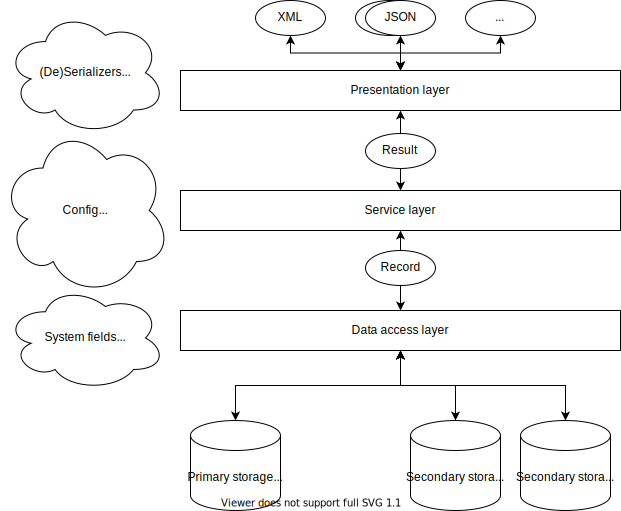

# Software architecture

**Intended audience**

This guide is intended for maintainers and developers of InvenioRDM itself.

**Scope**

The guide provides a high-level overview of the core software architecture of InvenioRDM.

## Layers

InvenioRDM has a layered architecture that consists of three layers:

- Presentation layer
- Service layer
- Data layer

There is a strict data flow between the layers, and each layer has very specific responsibilities. It's highly important that you as a developer know the basic principles for the  data flow and  each layer's responsibilities. Failure to understand the basic data flow, leads to using the wrong objects for the wrong things, which eventually turns into messy unmaintainable code.

**Data flow basics**

The diagram below shows a simplified view of the data flow in the architecture.



*The presentation layer* parses incoming requests and routes them to service layer. This involves sending and receiving data in multiple different formats and translating these into an internal representation. For instance, this includes parsing arguments from an HTTP request (e.g., parsing the query string parameters).

*The service layer* is completely independent of the presentation layer and can be used by many different presentation interfaces such as REST APIs, CLIs, Celery tasks. The service layer contains the overall control flow and is responsible for e.g. checking permissions and performing semantic data validation.

*The data access layer* is responsible for ensuring data integrity, harmonizing data access to different storages as well as fetching and storing the data in the underlying systems.

The data flow between the layers is strictly limited to a few well-defined objects to ensure a clean separation of concerns. The presentation layer communicates with the service layer via a record projection (i.e. a view of a record localised to a specific identity). The service layer communicates with the data access layer via a record entity that provides data abstraction, syntactic data validation, and a strong programmatic API.

!!! tip "Tip: Where do you belong?"

    A key question you should always ask yourself when designing or writing code is where your code belongs in the architecture:

    - Is it a presentation, service, or data access layer object?
    - Is the object crossing boundaries between layers?

    Answering where you code belongs helps identity and disentangle responsibilities.


### Data access layer

The data access layer is responsible for:

- Fetching and storing data on primary (the database) and secondary storage (Elasticsearch/OpenSearch, cache, files, ...).
- Harmonizing data access to the same object on primary and secondary storages (e.g. a record in the database vs in the search index).
- Ensuring data integrity and managing relations among data objects.

The data access layer usually lives inside an Invenio module in a package named ``records``. It may consist of

- Record APIs (``/records/api.py``).
- JSONSchemas (``/records/jsonschemas/``).
- Elasticsearch mappings (``/records/mappings/``).
- SQLAlchemy models (``/records/models.py``).
- System fields (``/records/systemfields/``).
- Dumpers (``/records/dumpers/``).

**Purpose**

The data access layer serves two purposes:

- Provide a strong programmatic API that produce a clean, simple and reliable
  control flow in the service layer.
- Persist our business objects on data storage in a reliable and performant
  way.

!!! tip "Tip: Messy service layer?"

    If your service layer code looks messy, you may need to work on your data
    access layer.

    A typical example is the service layer doing data-wrangling with
    dictionaries. For instance a conditional get on a dictionary key (e.g.
    ``data.get('...')``), or having to e.g. convert back and forth between
    data types (e.g. UUIDs to/from strings).

**Guiding principles**

The data layer is built around the following guiding principles:

- **One data representation**: The service layer should work with one an only one
  data representation of an entity independent of if the entity was retrieved
  from primary or secondary storage.

- **One primary storage, many secondary storages**: The primary version of a record
  exists in one and only one copy on the primary storage (the database),
  however multiple secondary copies may exist in the search index.

- **Idempotence of dumping/loading**: Dumping and loading to/from secondary storage
  (such as the search index) must produce the same record.

- **Denormalization over normalization**: If we have to choose, we usually prefer
  fast read speed over fast write speed.

- **Data versioning**: We version data and rely heavily on [optimistic
  concurrency control](../concepts/concurrency-control.md) for detecting conflicts
  and determining stale secondary copies.

**Record API**

The record API is the primary programmatic API that the service layer uses to
work with the data access layer. The record API ensures data integrity and manages
the life-cycle of the record itself and related objects such as persistent
identifiers and files.

The record is in charge of:

- defining the structural schema that data is validated against (using
  JSONSchemas).
- defining search index routing and indexing behaviour.
- managing the life-cycle of an associated persistent identifier.
- data versioning
- state management

A record is usually defined using a declarative API named **system fields** based
on [Python data descriptors](https://docs.python.org/3/howto/descriptor.html).

**JSONSchemas**

The JSONSchemas defines the structure of a JSON document we store in the database. The main responsibility is structural validation of the JSON document. The best analogy is that it is a database table schema. Most importantly, it is NOT responsible for business-level validation of the JSON document.

A good example of this is making a field a required property. It's correct to require a property if you would e.g. have defined a database table column as ``NOT NULL``. It's wrong to require a property if it's requirement that the user must enter a value in a certain field (because this is business-level validation, and you may want to store partially valid documents).

Modules:
- [Invenio-Records](https://github.com/inveniosoftware/invenio-records): Defines the high-level APIs for the Record API, SQLAlchemy models, system fields and dumpers.
- [Invenio-JSONSchemas](https://github.com/inveniosoftware/invenio-jsonschemas): Provides a registry for JSONSchemas available to the application.

**Mappings**

The search mappings define how records are indexed and made searchable. Records are denormalised when indexed to provide high performance for searches over the records. The mapping MAY therefore define additional fields compared to the JSONSchema.

**Dumpers**

Dumpers are responsible for dumping and loading prior to storing/fetching records on secondary storage (e.g. the search index), and play a key role for harmonizing data access to records from primary and secondary storages.

Dumpers are specific to a secondary storage system (e.g. a search dumper, a file dumper, ...).

The dump and load of a dumper MUST be idempotent - i.e. ``record == Record.load(record.dump())``. This ensures that independently of if a record was retrieved from primary or secondary storage, it has the same data and works in the same manner.

For instance, the Extended Date Time Format dumper works in the following manner:

- The dump adds a start and end date range so that the EDTF can be queried by Elasticsearch.
- The load removes the two start and end date fields from the search document when loaded.

**System fields**

System fields are responsible for:

- providing *managed access* to a top-level property in a record
- manages relations with other objects
- hooking into the record life-cycle

System fields basically provides a declarative programmatic API that makes it easier to work with records and related objects. Under the hood, system fields are Python data descriptors.

A key design principle for system fields is that an *instance* of a system field manages a single namespace of a record so that system fields do not conflict. For instance an access system field manages the top-level ``access`` key in a record ``{'access': ...}``.

System fields participate in the dumping/loading of records from secondary storage via being able to hook into the record life-cycle. The difference between system fields and dumpers, is that a dumpers produce a dump for a specific secondary storage system, while system fields produce the same dump for all secondary storage systems.

System fields may be used to manage relations to other objects, and can work similar to a foreign key.

Applications of system fields are vast, but some examples include:

- Added ``$schema`` to the record to ensure JSON schema validation.
- Created, update and delete persistent identifiers for records and serialize them into the record.
- Ensure a certain property on the JSON document is operated as a set.

System fields to a large degree avoid building inheritance among record APIs and instead provide a declarative way of composing a record API class.

**SQLAlchemy models**

SQLAlchemy record models are responsible for storing the master version of a record (i.e. the primary storage) and provide database independence. All record models share some few common properties:

- A JSON column for storing the JSON-encoded document of a record.
- An internal UUID identifier.
- Creation and modification timestamps.
- Version counter for optimistic concurrency control.

UUIDs are used because they are storage efficient (128 bits) and random so that an application server can generate an id with low chance of collision.

It's important to understand that there's two distinct representations of a record:
- Python dictionary
- JSON document

These two distinct representations of a record may often be very similar, but it's important to understand that the JSON document is constrained to the JSON object model, while the Python dictionary can hold more rich data types as long as they are JSON-serializable (e.g. a datetime object).

### Service Layer

The service layer contains the domain and business logic of the application and is responsible for:

- Authorization (i.e. checking permissions)
- Business-level validation
- Control flow

The service layer usually lives inside an Invenio module in a package named ``service``. It may consist of:


- Service config (``config.py``)
- Service schema(s) (``schema/``)
- Service implementations (``service.py``)
- Service components (``components/``)
- Service results (``results.py``)
- Domain errors (``errors.py``)
- Background tasks (``tasks.py``)

**Purpose**

The main purpose of the service layer is to have an interface independent entry point into the application.

**Guiding principles**

The service layer is built around the following guiding principles:

- **Mimick the end-user interface**: There is usually a one to one correspondence between say a button in the user interface and a method in a service.

- **Clean control flow**: The control flow of a service method should be reasonable easy to follow,

- **Interface independent**: The service must be independent of the interface it's being called from. This means among other things that a service knows nothing about the HTTP request.

**Service**

A service itself is the high-level entry point into the application. A service
provides methods that usually maps directly to some sort of user interface action like pressing a button, performing a search and similar.

A service often provides transactional boundaries within InvenioRDM.

**Input**

**Service config**

The service config is a container for

Responsible for:

- Inject dependencies via a single object.

**Unit of work (UoW)**

We use a design pattern called
[*unit of work*](https://martinfowler.com/eaaCatalog/unitOfWork.html) in order
to ensure that we can group multiple state changing service methods into a
single atomic operation. State changing service methods is essentially anything
that commits a database transaction such as create/update/delete.

For instance in a single service method we must always ensure that we commit
the database transaction before indexing and sending off Celery tasks.
Otherwise we risk the transaction commit fails and we have documents out of
sync between our database and search index.

When we group multiple service method calls, we have to delay the database
transaction commit until after all service methods have done their work, and
thus we also need to coordinate indexing and task operations from each
service method that has to be done after the commit.

The unit of work context manager takes care of this job for us. It coordinates
transaction operations between multiple service calls.

!!! tip "Do not use ``db.session.commit()`` in a service method"

    You should use the unit of work instead of running an explicit
    ``db.session.commit()`` or ``db.session.rollback()`` in the code. Example:

    ```python
    from invenio_records_resources.services.uow import \
        RecordCommitOp, unit_of_work,

    @unit_of_work()
    def create(self, ..., uow=None):
        record = ...
        # No db.session.commit(), no self.indexer.index(...)
        uow.register(RecordCommitOp(record, indexer=self.indexer))
    ```

The ``unit_of_work()`` decorator ensures that if a UoW is not provided,
  it is automatically created and committed once the function returns.

**Service schema**

Responsible for:

- data validation
- field-level permission checking
- dumping and loading record projections

**Search**

Responsible for:

- Faceting, search query parsing, etc.

**Permissions**

Responsibile for defining a declarative permission model.

**Components**

Responsible for providing a specific feature in the service, and make the service customizable.

### Presentation Layer

**Purpose**

The main purpose of the presentation layer is to parse user requests and call required
services.

**Guiding principles**

- Explicitely parse and validate all input parameters.
- Serialize to/from a single internal representation.
- Conflict detection through optimistic concurrency control.
- Presentation must not contain business logic (e.g. permission checks).

**Celery tasks**

Celery tasks are considered part of the presentation layer and thus normally
only call a service method. As a service may want to use background jobs to
perform tasks we however often define Celery tasks in the service.

**Views**

UI Flask views are part of the presentation layer, and similarly always call
services to perform their job. Often, the UI views are simply rendering
a template which injects a JavaScript frontend application that queries the
REST API.

**Resources**

Resources define the REST API and are responsible for RESTful routing,
parameter parsing, content negotiation etc.

**Resources request context**

The resource request context is a Flask context object on which only validated
input data is stored. Thus, accessing data on ``requests_resourcectx`` instead of
``request`` means that at least basic validation has been performed.

**Resource configs**

The resource config are used for dependency injection

## Performance considerations

Performance is of very high importance for InvenioRDM. There are however often
trade-offs to be made.

**Query vs indexing speed**

For InvenioRDM query speed is more important than fast indexing speeds. This means
we'll sometimes denormalize data to have quicker queries. Once we denormalize
data we immediately must also deal with stale data and cache invalidation.

The version counter on all records is instrumental in being able to manage
the speed.

**Database vs search engine**

The database is the primary data storage for InvenioRDM, however the database
does not perform well for searching large number of records. Thus in general
we only perform primary key lookups in the database, and try to move all other
queries to the search index.

As the search index can be slightly outdated from the primary copy, we focus on
updating the index immediately in the cases where it's important for the
user experience (e.g. a user deletes a draft and is immediately returned to a
list of their drafts - this list should not include the just deleted draft).
