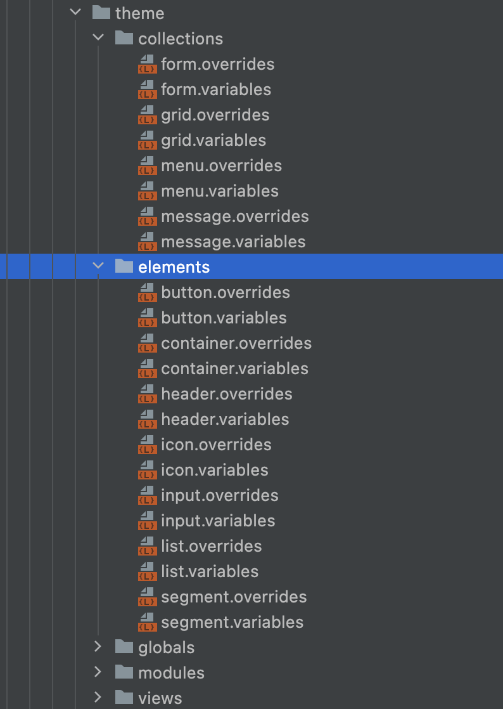
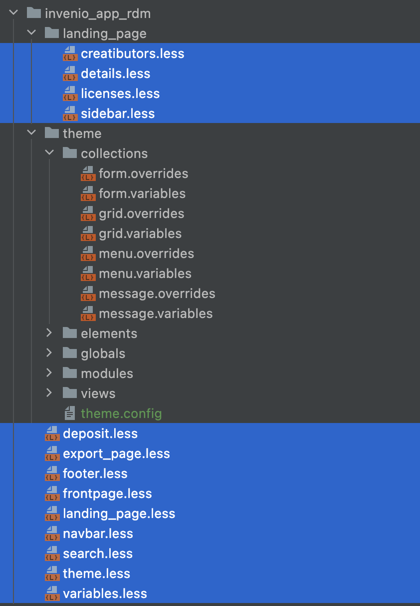

# CSS and JavaScript

## jQuery

The most common usage of jQuery is for JavaScript in Jinja templates.

### Selectors

Let's say you want to select the following top-level div:

```html
<div id="my-tab-menu" class="ui tab menu">
  <div class="item active">Menu 1</div>
  ...
</div>
```

✅ DO

Whenever possible, prefers `id` for selectors: this is much more efficient.

```javascript
$('#my-tab-menu').tab();
```

❌ DON'T

When the usage of `id` is not possible, you might need to `.classes` for selectors, less efficient and more prone to errors.

```javascript
$('.menu.tab').tab();
```

With the second approach, you apply the function to _all_ tab menu nodes on the page. What if there is a second menu? Or react element with the same class? None of your components/elements will behave as expected.

## Semantic UI

Semantic UI is the UI components library included in InvenioRDM and used in all web pages.

### Documentation

Save your time and frustration, read the documentation before you start with Semantic UI!

- [React Semantic UI](https://react.semantic-ui.com/)
- [Semantic UI](https://semantic-ui.com/)

Why is this important? You might rush into using available components without knowing their full power. Conversely, you might find yourself "reinventing the wheel", instead of using features already available in semantic.

### Components styling

Semantic UI is quite complete as a theme, there is a high chance you can use one of many available props to style your component, instead of writing custom CSS (custom CSS is hard to maintain, especially for big projects, like ours).

✅ DO

```javascript
render() {
  <Container>
    <MyComponent/>
  </Container>
}
```

or

```html
<div class="container">
  ...your content
</div>
```

❌ DON'T

```javascript
render() {
  <div className="my-centered-content"> // try to avoid custom styling!
    <MyComponent/>
  </div>
}
```

```css
.my-centered-content {
  margin-left: auto;
  margin-right: auto;
}
```

### File structure

Semantic UI has a fixed file structure; therefore, for creating custom CSS, the best is to follow the structure of the theme, so that overwritten elements are easily found!

✅ DO



❌ DON'T



## Custom CSS

!!! warning "Avoid custom CSS"

    Use only custom CSS as a very last resort!

Be aware of the scope of your changes. Do you want to overwrite only one instance of the element?

✅ DO

```css
#my-unique-menu-element {
  ...
}
```

❌ DON'T

```css
.ui.menu {
  // this will overwrite the style of each menu element using this stylesheet!
}
```

### Avoid ``!important``

Using `!important` makes overriding (think about the cookiecutter and my-site instances) very complicated to the end user. With the semantic-ui templating system using `!important` should not be needed in most of the cases.

❌ DON'T

```css
.ui.menu{
  color: red !important;
}
```
