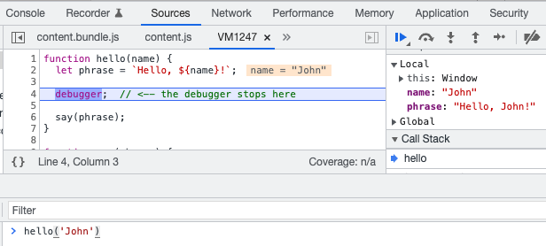
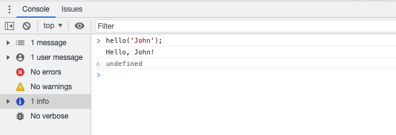

# Debugging

## Python/Flask
**Python debugger**

For debugging use the Python debugger (PDB) or one of the variations (ipdb, pytest and wdb).

To set a breakpoint place the following code:

```python
breakpoint()
```

**Flask DebugToolbar**

You can also install [Flask-DebugToolbar](https://flask-debugtoolbar.readthedocs.io/en/latest/):

```shell
cd ~/src/my-site
pipenv run pip install Flask-Debugtoolbar
```

It has built-in:

- Profiler
- SQL queries logging
- View config/templates

**SQL queries**

Last, but not least you can print SQL queries to the console by setting the `SQLALCHEMY_ECHO` variable in your ``config.py``:

```shell
# config.py
SQLALCHEMY_ECHO = True
```

**Logging output**

If you need to debug some code in a deployed environment (hard to debug locally), you can print the logs to
the standard output or to a file.
To see the logs in the terminal (e.g. in a container log), you can do the following:

1. prepare your code with the necessary logging instructions:
```python
from flask import current_app
  ...
  current_app.logger.info(f"my variable: {my_variable}")
```
2. make sure that the log level of Flask is at least the same as your log instructions, in this case `info`.
This is needed because Flask does not set a log level when running in non-DEBUG mode:
```python
def my_func():
  import logging
  current_app.logger.setLevel(logging.INFO)
  current_app.logger.root.setLevel(logging.INFO)
  current_app.logger.handlers[0].setLevel(logging.INFO)  # handlers[0] is normally the stdout handler
  ...
```
3. deploy and run: you should now see all your logs.

You can customize this, for example, with a file handler. Refer to the Python documentation for more information.

## JavaScript

All modern browsers have a built-in JavaScript debugger. You can enable the debugger in your browser and take advantage of the below 2 main ways to debug your JS application:

- Use the `debugger` statement in your code.
- Use the `console.log()`.

**Debugger**

You can add the `debugger` statement wherever you want to stop the execution of the application code. You can do that by following the next steps:

- Add the statement in your code e.g.,

```javascript
function hello(name) {
  let phrase = `Hello, ${name}!`;

  debugger;  // <-- the debugger stops here

  say(phrase);
}

function say(phrase) {
  alert(`** ${phrase} **`);
}
```

- Refresh the page.
- The application execution will stop in the place that you have put the `debugger` statement. You can think of it as a breakpoint to your source code.

**Note**: You can test the functionality above by copy/paste the code in your browser's console tab and run the `hello` function. You should see an output similar to:




**console.log()**

Another powerful tool you have to debug your application is the `console.log()` function. You can think of it as something similar to Python's `print()` function but instead of printing in your terminal, it shows the output in your browser's console.

To use the command you can follow the next steps:
- Add the statement in your code e.g.,

```javascript
function hello(name) {
  let phrase = `Hello, ${name}!`;

  console.log(phrase);  // <-- the phrase value will be logged in your browser's console

  say(phrase);
}

function say(phrase) {
  alert(`** ${phrase} **`);
}
```

- Go to your browser and open the debugger console.
- Check the output of your log command:


