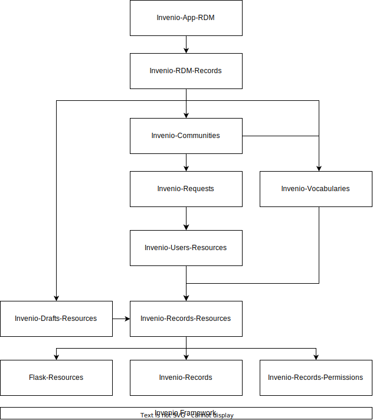

# Source code

For development you need the latest ``master`` or ``main`` branch of the source
code (name depends on  the repository).

Following show you to fork the repository and checkout the source code.

### With GitHub CLI

First checkout the source code from GitHub and get the latest ``master`` or
``main``  branch (depends on the repository which name is used).

This is most easily done using the [GitHub CLI tool](https://cli.github.com):

```
# with GitHub CLI tool:
gh repo fork inveniosoftware/invenio-app-rdm
cd invenio-app-rdm
```

With the previous command, we made a checkout of [Invenio-App-RDM](https://github.com/inveniosoftware/invenio-app-rdm) module. You'll have to adapt the command to checkout the module you want to work on.

### Without GitHub CLI

Without the GitHub CLI tool, you'll first have to [fork the repository](https://docs.github.com/en/get-started/quickstart/fork-a-repo)
on GitHub. Then, once you have a fork you can clone the repository and add the
upstream repository remote:

```
# without GitHub CLI:
git clone https://github.com/<your username>/invenio-app-rdm
cd invenio-app-rdm
git remote add upstream git@github.com:inveniosoftware/invenio-app-rdm.git
```

### Repositories survival guide

The InvenioRDM codebase is split over a number of different repositories. Below you'll find a short overview over the most



- CLI tool
    - [invenio-cli](https://github.com/inveniosoftware/)
        - Standalone CLI tool used to install and manage InvenioRDM.
- Instance template
    - [cookiecutter-invenio-instance](https://github.com/inveniosoftware/)
        - Template for the project folder created by ``invenio-cli``.
- Application repositories
    - [invenio-app-rdm](https://github.com/inveniosoftware/invenio-app-rdm)
        - The core application (e.g. the site configuration)
        - Jinja and JSX templates
        - Views for landing page and deposit form
        - Frontend: deposit form, search page
    - [invenio-rdm-records](https://github.com/inveniosoftware/invenio-rdm-records)
        - Concrete implementation of the REST API by using most of the modules below.
        - Defines the metadata model (JSONSchemas, Elasticsearch mappings, schemas etc.)
        - Defines the concrete permission policy.
        - Defines a record integration in a community and request.
    - [invenio-communities](https://github.com/inveniosoftware/invenio-communities)
        - Implementation of the Communities REST API.
        - Defines the community metadata model (JSONSchemas, Elasticsearch mappings, schemas etc.)
        - Provides features to Invenio-Requests specific to communities.
        - Views for communities pages
        - Assets for the communities views (Jinja/JSX templates, LESS files)
    - [invenio-requests](https://github.com/inveniosoftware/invenio-requests)
        - Implementation of the generic request REST API. Allows other modules (like communities/rdm-records) to inject
          new request types.
        - Views for the requests pages
        - Assets for the requests views (Jinja/JSX templates, LESS files)
    - [invenio-users-resources](https://github.com/inveniosoftware/invenio-users-resources)
        - Implementation of the users and groups REST API. Enables indexing and search for users.
    - [invenio-drafts-resources](https://github.com/inveniosoftware/invenio-drafts-resources)
        - General purpose library used to build REST APIs for deposit interfaces.
        - Drafts API and versioning support
        - Used by invenio-rdm-records
    - [invenio-records-resources](https://github.com/inveniosoftware/invenio-records-resources)
        - General purpose library used to build REST APIs for records backed by services and data access layer.
        - Core APIs for the service and data access layers.
        - Used by invenio-vocabularies, invenio-drafts-resources.
    - [flask-resources](https://github.com/inveniosoftware/flask-resources)
        - General purpose library used to build Flask views for REST APIs.
        - Core APIs for the presentation layer.
        - Used by invenio-records-resources
    - [invenio-vocabularies](https://github.com/inveniosoftware/invenio-vocabularies)
        - Concrete REST APIs for creating or loading smaller vocabularies.
        - Used by invenio-rdm-records
    - [invenio-records-permissions](https://github.com/inveniosoftware/invenio-records-permissions)
        - General purpose library for building permission policies for records.
    - [invenio-records](https://github.com/inveniosoftware/invenio-records)
        - General purpose library for building programmatic APIs for JSON documents with validation.
