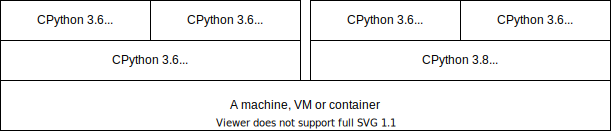

# Python virtual environments

The following is a quick survival guide for disambiguating Python virtual
environments, the tools used to create them and terms such as:

- Distribution
- Installation of a distribution
- Virtual environment
- ``python`` and ``pip``
- ``virtualenv``, ``venv``, ``virtualenv-wrapper``, ``pipenv``, ``pyenv``.

### Distributions

There exist several Python distributions:

- CPython (official one downloadable from python.org)
- Anaconda
- PyPy
- ActivePython

Each distribution provides a *Python interpreter* that can execute Python
programs (i.e. a distribution provides the ``python`` command).

### Distribution version

Each distribution supports multiple versions of the Python programming language e.g., Python 3.8 and Python 3.9.

### Installation of a distribution

You can have one or more Python distributions installed at the computer at the
same time. E.g. you can have CPython 3.7, 3.8, 3.9. Often, your operating system
also already ships a default Python installation.

What's important to understand is that each installation of a distribution
provides an isolated Python environment. Technically this translates down
to having **multiple ``python`` commands** in different paths (e.g.
``/usr/bin/python`` or ``/usr/bin/local/python3.8/python3``).

Pay attention to *symlinks and aliases*, e.g. ``python`` might be an alias
for ``python3``.

### Python distribution tools

The most prime example of a Python distribution tool is ``pip``, which you use
to install Python packages from the Python Package Index (PyPI).

The command ``pip`` is always tied to a specific installation of a Python
distribution. So when you call ``pip install ...``, it will install the Python
package into that specific installation of a distribution.

Thus in addition to having multiple ``python`` commands, you can have multiple
``pip`` commands that belongs to a distribution.

### Virtual environments

A Python virtual environment is *created from a distribution installation*. It
isolates the Python packages and commands installed.

For instance, if you have two Python programs A and B, and Python program A depends on
version 1 of package X, and program B depends on version 2 of the same
package X. Both version 1 and version 2 cannot be installed at the same time
in a single Python distribution.

Virtual environments allow you to have a virtual environment for program A and
another for program B each with a different version installed of package X.

This means that a virtual environment has its own ``python`` and ``pip`` commands.

## Tools

- ``pyenv`` is a tool to manage and install multiple Python **distributions**.
- ``venv`` and ``virtualenv`` are tools to create **virtual environments** for a specific installation of a **distribution**.
- ``pipenv``, ``poetry``, ``virtualenv-wrapper`` are tools used to manage ``venv`` and/or ``virtualenv``.
- ``brew``, ``yum``, ``apt`` are package manages that can be used to install e.g. multiple Python **distributions**.
- ``invenio-cli`` uses ``pipenv`` on your local machine or in containers to create and manage
  a **virtual environment**.
