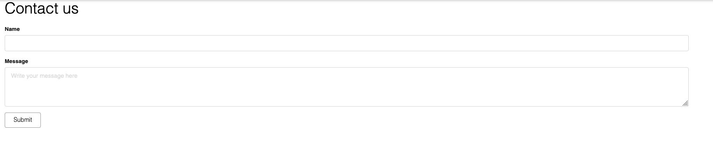

# Creating custom code and views

*Introduced in InvenioRDM v11*

To extend your instance with your own custom code and views, you can use the predefined “site” folder in your instance. The site folder works just like any other installed package. This means that you no longer need to develop and publish a separate package to add custom views and functionality to your instance.

Example of customizations could be the creation of new Python modules or utilities, new views (including Jinja templates) or REST APIs, new UI components and JavaScript code.

Let's go through an example of making a new view with some JavaScript files in our instance.

## Enable the site folder

First of all, you need to make sure the site folder is available and editable. When bootstrapping InvenioRDM, you will get the following option:

```bash
Select site_code:
1 - yes
2 - no
Choose from 1, 2 [1]:
```

To generate the site folder, you will need to select option `1 - yes` (this is already the default option). Now, after the bootstrapping is finished, you can see a folder named "site" in the root folder of your instance, as well as the following line in your instance folder's Pipfile:

```python hl_lines="3"
[packages]
...
my-site = {editable=true, path="./site"}
```

This means that the site folder will be installed as a package with the name `my-site`, and it is editable. This package now works as any other package installed in your instance (`invenio-app-rdm`, `invenio-communities`, etc.), allowing you to customize your instance and create new views and features without adding a separate package manually.

When bootstrapped, your project will include the following structure:

```
├── site
│   ├── my_site
│   │   ├── assets
│   │   ├── templates
│   │   ├── __init__.py
│   │   ├── views.py
│   │   ├── webpack.py
│   ├── setup.cfg
│   ├── setup.py
│   ├── tests
```

For existing installations, there is no automatic procedure. One easy way could be to generate a new InvenioRDM instance in another folder with the exact same naming as the original one, and then copy from it the `site` folder over to your existing instance's root directory.

## Configure your new view

To get started with the custom view, add a new folder in `./site/my_site`. In this example, you will create a "support" view, hence name your folder "support". The folder structure should look like this:

```
├── site
│   ├── my_site
│   │   ├── support
│   │   │   ├── __init__.py
│   │   │   └── support.py
```

In `support.py`, you define the class for our new support-view:

```python
from flask import render_template
from flask.views import MethodView


class MySiteSupport(MethodView):
    """MySite support view."""

    def __init__(self):
        self.template = "my_site/support.html"

    def get(self):
        """Renders the support template."""
        return render_template(self.template)
```

In the `__init__` method, you define the path to the template. The `get` method returns the rendered Jinja template as HTML.

Create the new template `support.html` in the `templates` folder:

```
├── site
│   ├── my_site
│   │   ├── support
│   │   ├── templates
│   │   │   ├── semantic-ui
│   │   │   │   ├── my_site
│   │   │   │   │   └── support.html
```

Here is the code of the template:

```jinja



    <div id="contact-page" class="ui container">
        <h1>Contact us</h1>
        
            <div id="root-container" class="panel-body"></div>
        
    </div>

```

The `<div>` element with id `root-container` will then later render a React application.

## Register the view

Let's register the view configured in `support.py`. To do this, open the `views.py` file in `./site/my_site` and add a new URL rule within the `create_blueprint` function like the following:

```python hl_lines="11-14"
from flask import Blueprint
from .support.support import MySiteSupport

def create_blueprint(app):
    blueprint = Blueprint(
        "my_site",
        __name__,
        template_folder="./templates",
    )

    blueprint.add_url_rule(
        "/support",
        view_func=MySiteSupport.as_view("support_form"),
    )

    return blueprint
```

That is really all you need to get your custom view available on your desired path. If you now open your instance on `/support`, you will see the new template we added, `support.html`:


## Adding JavaScript to your template

If you want, or need, to use JavaScript for your template, you will need to configure a Webpack bundle for the `site` folder. This is done in the predefined `webpack.py` file of `site/my_site`.

Let's start by creating a JavaScript file in the assets folder:

```
├── site
│   ├── my_site
│   │   ├── assets
│   │   │   ├── semantic-ui
│   │   │   │   ├── js
│   │   │   │   │   ├── my_site
│   │   │   │   │   │   └── support.js
│   │   ├── support
│   │   ├── templates
```

The JavaScript file could be anything that should be executed when the page is rendered, as an example it can render a simple Semantic UI form:

```javascript
import React from "react";
import ReactDOM from "react-dom";
import { Button, Form } from "semantic-ui-react";

const rootContainer = document.getElementById("root-container");

ReactDOM.render(
  <Form>
    <Form.Input label="Name" />
    <Form.TextArea label="Message" placeholder="Write your message here" />
    <Button type="submit">Submit</Button>
  </Form>,
  rootContainer // Target container on where to render the React components.
);
```

Now let's register this file in the Webpack bundle. In the file `webpack.py`, add a new entry, pointing to your new JavaScript file:

```python hl_lines="10"
from invenio_assets.webpack import WebpackThemeBundle

theme = WebpackThemeBundle(
    __name__,
    "assets",
    default="semantic-ui",
    themes={
        "semantic-ui": dict(
            entry={
                "my-site-support": "./js/my_site/support.js",
            },
        ),
    },
)
```

Here you can see the new alias for the JavaScript file `my-site-support`, which is the name that will be used to reference the bundle.

Now, you are all set to include the JavaScript file to the template. In the template file `support.html`, add the following Jinja block:

```jinja hl_lines="12-15"



    <div id="contact-page" class="ui container">
        <h1>Contact us</h1>
        
            <div id="root-container" class="panel-body"></div>
        
    </div>



    {{ super() }}
    {{ webpack['my-site-support.js'] }}

```

As you can see, we are extending the predefined template from <a href="https://github.com/inveniosoftware/invenio-theme/blob/master/invenio_theme/templates/semantic-ui/invenio_theme/page.html" target="_blank">`invenio-theme/page.html`</a>. We are calling `{{ super() }}` as we don't want to replace the existing JavaScript bundles, but rather extend them to also include the new JavaScript file.

To include the new JavaScript bundle in the final built assets, you will have to rebuild them by running the following command:

```terminal
invenio-cli assets build
```

and restart the instance:

```terminal
invenio-cli run
```

That's all! Now you should be all set to further develop your custom view as you like.

The final result should look like this:


