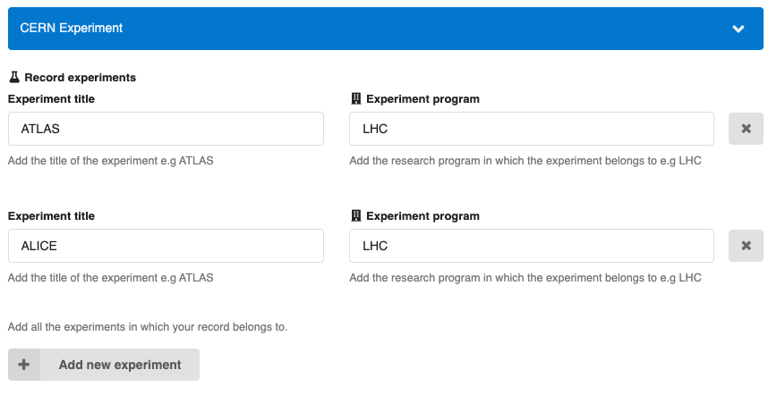
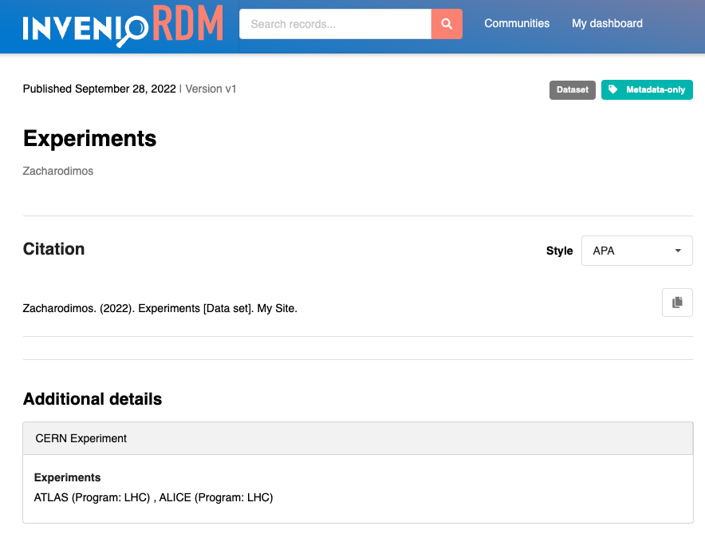

# Creating a new custom field

*Introduced in InvenioRDM v10*

This guide describes how to create your own custom field. If you have not done it yet, please read first about configuring [records custom fields](../../customize/metadata/custom_fields/records.md).
The new custom field in this example will extend the use case described in the records custom field documentation:

_When uploading a research preprint at CERN, I want to record the title and the research program of the related CERN experiments._

Let's implement a new field `experiments`, which will be a list of objects with the following structure:

```json
{
  "experiments": [
    {
      "title": "ATLAS",
      "program": "LHC"
    },
    {
      "title": "ALICE",
      "program": "LHC"
    }
  ]
}
```

Let's define a new custom field type. For convenience, we will define the new custom field type in the `my-site/invenio.cfg` where the application configuration resides. Therefore, no import will be needed to use it in the `RDM_CUSTOM_FIELDS` variable.

```python
from invenio_records_resources.services.custom_fields import BaseListCF
from marshmallow import fields
from marshmallow_utils.fields import SanitizedUnicode

class ExperimentsCF(BaseListCF):
    """Experiments with title and program."""

    def __init__(self, name, **kwargs):
        """Constructor."""
        super().__init__(
          name,
          field_cls=fields.Nested,
          field_args=dict(
            nested= dict(
                title=SanitizedUnicode(),
                program=SanitizedUnicode()
            )
          ),
          multiple=True,
          **kwargs
        )


    @property
    def mapping(self):
        """Return the mapping."""
        return {
            "properties": {
                "title": {
                    "type": "text"
                },
                "program": {
                    "type": "text"
                },
            }
        }
```

## Implement the new UI widget

Let's now create the new UI widget in a file `Experiments.js` in `my-site/assets/templates/custom_fields`:

```javascript
import React, { Component } from "react";

import { Input, Array } from "react-invenio-forms";
import { Grid, Form, Button, Icon } from "semantic-ui-react";

const newExperiment = {
  title: "",
  program: "",
};

export class Experiments extends Component {
  render() {
    const {
      fieldPath, // injected by the custom field loader via the `field` config property
      title,
      program,
      icon,
      addButtonLabel,
      description,
      label,
    } = this.props;
    return (
      <Array
        fieldPath={fieldPath}
        label={label}
        icon={icon}
        addButtonLabel={addButtonLabel}
        defaultNewValue={newExperiment}
        description={description}
      >
        {({ arrayHelpers, indexPath }) => {
          const fieldPathPrefix = `${fieldPath}.${indexPath}`;
          return (
            <Grid>
              <Grid.Column width="7">
                <Input
                  fieldPath={`${fieldPathPrefix}.title`}
                  label={title.label}
                  placeholder={title.placeholder}
                  description={title.description}
                ></Input>
              </Grid.Column>
              <Grid.Column width="8">
                <Input
                  fieldPath={`${fieldPathPrefix}.program`}
                  label={program.label}
                  icon={"building"}
                  placeholder={program.placeholder}
                  description={program.description}
                ></Input>
              </Grid.Column>
              <Grid.Column width="1">
                <Form.Field style={{ marginTop: "1.75rem", float: "right" }}>
                  <Button
                    aria-label={"Remove field"}
                    className="close-btn"
                    icon
                    onClick={() => arrayHelpers.remove(indexPath)}
                    type="button"
                  >
                    <Icon name="close" />
                  </Button>
                </Form.Field>
              </Grid.Column>
            </Grid>
          );
        }}
      </Array>
    );
  }
}
```

Since we added a new Javascript file, we need to [rebuild our assets](../../customize/look-and-feel/theme.md#automatic-re-build):

```bash
$ invenio-cli assets build
```

!!! tip "Where to place a custom UI widget?"
    Custom UI widgets can be implemented in multiple places. Besides in the instance, they can also be implemented in other modules such as
    `react-invenio-deposit` or `react-invenio-forms`, however be aware that "where" to place a widget depends on "who" needs the custom field.

## Layout template

Let's now create the template that will be used to display the newly added field in the record landing page. We create a new file `experiments.html` in `my-site/templates`:

```html
<dt class="ui tiny header">{{ _("Experiments")}}</dt>

 {{value.get("title", "Unknown")}} ({{
_("Program") }}: {{value.get("program", "Unknown")}}) {{ ", " if not loop.last
}} 
```

## Configuration

Finally, we need to add the new field to the `RDM_CUSTOM_FIELDS` and `RDM_CUSTOM_FIELDS_UI` configuration:

```python
RDM_CUSTOM_FIELDS = [
    ExperimentsCF(name="experiments")
]

RDM_CUSTOM_FIELDS_UI = [{
    "section": "CERN Experiments",
    "fields": [{
        "field": "experiments",
        "ui_widget": "Experiments",
        "template": "experiments.html",
        "props": {
            "label": _("Experiments"),
            "title": {
                "label": _("Experiment title"),
                "placeholder": _("Add the title..."),
                "description": _("Add the title of the experiment e.g ATLAS")
            },
            "program": {
                "label": _("Experiment program"),
                "placeholder": _("Add the program..."),
                "description": _("Add the research program in which the experiment belongs to e.g LHC")
            },
            "addButtonLabel": _("Add new experiment"),
            "icon": "lab",
            "description": "Add all the experiments in which your record belongs to."
        }
    }]
}]
```

Custom field initialization, in a new shell run:

```bash
$ cd my-site

$ pipenv run invenio rdm-records custom-fields init -f experiments
```

## See it in action

### Upload form

The new field will be displayed at the bottom of the upload form:



### Record landing page

The new field will be displayed in the record landing page:


