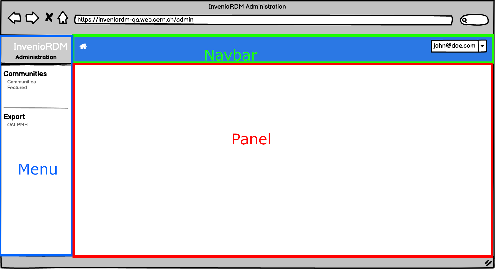
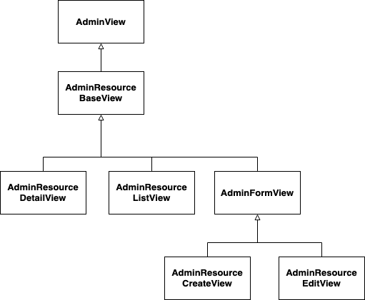
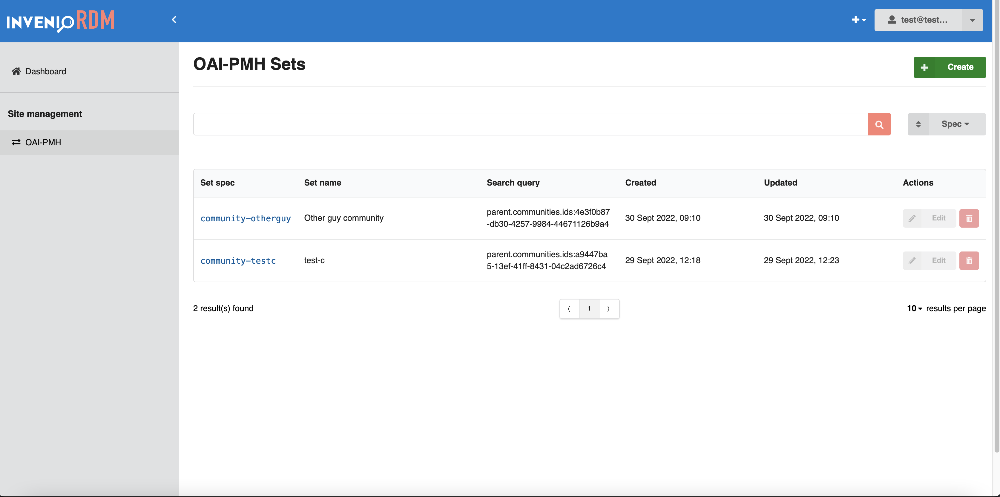
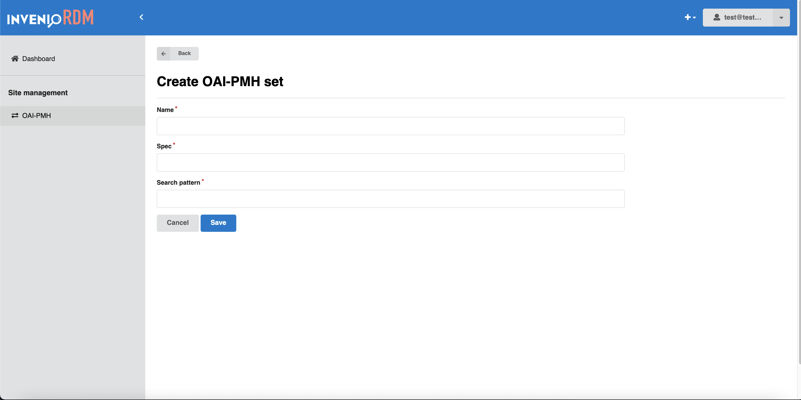
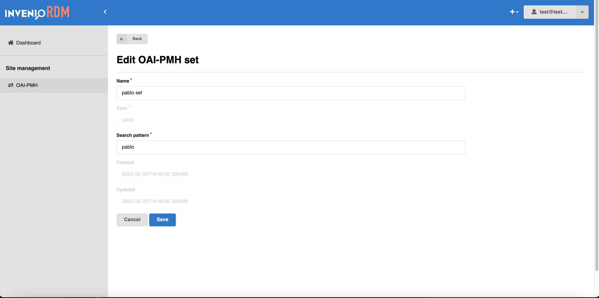
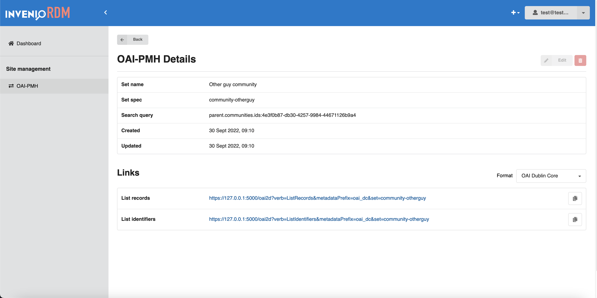
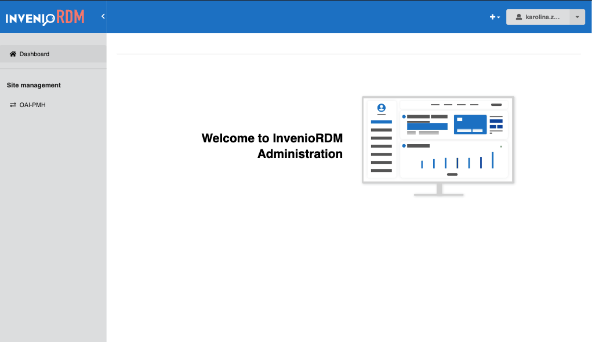

# Administration panel

*Introduced in InvenioRDM v10*

## Summary

The following document is a developer guide to the InvenioRDM administration panel, detailing its programmatic interface and usage.

## Intended audience

This guide is intended for developers of InvenioRDM.

## Overview

Invenio administration panel gives the administrator an easy and simple web interface to effectively manage an instance of InvenioRDM.

## Domain dictionary

The following terms are introduced to facilitate defining the domain:

- `administration panel` - the interface panel enabling a `manager` to administrate the instance of InvenioRDM in a developer-independent way.
- `administrator` - a person with domain knowledge, with a special set of permissions, able to manage an InvenioRDM instance, not necessarily having developer skills.
- `frontsite`, `end user interface` - currently known InvenioRDM interface, accessible by anonymous and logged-in users, without administrator role.
- `administration view` - content of the administration panel (pages)

## Administration panel



An instance developer can register new entries in the menu (see the administration [RFC](https://github.com/inveniosoftware/rfcs/blob/master/rfcs/rdm-0067-administration-panel.md)). A menu entry will display the associated views in the panel section. The navbar menu layouts are customizable to meet the needs of the InvenioRDM instance.

### Architecture



The views are implemented as shown on the diagram below. InvenioRDM developer can implement a new admin view by inheriting one of the following view classes:

| View                    | Description                                                                                                                                   |
|-------------------------|-----------------------------------------------------------------------------------------------------------------------------------------------|
| AdminView               | Base view class, provides flask view blueprint registration and administration side menu registration                                         |
| AdminResourceDetailView | Details view base - displays details of a single item of the resource                                                                         |
| AdminResourceListView   | ListView base - displays a search page with all the resource items of a given type                                                            |
| AdminResourceCreateView | View generating a form to add a new instance of a resource                                                                                    |
| AdminResourceEditView   | View generating a form to edit an existing resource item                                                                                      |

### Views

#### Create a resource based view

Administration resource based views are using existing REST API. The CRUD operations are provided for any existent InvenioRDM [resource](../../develop/topics/resource.md) (e.g. community, record, OAISet - meaning they follow the REST API resource architecture pattern).

As an example, a step-by-step guide is provided to generate an administration view for OAI-PMH Sets.

##### Folder structure

To create an administration view for a module, the following structure is recommended:

```console
invenio-rdm-records
|-- administration
    |-- __init__.py
    |-- views
        |-- __init__.py
        |-- oai.py
```

Views are implemented in `invenio_rdm_records/administration/views/<myview>.py`. We strongly recommend to follow this proposed folder structure as it promotes clear code organisation, however it is not technically required.

##### List view

A ListView displays a list of records that are retrieved from an InvenioRDM [resource](../../develop/topics/resource.md) REST APIs endpoint. By default, `Invenio-Administration` provides a core module that generates this view, based on given `ListView` configuration.

By default, the ListView is represented as a table. The view uses a search app, bootstrapped using [React-SearchKit](https://inveniosoftware.github.io/react-searchkit/). It provides a tabular view of the resources, as well as a set of features such as searching, sorting and even faceting.



Each row contains a set of actions that can be performed on a resource. These actions can be the "default" ones, such as "Edit" or "Delete", but can also be extended to support custom actions that are only available for that specific resource, e.g. feature a community.

###### Usage

This is an example of ListView configuration for OAI-PMH set resource.

```python
from invenio_administration.views.base import AdminResourceListView

class OaiPmhListView(AdminResourceListView):
    """Configuration for OAI-PMH sets list view."""

    api_endpoint = "/oaipmh/sets"
    name = "OAI-PMH"
    resource_config = "oaipmh_server_resource"
    search_request_headers = {"Accept": "application/json"}
    title = "OAI-PMH Sets"
    category = "Site management"
    pid_path = "id"
    icon = "exchange"
    template = "invenio_rdm_records/oai-search.html"

    display_search = True
    display_delete = True
    display_edit = True

    item_field_list = {
        "spec": {"text": "Set spec", "order": 1},
        "name": {"text": "Set name", "order": 2},
        "search_pattern": {"text": "Search query", "order": 3},
        "created": {"text": "Created", "order": 4},
        "updated": {"text": "Updated", "order": 5},
    }

    search_config_name = "RDM_OAI_PMH_SEARCH"
    search_facets_config_name = "RDM_OAI_PMH_FACETS"
    search_sort_config_name = "RDM_OAI_PMH_SORT_OPTIONS"

    create_view_name = "oaipmh_create"
    resource_name = "name"
```

For the full attributes list and description visit the [reference docs](../../reference/administration_reference.md).


##### Create view



A create view displays a page on which a resource can be created. By default, `Invenio-Administration` provides a core module that generates this view based on given `CreateView` configuration.

Form fields are configured as class attributes. If the `form_fields` attribute is not implemented, the view will display all the fields configured in the resource's [serializer](../topics/serializers.md#data-transformations).

###### Usage

This is an example of CreateView configuration for OAI-PMH set resource.

```python
class OaiPmhCreateView(AdminResourceCreateView):
    """Configuration for OAI-PMH sets create view."""

    name = "oaipmh_create"
    url = "/oai-pmh/create"
    resource_config = "oaipmh_server_resource"
    pid_path = "id"
    api_endpoint = "/oaipmh/sets"
    title = "Create OAI-PMH set"

    list_view_name = "OAI-PMH"

    form_fields = {
        "name": {"order": 1, "text": "Set name"},
        "spec": {"order": 2, "text": "Set spec"},
        "search_pattern": {"order": 3, "text": "Search query"},
    }

```

For the full attributes list and description visit the [reference docs](../../reference/administration_reference.md)


##### Edit view



This view displays a form to edit a selected resource. Form fields are customizable to each resource by implementing marshmallow [schema](../topics/serializers.md#data-transformations)

###### Usage

This is an example of EditView configuration for OAI-PMH set resource.

```python
class OaiPmhEditView(AdminResourceEditView):
    """Configuration for OAI-PMH sets edit view."""

    name = "oaipmh_edit"
    url = "/oai-pmh/<pid_value>/edit"
    resource_config = "oaipmh_server_resource"
    pid_path = "id"
    api_endpoint = "/oaipmh/sets"
    title = "Edit OAI-PMH set"

    list_view_name = "OAI-PMH"

    form_fields = {
        "name": {"order": 2, "text": "Set name"},
        "spec": {"order": 3, "text": "Set spec"},
        "search_pattern": {"order": 4, "text": "Search query"},
        "created": {"order": 5},
        "updated": {"order": 6},
    }
```

For the full attributes list and description visit the [reference docs](../../reference/administration_reference.md)


##### Details view


By default, this view displays the details of a selected resource. It can be configured to display/hide a set of fields.

It can be extended or completely overridden by a custom view.

For OAI-PMH sets, as seen in the figure, this view uses a custom Jinja template and `React` to render a second table that displays OAI-PMH Sets links.

More information on template override and custom React components will be detailed later in this guide.

###### Usage

This is an example of DetailView configuration for OAI-PMH set resource.

```python
class OaiPmhDetailView(AdminResourceDetailView):
    """Configuration for OAI-PMH sets detail view."""

    url = "/oai-pmh/<pid_value>"
    api_endpoint = "/oaipmh/sets"
    search_request_headers = {"Accept": "application/json"}
    name = "OAI-PMH details"
    resource_config = "oaipmh_server_resource"
    title = "OAI-PMH Details"

    template = "invenio_rdm_records/oai-details.html"
    display_delete = True
    display_edit = True

    list_view_name = "OAI-PMH"
    pid_path = "id"

    item_field_list = {
        "name": {"text": "Set name", "order": 1},
        "spec": {"text": "Set spec", "order": 2},
        "search_pattern": {"text": "Search query", "order": 3},
        "created": {"text": "Created", "order": 4},
        "updated": {"text": "Updated", "order": 5},
    }
```

For the full attributes list and description visit the [reference docs](../../reference/administration_reference.md)

##### Views registration

In order to render views in `Invenio-Administration`, they must be registered from the module on which they are implemented.

To register your new view, you will have to:

1. Create views in the module.
2. Configure views to match your needs.
3. Register views in `Invenio-Administration` entry point group.

In OAI-PMH sets example, views are registered in `Invenio-Administration` as individual entry points from `invenio-rdm-records`.

Edit the setup.cfg in the module and add:

```ini
[options.entry_points]
invenio_administration.views =
    invenio_rdm_records_oai_list = invenio_rdm_records.administration.views.oai:OaiPmhListView
    invenio_rdm_records_oai_edit = invenio_rdm_records.administration.views.oai:OaiPmhEditView
    invenio_rdm_records_oai_create = invenio_rdm_records.administration.views.oai:OaiPmhCreateView
    invenio_rdm_records_details = invenio_rdm_records.administration.views.oai:OaiPmhDetailView
```

#### Create custom view

A custom view can be created by inheriting directly from `AdminView`.

##### Usage

In your `<invenio-module>` (called `invenio_module` for simplicity), create a `<filename>.py` file:

```python
from invenio_administration.views.base import AdminView

class MyCustomView(AdminView):
    """My custom view."""

    name = "customview"
    category = "My category"
    template = "invenio_module/custom_view_template.html"  # placed in templates/invenio_module/custom_view_template.html
    url = None
    menu_label = "Custom View"
    icon = "user"
```

The class defined for the custom view must be registered as an entry point, as follows:

Edit the `setup.cfg` of your module and add:

```ini
[options.entry_points]
invenio_administration.views =
    invenio_module_admin_custom_view = invenio_module.path.to.filename:MyCustomView
```

For the full attributes list and description visit the [reference docs](../../reference/administration_reference.md)

### Customisation: dashboard view

The dashboard view (also known as index view) is a first page that administrator sees after loging into the administration panel.



For simple customisations, dashboard view can be overridden by adding new Jinja template in your local instance, as follows: `templates/invenio_administration/index.html`.

In case of more complex use cases, the dashboard view can be configured by creating a view that inherits from the `AdminView` and updating the config variable `ADMINISTRATION_DASHBOARD_VIEW` with the new declared view.

```python
ADMINISTRATION_DASHBOARD_VIEW = (
    "invenio_administration.views.dashboard.AdminDashboardView"
)
```


### Customisation: Jinja templates

The views are defined by Jinja templates, and this can be easily extendable and overridable by redefining their blocks.

If you would like to customize any of the exising default administration views, you can do so by overriding their Jinja templates, for each type of the view can be overridden by using the Jinja's inheritance:

```html
<!-- Details view -->

<!-- Edit view -->

<!-- Search view -->

<!-- Create view -->

<!-- Dashboard view -->

```

In each view you can override or extend different blocks, mainly there are 2 blocks that can be overridden to display our custom content:

- `admin_page_content`: Content of each view. It's present in all the views.
- `JavaScript`: Main block to place any JavaScript content.

```html



   {# MY custom content #}



  # don't forget the parent JS assets!
  {{ super() }}
  # don't forget to add proper assets to your template
  {{ webpack['invenio-administration-search.js'] }}

```


More information about `blocks` and template inheritance is available in [Jinja documentation](https://Jinja.palletsprojects.com/en/3.0.x/templates).
To find more about the different blocks that can be overridden in each of the views you can check the code of the views [here](https://github.com/inveniosoftware/invenio-administration/tree/main/invenio_administration/templates/semantic-ui/invenio_administration).

### Customisation: React components

In addition to Jinja, in each view there is the possibility to overwrite single building block of the UI - React components.
If you would like to, for example, change layout of the default view, you can create your own React component to display the view.

Create a js file (`MyComponent.js`) containing your custom component, which you have to place in `/assets/js` folder of your module.

```javascript
class MyComponent extends Component {
    render() {
        return "Hello World!"
    }
}

const domContainer = document.getElementById("invenio-details-config");
domContainer &&
  ReactDOM.render(
    <MyComponent />,
    domContainer
  );
```

Add the `.js` file as webpack entry - inside `webpack.py` file of your module:

```diff
theme = WebpackThemeBundle(
    __name__,
    "assets",
    default="semantic-ui",
    themes={
        "semantic-ui": dict(
            entry={
+               "my-component":
+                   "./js/path/to/my/new/file/MyComponent.js",
                ...
```

Once the file was added as webpack entry, we can add it to the template we are overriding. Make sure webpack.py file is registered as entry point in your module.

```html



  <div
    id="invenio-details-config"
  >
  </div>


  # don't forget the parent JS assets!
  {{ super() }}
  # make sure the name of the asset matches the name you registered in the webpack entry
  {{ webpack['my-component.js'] }}

```

Make sure unique html tag ID in your `.js` file and Jinja template match.

If you need to overwrite only the React components in your view (without customising Jinja templates) - you can skip the step above, and use one of the existing DOM elements identifiers:

- `invenio_administration/create.html` -> id="**invenio-administration-create-root**"
- `invenio_administration/details.html` -> id="**invenio-details-config**"
- `invenio_administration/edit.html` -> id="**invenio-administration-edit-root**"
- `invenio_administration/search.html` -> id="**invenio-search-config**"

### Permissions

Only users with action `administration-access` granted are allowed to access the Invenio Administration panel.
This new permission's action has been introduced in InvenioRDM v10.0.0.

There are two ways to grant this permission:

1. Permission can be added using a role:

    ```bash
      # make sure you are inside your instance's directory
      cd my-site
      # Create a role named administration
      pipenv run invenio roles create administration
      # Allow access to administration to the administration role
      pipenv run invenio access allow administration-access role administration
      # Add administration role to an user email
      pipenv run invenio roles add <user_email> administration
    ```

2. Permission can be added to a specific user:

    ```bash
      # Grant access to a specific user to the action administration-access
      pipenv run invenio access allow administration-access user <user_email>
    ```

### Admin actions permissions

Any request endpoint which is handled by administration panel (creating a resource, editing a resource, featuring a community, etc.), must have `Administration()` permission added, for example:

```python
from invenio_administration.generators import Administration
from invenio_records_permissions import BasePermissionPolicy


class OAIPMHServerPermissionPolicy(BasePermissionPolicy):
    """OAI-PMH permission policy."""

    can_read = [Administration()]
    can_create = [Administration()]
    can_delete = [Administration()]
    can_update = [Administration()]
    can_read_format = [Administration()]
```

#### Custom permissions

You can customize your individual permissions per view by overwriting `decorators` class attribute as shown below (see also [Flask class based views documentation](https://flask.palletsprojects.com/en/2.2.x/views/#view-decorators)).

```python
from invenio_administration.permissions import administration_permission

class MyView:
    decorators = [administration_permission.require(http_exception=403)]

```
