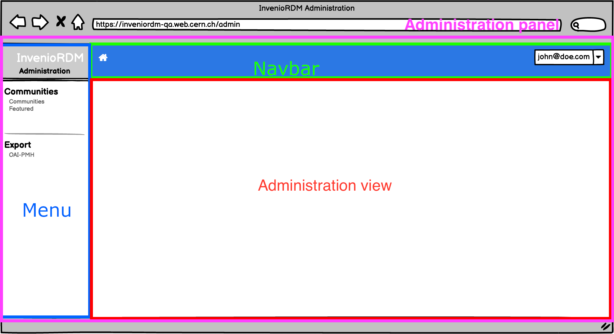

# Administration panel views

## Summary

The following document is a developer guide to the invenio administration panel, detailing its programmatic interface and usage.

## Intended audience

This guide is intended for developers of InvenioRDM.

## Overview

Invenio administration panel gives the administrator a set of tools to effectively manage an instance of InvenioRDM. 

## Domain dictionary

The following terms are introduced to facilitate defining the domain:

- `administration panel` - the interface panel enabling a `manager` to administrate the instance of InvenioRDM in a developer-independent way.
- `administrator` - a person with domain knowledge, with a special set of permissions, able to manage an InvenioRDM instance, not necessarily having developer skills.
- `frontsite`, `end user interface` - currently known InvenioRDM interface, accessible by anonymous and logged-in users, without administrator role.
- `administration view` - subpages of the administration panel

## Administration panel



An instance developer can register new entries in the menu (see backend [RFC](https://github.com/inveniosoftware/rfcs/pull/67)). A menu entry will display the associated views in the panel section. The navbar menu layouts are customizable to meet the needs of the InvenioRDM instance.

### Architecture


Administration views can be used "out of the box", meaning that some functionalities are provided as long as the installed views follow the architecture mentioned below. E.g. to implement a list page for a resource, its view must be of type `AdminResourceBaseView`.

More information on views, e.g. how they can be customized and extended, is provided [below](#list-view).

### Views

#### Create a resource based administration view

The CRUD views are provided out of the box for any existent RDM resource (e.g. community, record, OAISet - meaning they follow the REST API resource architecture pattern). Nevertheless, these views can be extended or completely replaced by custom ones.

As an example, a step-by-step guide is provided to generate an administration panel for OAI-PMH Sets.

##### Folder structure

To create an administration panel for a module, the following structure is proposed:

```console
invenio-rdm-records
|-- administration
    |-- __init__.py
    |-- views
        |-- __init__.py
        |-- oai.py
```

Views are implemented in `invenio_rdm_records/administration/views/oai.py`. Instructions on how to create and register views will be detailed in the following sections.

#### List view

A List view displays a list of records that are retrieved from an InvenioRDM resource API endpoint. By default, `invenio-administration` provides a core module that generates this view, based on given `ListView` configuration.

Table view uses a search app, bootstrapped using [React Search Kit](https://inveniosoftware.github.io/react-searchkit/). It provides a tabular view of the resources, as well as a set of features such as searching, sorting and even faceting.

Each row contains a set of actions that can be performed on a resource. These actions can be "default" ones, such as "Edit" or "Delete", but can also be extended to support custom actions that are only available for that specific resource, e.g. feature a community.


##### Usage

This is an example of ListView configuration for OAI-PMH set resource.

```python
from invenio_administration.views.base import AdminResourceListView

class OaiPmhListView(AdminResourceListView):
    """Configuration for OAI-PMH sets list view."""

    api_endpoint = "/oaipmh/sets"
    name = "OAI-PMH"
    resource_config = "oaipmh_server_resource"
    search_request_headers = {"Accept": "application/json"}
    title = "OAI-PMH Sets"
    category = "Site management"
    pid_path = "id"
    icon = "exchange"
    template = "invenio_rdm_records/oai-search.html"

    display_search = True
    display_delete = True
    display_edit = True

    item_field_list = {
        "spec": {"text": "Set spec", "order": 1},
        "name": {"text": "Set name", "order": 2},
        "search_pattern": {"text": "Search query", "order": 3},
        "created": {"text": "Created", "order": 4},
        "updated": {"text": "Updated", "order": 5},
    }

    search_config_name = "RDM_OAI_PMH_SEARCH"
    search_facets_config_name = "RDM_OAI_PMH_FACETS"
    search_sort_config_name = "RDM_OAI_PMH_SORT_OPTIONS"

    create_view_name = "oaipmh_create"
    resource_name = "name"
```

For the full attributes list and description visit [reference docs](../../reference/administration_reference.md)


#### Create view


A Create view displays a page on which a resource can be created. By default, `invenio-administration` provides a core module that generates this view based on given `CreateView` configuation.

Each field in the form is previously configured in the view.

##### Usage

This is an example of CreateView configuration for OAI-PMH set resource.

```python
class OaiPmhCreateView(AdminResourceCreateView):
    """Configuration for OAI-PMH sets create view."""

    name = "oaipmh_create"
    url = "/oai-pmh/create"
    resource_config = "oaipmh_server_resource"
    pid_path = "id"
    api_endpoint = "/oaipmh/sets"
    title = "Create OAI-PMH set"

    list_view_name = "OAI-PMH"

    form_fields = {
        "name": {"order": 1, "text": "Set name"},
        "spec": {"order": 2, "text": "Set spec"},
        "search_pattern": {"order": 3, "text": "Search query"},
    }

```

For the full attributes list and description visit [reference docs](../../reference/administration_reference.md)


#### Edit view


This view displays a form to edit a selected resource. Form fields are customizable to each resource and some are allowed to be `read only`.

##### Usage

This is an example of EditView configuration for OAI-PMH set resource.

```python
class OaiPmhEditView(AdminResourceEditView):
    """Configuration for OAI-PMH sets edit view."""

    name = "oaipmh_edit"
    url = "/oai-pmh/<pid_value>/edit"
    resource_config = "oaipmh_server_resource"
    pid_path = "id"
    api_endpoint = "/oaipmh/sets"
    title = "Edit OAI-PMH set"

    list_view_name = "OAI-PMH"

    form_fields = {
        "name": {"order": 2, "text": "Set name"},
        "spec": {"order": 3, "text": "Set spec"},
        "search_pattern": {"order": 4, "text": "Search query"},
        "created": {"order": 5},
        "updated": {"order": 6},
    }
```

For the full attributes list and description visit [reference docs](../../reference/administration_reference.md)


#### Details view


By default, this view displays the details of a selected resource. It can be configured to display/hide a set of fields.

It can be extended or completely overridden by a custom view.

For OAI-PMH sets, as seen in the figure, this view uses a custom jinja template and `React` to render a second table that displays OAI-PMH Sets links.

More information on template override and custom react components will be detailed later in this guide.

##### Usage

This is an example of DetailView configuration for OAI-PMH set resource.

```python
class OaiPmhDetailView(AdminResourceDetailView):
    """Configuration for OAI-PMH sets detail view."""

    url = "/oai-pmh/<pid_value>"
    api_endpoint = "/oaipmh/sets"
    search_request_headers = {"Accept": "application/json"}
    name = "OAI-PMH details"
    resource_config = "oaipmh_server_resource"
    title = "OAI-PMH Details"

    template = "invenio_rdm_records/oai-details.html"
    display_delete = True
    display_edit = True

    list_view_name = "OAI-PMH"
    pid_path = "id"

    item_field_list = {
        "name": {"text": "Set name", "order": 1},
        "spec": {"text": "Set spec", "order": 2},
        "search_pattern": {"text": "Search query", "order": 3},
        "created": {"text": "Created", "order": 4},
        "updated": {"text": "Updated", "order": 5},
    }
```

For the full attributes list and description visit [reference docs](../../reference/administration_reference.md)

#### Views registration

In order to render views in `invenio-administration`, they must be registered from the module on which they are implemented.

A typical flow of actions to register views for a module is as follows:

1. Create views in the module.
2. Configure views to match your needs.
3. Register views in `invenio-administration` entry point group.

In OAI-PMH sets example, views are registered in `invenio-administration` as individual entry points from `invenio-rdm-records`.

```bash
vim invenio-rdm-records/setup.cfg
```

```ini
[options.entry_points]
invenio_administration.views =
    invenio_rdm_records_oai_list = invenio_rdm_records.administration.views.oai:OaiPmhListView
    invenio_rdm_records_oai_edit = invenio_rdm_records.administration.views.oai:OaiPmhEditView
    invenio_rdm_records_oai_create = invenio_rdm_records.administration.views.oai:OaiPmhCreateView
    invenio_rdm_records_details = invenio_rdm_records.administration.views.oai:OaiPmhDetailView
```

### Create custom view

A custom view can be created by inheriting directly from `AdminView`.
#### Usage

```python
from invenio_administration.views.base import AdminView

class MyCustomView(AdminView):
    """My custom view."""

    name = "customview"
    category = "My category"
    template = "invenio_administration/index.html"
    url = None
    menu_label = "Custom View"
    icon = "user"
```

The class defined for the custom view must be registered as an entry point, as follows:

```bash
vim invenio-rdm-records/setup.cfg
```

```ini
[options.entry_points]
invenio_administration.views =
    invenio_module_admin_custom_view = invenio_module.administration.views:MyCustomView
```

For the full attributes list and description visit [reference docs](../../reference/administration_reference.md)

### Customisation: dashboard view

The dashboard view can be configured by creating a view that inherits from the `AdminView` and updating the config variable `ADMINISTRATION_DASHBOARD_VIEW` with the new declared view.

```python
ADMINISTRATION_DASHBOARD_VIEW = (
    "invenio_administration.views.dashboard.AdminDashboardView"
)
```

If there is no need to provide any additional template context, dashboard view can be also overridden by adding new jinja template in your local instance, as follows: `templates/invenio_administration/index.html`. 

### Customisation: jinja templates

The views are defined by jinja templates, and this can be easily extendable and overridable by redefining their blocks.

Depending on the desired view to overridden, the correct template should be extended:

```html
<!-- Details page -->

<!-- Edit page -->

<!-- Search page -->

<!-- Create page -->

<!-- Dashboard page -->

```

In each page we can override or extend different blocks, mainly there are 2 blocks that can be overrided to display our custom content:

- `admin_page_content`: Main content each page. It's present in all the views.
- `javascript`: Main block to place any javascript content. It's important to always use {{ super() }} inside this block to inherit all the javascript needed to render the rest of the page.

More information about `blocks` is available in [Jinja documentation](https://jinja.palletsprojects.com/en/3.0.x/templates).
To find more about the different blocks that can be overridden in each of the views you can check the code of the views [here](https://github.com/inveniosoftware/invenio-administration/tree/main/invenio_administration/templates/semantic-ui/invenio_administration).

### Customisation: React components

In addition to jinja, in each view there is the possibility to inject React components. In order to do this, the view must be extended with a custom jinja template as described above. In this template, the javascript code that will render the view should be declared in the `javascript` block and in this block, the file that will render the React components must be included in webpack. In `webpack.py` the following line must be added:

```diff
theme = WebpackThemeBundle(
    __name__,
    "assets",
    default="semantic-ui",
    themes={
        "semantic-ui": dict(
            entry={
+               "invenio-administration-search":
+                   "./js/invenio_app_rdm/src/search/search.js",
                ...
```

Once the file was added to webpack we can add it to the template we are overriding. The webpack configuration **must** be registered in the module entry point!

```html



  <div
    id="invenio-details-config"
  >
  </div>


  {{ super() }}  # don't forget the parent JS assets!
  {{ webpack['invenio-administration-search.js'] }}  # it is crucial to remember about adding proper assets to your jinja 

```

When overriding the views, the block `admin_page_content` can be overridden, and a new `div` with a custom id can be set so that, in the new javascript file that was added to webpack the components can be injected in the view by looking for the correct id in the DOM and, like in the following example:

```javascript
const domContainer = document.getElementById("invenio-details-config");
domContainer &&
  ReactDOM.render(
    <MyCustomComponent />,
    domContainer
  );

```

For most of the views there is no need to override the `admin_page_content` block as the React component can be injected in the already existing view - by reusing existing DOM and React root element IDs 
Here a list of known DOM elements ids, depending on the template that's being extended:

- `invenio_administration/create.html` -> id="**invenio-administration-create-root**"
- `invenio_administration/details.html` -> id="**invenio-details-config**"
- `invenio_administration/edit.html` -> id="**invenio-administration-edit-root**"
- `invenio_administration/search.html` -> id="**invenio-search-config**"

### Permissions

The `administration-access` permission is needed to access the administration panel. This permission is being introduced in version 10. There are two ways to grant this permission.

1. Permission can be added using a role:

    ```bash
      # Create a role
      pipenv run invenio roles create administration
      # Allow access to administration to the administration role
      pipenv run invenio access allow administration-access role administration
      # Add administration role to an user email
      pipenv run invenio roles add <user_email> administration
    ```

2. Permission can be added to a specific user:

    ```bash
      # Add access to administration to an user email
      pipenv run invenio access allow administration-access user <user_email>
    ```
   
### Admin actions permissions

Any request endpoint which is handled by administration panel (creating a resource, editing a resource, featuring a community, etc.), must have `Administration()` permission added, for example:

```python
from invenio_administration.generators import Administration
from invenio_records_permissions import BasePermissionPolicy


class OAIPMHServerPermissionPolicy(BasePermissionPolicy):
    """OAI-PMH permission policy."""

    can_read = [Administration()]
    can_create = [Administration()]
    can_delete = [Administration()]
    can_update = [ Administration()]
    can_read_format = [Administration()]
```

#### Custom permissions

You can customize your individual permissions per view by overwriting `decorators` class attribute as shown below (see also [Flask class based views documentation](https://flask.palletsprojects.com/en/2.2.x/views/#view-decorators)).
For more details on configuring administration views, follow the rest of this guide.

```python
from invenio_administration.permissions import administration_permission

class MyView:
    decorators = [administration_permission.require(http_exception=403)]

```
