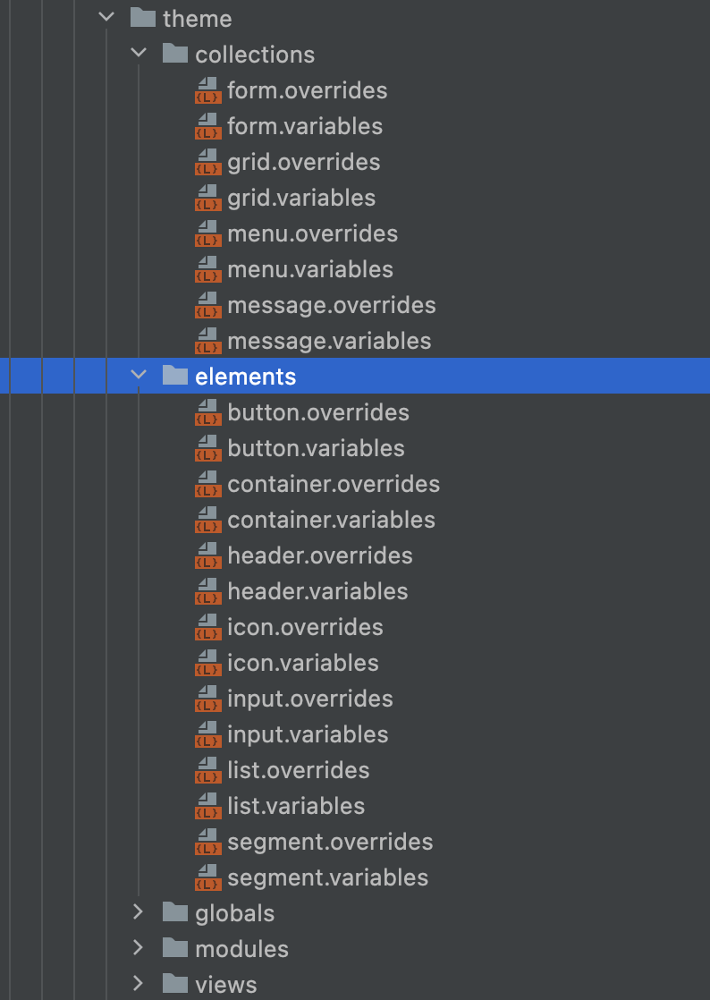
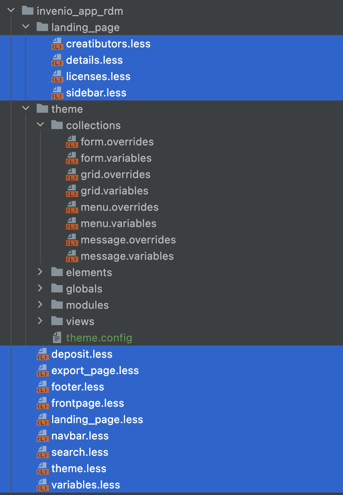

#CSS and JS best practices

## jQuery

The most common usage of jQuery is when we apply JS to jinja (HTML) elements. 

### Selectors

```html
<div id="my-tab-menu" class="ui tab menu">
  <div class="item active">Menu 1</div>
  ...
</div>
```

✅ DO

```javascript
$('#my-tab-menu').tab();
```

❌ DON'T
```javascript
$('.menu.tab').tab();
```

With the second approach you apply the function to all tab menu nodes on the page. What if there is a second menu? Or react element with the same class? None of your components/elements will behave as expected.  

## Semantic UI

### Documentation

Save your time and frustration, read the documentation (before you start with semantic UI)!


Why this is important? You might rush into using available components without knowing their full power - you will find yourself "reinventing the wheel", instead of using features already available in semantic. 

### Say no to custom CSS (before it is too late)


✅ DO
```javascript
render() {
  <Container>
    <MyComponent/>
  </Container>
}
```

or 

```html
<div class="container">
  ...your content
</div>
```

❌ DON'T

```javascript
render() {
  <div className="my-centered-content"> // try to avoid custom styling!
    <MyComponent/>
  </div>
}
```

```css
.my-centered-content {
  margin-left: auto;
  margin-right: auto;
}
```

==Documentation first, custom CSS only as a last resort.==

Semantic UI is quite complete as a theme, there is a high chance you can use one of many available props to style your component, instead of writing custom CSS (custom CSS is hard to maintain, especially for big projects, like ours).

#### File structure

✅ DO



❌ DON'T




Semantic UI has fixed file structure, therefore, for creating custom CSS, the best is to follow the structure of the theme, so that overwritten elements are easily found!

#### Custom CSS

Use only as a last resort!

Be aware of the scope of your changes. Do you want to overwrite only one instance of the element? 

✅ DO

```css
#my-unique-menu-element {
  ...
}
```

❌ DON'T

```css
.ui.menu {
  // this will overwrite the style of each menu element using this stylesheet!  
}
```

#### Not as important as it seems

❌ DON'T

```css
.ui.menu{
  color: red !important;
}
```

Using `!important` makes overriding (think about the cookiecutter and my-site instances) very complicated to the end user. With the semantic-ui templating system using `!important` should not be needed in most of the cases 