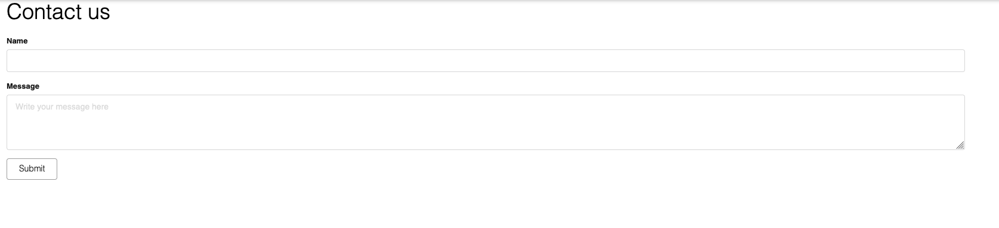

# Creating a custom view

_Introduced in invenioRDM v11_

To extend your instance with your own custom views, you can use the predefined “site” folder in your instance. The site folder works just like any other installed package. This means that you no longer need to develop and publish a separate package to add custom views and functionality to your instance.

Let's go through an example of making a new view in our instance:

## Enable the site folder

First of all, we need to make sure the site folder is available and editable. When installing InvenioRDM, you will get the following option:

```bash
Select site_code:
1 - yes
2 - no
Choose from 1, 2 [1]:
```

To generate the site folder, you will need to select option `1 - yes` (This is already the default option). Now, after the installation is ready, you can see a folder named "site" in the root folder of your instance, as well as the following line in your instance folder’s Pipfile:

```python

[packages]
    ...
my-site = {editable="True", path="./site"}
```

This means that the site folder is installed as a package with the name `my-site`, and it is editable. This package now works as any other package installed in your instance (`invenio-app-rdm`, `invenio-communities`, etc.), allowing you to customise your instance and create new views and features without adding a separate package manually.

When bootstrapped, your project will include the following structure:

```
├── site
│   ├── my_site
│   │   ├── assets
│   │   ├── templates
│   │   ├── __init__.py
│   │   ├── views.py
│   │   ├── webpack.py
│   ├── setup.cfg
│   ├── setup.py
│   ├── tests
```

## Configure your new view

To get started with our custom view, we will add a new folder in `./site/my_site`. In this example we will make a "support" view, hence we will name our folder "support". Our folder structure is now like this:

```
├── site
│   ├── my_site
│   │   ├── support
│   │   │   ├── __init__.py
│   │   │   └── support.py
```

In `support.py` we will define the class for our new support-view:

```python
from flask import render_template
from flask.views import MethodView


class MySiteSupport(MethodView):
    """MySite support view."""

    def __init__(self):
        self.template = "my_site/support.html"

    def get(self):
        """Renders the support template."""
        return render_template(self.template)
```

In our init function, we define the path to our template. In the get function we instruct our view to render the template we defined in the init function.

As you probably noticed, we added a reference to the template `support.html`. We will add this template in our templates folder:

```
├── site
│   ├── my_site
│   │   ├── support
│   │   ├── templates
│   │   │   ├── semantic-ui
│   │   │   │   ├── my_site
│   │   │   │   │   └── support.html
```

In this template we can add the following:

```HTML



    <div id="contact-page" class="ui container">
        <h1>Contact us</h1>
            
            <div id="root-container" class="panel-body"></div>
        
    </div>

```

We added a `<div>` element (`root-container`) to later render a react application on it.

## Register the view

Now we can register the view we configured in `support.py`. To do this, we will open the `views.py` file in `./site/my_site` and add a new url rule within the `create_blueprint` function like the following:

```python
blueprint.add_url_rule(
    "/support",
    view_func=MySiteSupport.as_view("support_form"),
)
```

Our full `views.py` file now looks like this:

```python
from flask import Blueprint
from .support.support import MySiteSupport

def create_blueprint(app):
    blueprint = Blueprint(
        "my_site",
        __name__,
        template_folder="./templates",
    )

    blueprint.add_url_rule(
        "/support",
        view_func=MySiteSupport.as_view("support_form"),
    )

    return blueprint
```

That is really all you need to get your custom view available on your desired path. If you now open your instance on `/support`, you will see the new template we added, `support.html`:


## Adding JavaScript to your template

If you want, or need, to use JavaScript for your template, we will need to configure webpack for the site folder. This is done in the predefined `webpack.py` file of `site/my_site`.

We can start by creating a js file in our assets folder:

```
├── site
│   ├── my_site
│   │   ├── assets
│   │   │   ├── semantic-ui
│   │   │   │   ├── js
│   │   │   │   │   ├── my_site
│   │   │   │   │   │   └── support.js
│   │   ├── support
│   │   ├── templates
```

Now we need to register this file in our webpack configuration, so that it will be available for us to use through our instance.

In our `webpack.py` we will add a new entry point, pointing to the file we just created:

```python
from invenio_assets.webpack import WebpackThemeBundle

theme = WebpackThemeBundle(
    __name__,
    "assets",
    default="semantic-ui",
    themes={
        "semantic-ui": dict(
            entry={
                "my-site-support": "./js/my_site/support.js",
            },
        ),
    },
)
```

Here you can see that we made an alias for our js-file: `my-site-support`, which is the name we will use to reference the file.

The JavaScript file could be anything that should be executed when the page is rendered, as an example it can render a simple Semantic UI Form:

```javascript
import React from 'react';
import ReactDOM from "react-dom";
import { Button, Form } from 'semantic-ui-react'

const rootContainer = document.getElementById("root-container");

ReactDOM.render(
    <Form>
        <Form.Input label="Name"/>
        <Form.TextArea label='Message' placeholder="Write your message here"/>
        <Button type='submit'>Submit</Button>
    </Form>,
    rootContainer // Target container on where to render the react components.
);
```

Now we are all set to connect the js-file to our template. In our template file `support.html`, we will add the following javascript block:

```HTML

    {{ super() }}
    {{ webpack['my-site-support.js'] }}

```

Now the full template will look like this:

```HTML



    <div id="contact-page" class="ui container">
        <h1>Contact us</h1>
            
            <div id="root-container" class="panel-body"></div>
        
    </div>



    {{ super() }}
    {{ webpack['my-site-support.js'] }}

```

As you can see, we are extending the predefined template from <a href="https://github.com/inveniosoftware/invenio-theme/blob/master/invenio_theme/templates/semantic-ui/invenio_theme/page.html" target="_blank">`invenio-theme/page.html`</a>. To make sure we keep all the existing references defined in the original template, we are adding `{{ super() }}` before our js-reference; we don't want to _override_ the existing JavaScript references, but rather extend the javascript-block to also include our new JavaScript reference.

Since we now added a new configuration for webpack, we will have to rebuild the assets of our instance by running the following command in our terminal:

```
invenio-cli assets build
```

and restart our instance

```
invenio-cli run
```

That's all! Now you should be all set to further develop your custom view as you like. 

See the final result for the example shown in this guide:


