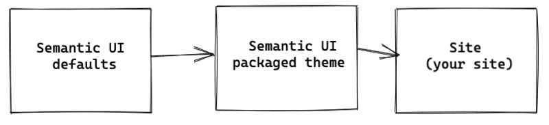
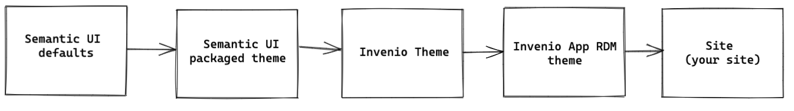

# Theming

This page will provide you with in-depth information about the InvenioRDM theme structure.

## Semantic UI

### Concepts

From Semantic UI docs:

> Semantic UI treats words and classes as exchangeable concepts.
Classes use syntax from natural languages like noun/modifier relationships, word order, and plurality to link concepts intuitively.

It basically refers to using the CSS classes to describe how the element looks like, not what it is, f.e.

```html
<div class="ui label right floated"></div>
```

tells us more about what to expect from the final view, rather than

```html
<div class="metadata-label"></div>
```

which has significant influence on the maintainability of the styling - and it is very important in large projects. It is easier for any developer to remember a few "behavioral" classes, rather than to remember that `metadata-label` will always be  right floated.

### Variety of available components and elements

Semantic UI exists both in "clean" HTML/CSS as well as in React. To know more about best practices between the two, visit [Best practices](../../develop/best-practices/react.md) page.

Semantic UI provides the developer with a plethora of ready to use React components and CSS classes. The important step in mastering Semantic UI development is consulting the documentation and experimenting with the outcome of using the provided elements. Custom CSS rules should be a last resort to achieve specific styling.

### Theme inheritance

The theming is based on the inheritance system created by Semantic UI, which needed to be adapted for InvenioRDM. The default structure is designed as follows:



While, for invenio-app-rdm we tweaked the theming structure into:



The theme structure was defined by providing our custom (overwriting Semantic UI defaults) InvenioRDM theme inheritance rules, available in [theme.less](https://github.com/inveniosoftware/invenio-app-rdm/blob/6249106ba962514338f8e313ff033f8f1bbd3fce/invenio_app_rdm/theme/assets/semantic-ui/less/invenio_app_rdm/theme/theme.less)

#### Your own theme

By **theme** we understand a common implementation of styling, in the common case it is InvenioRDM Theme. By **instance** styling we understand the final style sheets tweaking the InvenioRDM theme. The final styling is not overridable, and applied for the end instance (`my-site` instance)

If you would like to add another layer of **reusable** theme you can create your own "theme compiling" rules, by adding another layer to your own `theme.less`. By reusable we understand a theme, which will be "overwritten" in the final InvenioRDM instance.

#### Your customizations to RDM theme

If your instance is on the same "level" as `my-site` and is not extended further, everything is already configured in InvenioRDM, with no need for changes. To overwrite the InvenioRDM theme, use the [Customize theme section](../../customize/look-and-feel/theme.md).
