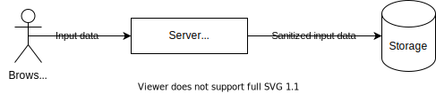

# Sanitize input data

This guide shows you some of the available tools in InvenioRDM to sanitize input data.
For a more thorough guide please see [OWASP Input Validation Cheat Sheet](https://cheatsheetseries.owasp.org/cheatsheets/Input_Validation_Cheat_Sheet.html)

## User input data

- **Input data** is ANY data that *a client sends to a server* (depicted below).
- **Output data** is ANY data that *a server sends to a client* (i.e. the opposite
direction).

This guide **only covers input data**, and namely how to sanitize the input
data.



Data provided by a user (trusted or untrusted) MUST be sanitized and
validated for two reasons:

1. Security
2. Clean well-defined data

### Types of validation

Validation is often a conflated term. It can mean:

1. Syntax - the structure of a message
2. Semantics - the meaningfulness of a message
3. Pragmatics - the logic governing our response to a message

This guide covers syntax and semantic validation. For instance an ISO-formatted
date like ``2021-12-25`` may be *syntactically* correct, but may be
*semantically* wrong if it is supposed to represent a start date in the future.
The date ``2021-12-25`` may be **semantically** correct but we may anyway be
unable to comply if e.g. it's a delivery date and we don't deliver on Christmas
day (example of pragmatics). Pragmatics is often a core part of your business
rules.

### Where do you find input data

Any data that a user can manipulate is considered input data which includes
for instance:

- HTTP request headers (*all*), examples include:
    - ``Accept``
    - ``Content-Length``
- URL:
    - Path (``/api/records/123``)
    - Query string ``?a=1&b=2``
- Request body:
    - Binary data (e.g. files)
    - Form data, JSON, XML, ...
- CLI args

### Client-side validation

Client-side validation (e.g. using JavaScript to validate the user provided
input data) is purely to improve the user experience. An attacker can always
bypass the client-side validation by constructing the same HTTP request that
the browser is going to send. Hence, while client-side validation improves the
user experience, it can in no way replace the server-side validation of data.

### General strategies

**Validate at the edge**

Validation should happen as early as possible so that our code works with
well-formed data.

**Whitelist over blacklist**

Generally, you should always whitelist instead of blacklist. Whitelisting means
you define all possible input data, while blacklist just excludes values.
If you forget to add a value to a whitelist, it rarely creates a vulnerability,
whereas if you forget to add a value to a black list it can create a
vulnerability.


### Types of input data

You can basically classify input data in two broad categories:

- Binary data (files such as images, PDFs, etc.)
- Text data (Headers, URLs, query strings, form data, JSON, XML, ...)

**Text data**

Text data is usually parsed on the server-side and interpreted by the server
application. Normally it is reasonably easy to validate and sanitize text data.

**Binary data**

Binary data is usually things like files such as images, PDFs, spreadsheets and
the like. In most case it is hard to impossible to validate and sanitize binary
data.

### Unicode strings

**When to use?**

You want to accept string input from a user (e.g. a title).

**Why?**

A typical example is a user that copy/pastes a title from a PDF and
inadvertently copies hidden unicode characters. These characters might not be
allowed in e.g. XML documents, and hence we cannot generate e.g. a DataCite XML
export format.

**Low-level**

```python
from marshmallow_utils.html import sanitize_unicode
sanitize_unicode(input_data)
```

**Marshmallow**

```python
from marshmallow_utils.fields import SanitizedUnicode
class ASchema(Schema):
    afield = SanitizedUnicode()
```

### HTML (rich text)

**When to use?**

You want to accept rich text input from a user (i.e. they should be able to use
formatting such as bold, italics, bullet lists etc.), so that you later can
render the rich-text.

**Why?**

The input data only allow a set of white-listed tags and escapes everything
else. This way, we're sure that we can later safely render the value without
opening up for XSS attacks.

**Low-level**

```python
from marshmallow_utils.html import sanitize_html
sanitize_html(input_data)
```

**Marshmallow**

```python
from marshmallow_utils.fields import SanitizedHTML
class ASchema(Schema):
    afield = SanitizedHTML()
```

### Could find what you were looking for?

If you didn't find the type of data you want to validate, please get in touch
on the chat room and we'll add an example.

### What to do when you cannot validate (file upload example)?

In some cases it is either not possible or even wanted to validate input data.
A typical example of this is a file upload (e.g. InvenioRDM must be able to
accept any file format including binary data and HTML files with possible
cross-site scripting attacks).

1. First of all, do validate all that's possible to validate. For instance content
   length, mime types, virus check and similar may all be possible to validate.

2. Be extremely clear (via e.g. naming) in your application when something is
   unvalidated and should be considered untrusted.

3. Serving out the file again, you should ideally serve it from a custom
   top-level domain (see e.g. how GitHub/Google/DropBox server user uploaded
   files). If not, you should prevent the browser from rendering the file (e.g.
   SVGs, HTMLs, PDFs, etc.) should simply be downloaded as a file or rendered
   as text/plain.

NEVER EVER allow file uploads and serve back the upload file again to other
users. It's a huge vulnerability.


The best example is likely that you need to be able to upload any file format
to InvenioRDM.

