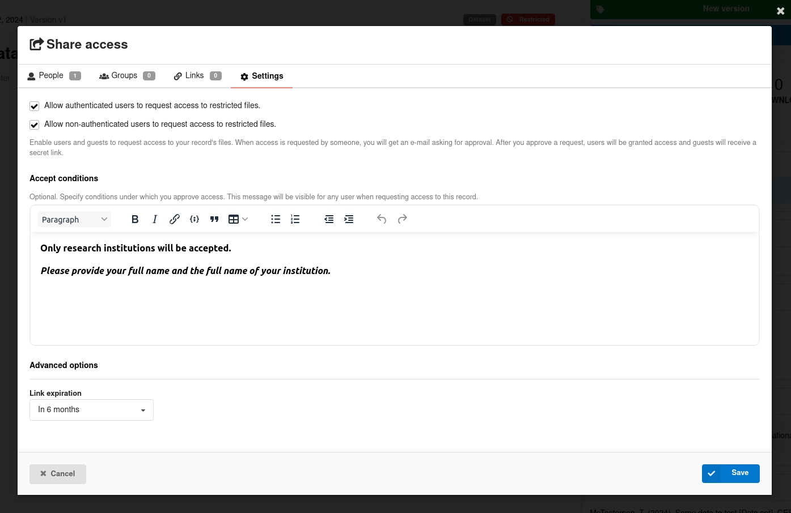

# Request access to restricted files of a record

_Introduced in InvenioRDM v12_

You can allow authenticated and non-authenticated (guest) users to request access to view the restricted files of a public record. Access can be set to expire on a specific date as well as never expire.

This can be useful for record owners to manage access to restricted files of each record. For unauthorized users, it gives the possibility to request access to the files.

Note: accepted access requests grant to the requestor access to **all** versions of the record.

## Enable access requests

As a record owner, you first need to allow accessing restricted files via a request:

0. Create a record with restricted files

1. Click on the "Share" button on the record landing page:

2. Navigate to the "Settings" tab of the modal:

3. Change the settings for the access requests:

    * Allow authenticated or/and unauthenticated users to request access to restricted files of your record.
    * Accept conditions. Provide a message that will be visible to the users in the request form (see screenshot below)
    * Set access expiration date. This setting will be applied by default to all access requests. When reviewing an access request, you can set a different value.

4. Save your changes

Now both authenticated and anonymous users are able to **request** view access to your record’s files. You need to approve their request to grant them access to your record's files.

## Request access to restricted files

As a user that would like to get access to restricted files of a record, it is necessary to **fill in the request form** appearing in the record landing page. This action creates and submits a new access request: the record's owner will be notificed, and the request will appear on their respectives dashboards.

## Accepting/Declining the request

The submitter and the record's owner can find the newly created access request in "My dashboard" -> "Requests", and can exchange comments. The record's owner can define a new expiration date (changing the default settings) for this access request, accept or decline it:

After accepting the request, the requestor will receive a notification by e-mail and will be able to access the restricted files:

