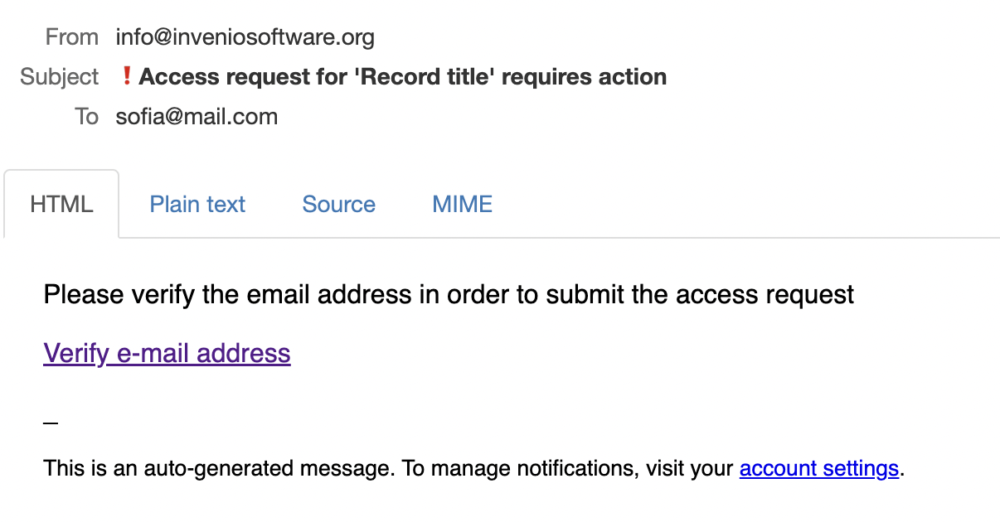

# Access requests to restricted files of a record

Functionality allows authenticated users and guests to request access to view the restricted files of a record. Access can be set to expire on a specific date as well as never expiring.

As a record owner, firstly, you need to allow different types of users to create access requests to your record's files:
0. Create a record with restricted files
1. Click on the "Share" button on the record landing page:

2. Navigate to the "Access requests" tab of the modal:

3. These are the settings for all access requests in general. 
*  Allow authenticated or/and unauthenticated users to request access to restricted files of your record.
*  Accept conditions. Provide a message that will be visible to the users in the request form (see screenshots below)
*  Set access expiration date. This setting will be applied to all the approved requests, unless you individually set them to a different option on the request page.

4. Save your changes and close the modal

Now both authenticated and anonymous users are able to **request** view access to your record’s files. You need to approve their request to grant them access to your record's files. The view for different types of users is different.

Here is the flow of a guest user:
1. Open the record with restricted files. See that there is an access request form on the page

2. Read request acceptance conditions in the form, provide your email address and your full name, add a request message. Click on the "Request access" button when done.

3. You will get an email with verification of your email address

4. Click on “Verify e-mail address” link

5. It will redirect you to the request page. At this point, the request is created and record owner can see it. You can add more comments to your request or cancel it.

Now let's take a look at the request page of the record owner.
1. Navigate to "My dashboard" -> "Requests" and click on the title of the record to open the request main page

2. Here there is a possibility to accept or decline a request, add a comment and change the access expiration date individually for this person.

After accepting the request, Sofia gets notified by email and is now able to access the files!
Guest user request page:

Record landing page:

The flow of an authenticated user is similar, with slightly different UI:

There is no email confirmation, user gets redirected to the request onclick of the "Request access" button:
