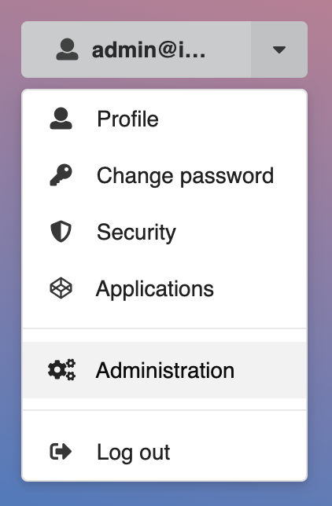
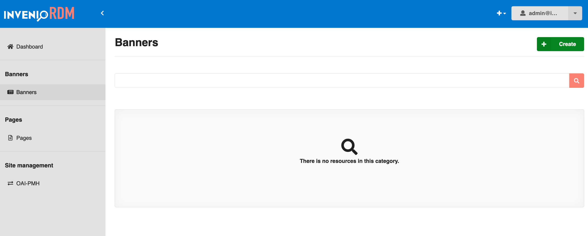
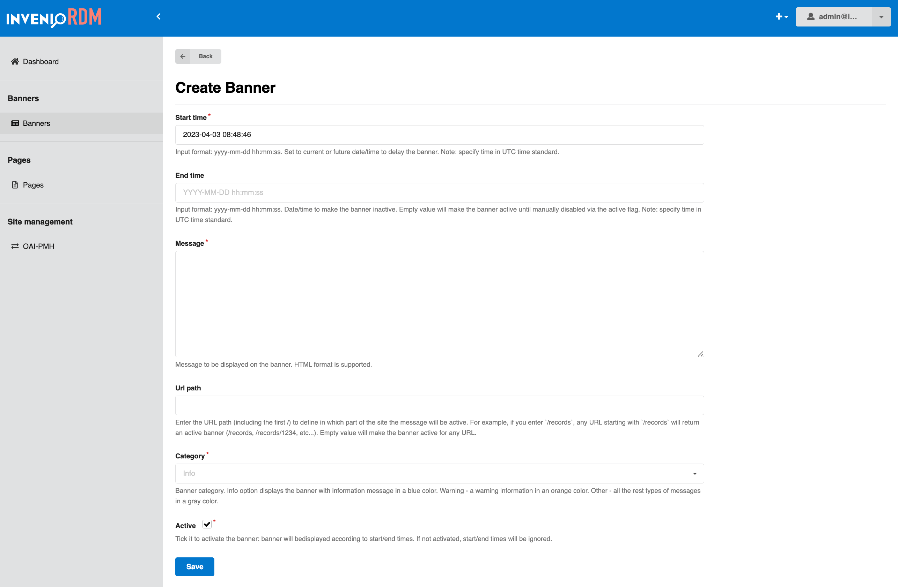
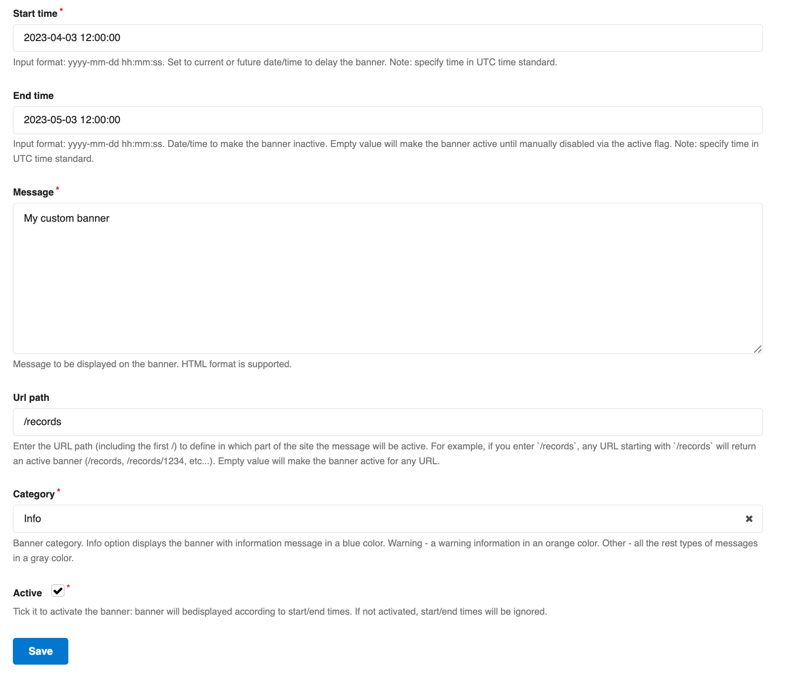
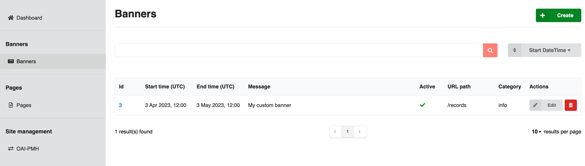
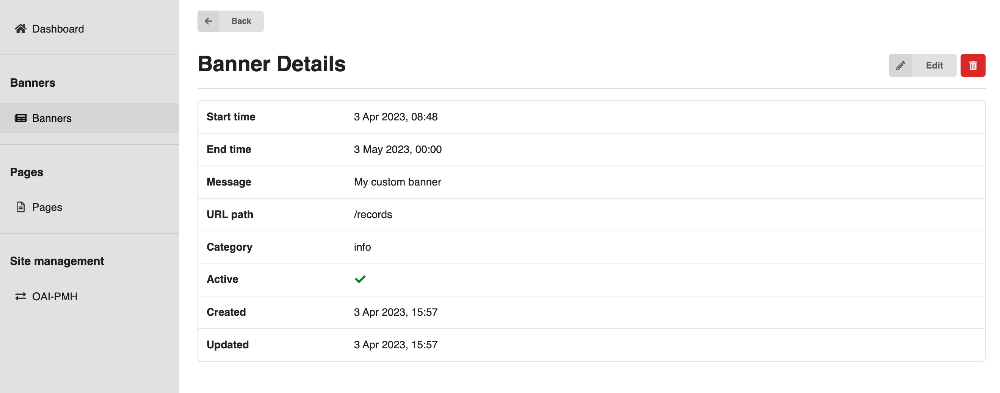
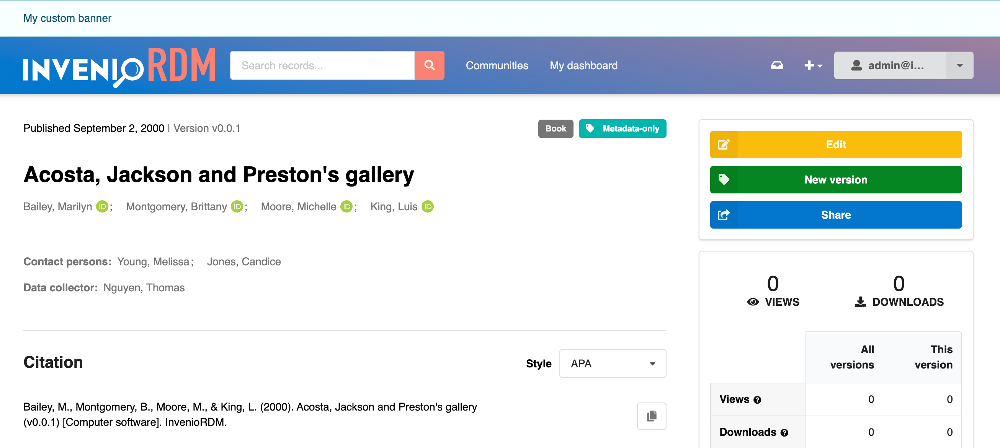
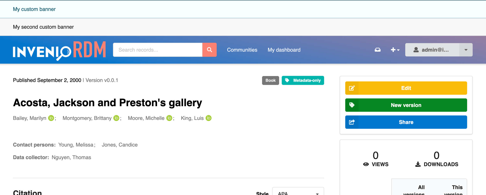

# Site banners

Banners can easily be added to your InvenioRDM instance through the admin panel. They can be added globally or to a specific path. 

## Adding a new banner

**As an admin user** you can add new banners through the admin panel at `/administration`. This is also available through the user-menu in the top right corner of your instance:

In the admin panel you will see "Banners" as a menu item in the sidebar. If you enter this, you will be shown an overview of all the banners added in your instance. In our case this list is empty, as we didn't add any banners yet.

To add a new banner, you can click the green "Create" button in the top right corner. This will take you to the form where you can add all the details for your new banner:

Here you can see that the first field "Start time" is already prefilled, however, you are free to update this to whatever start date and time you want. Note that both the start and end time need to be specified in UTC format.

- "Start time" (UTC format) is when your banner will become visible on your site.
- "End time" (UTC format) is when your banner will deactivate automatically.
- "Message" is the content that will show in your banner.
- "Url path" lets you specify where your banner should be visible. If left empty, the banner will show on every page of your site. If you specify a subpath, e.g. `/records`, the banner will show only on `/records` **and all its subpages** e.g. `/records/1234`.
- "Category" is where you can define the theme of your banner. Info - blue, Warning - orange, Other - gray.
- "Active" needs to be checked to activate the banner. This ensures that the banner will show on the given start time and deactivate on the given end time. If left unchecked, the start and end times will be ignored, and the banner will not be visible. This can be used to deactivate the banner temporarily, or permanently.

In the following example, the banner will show up on all subpages of `/records` as an info-banner between April 3rd, 2023 at 12:00 and May 3rd, 2023 at 12:00.

When ready, click save and you will be taken back to the "Banners" page where the new banner will appear in the list:

The list is searchable and can be filtered by selecting an option from the dropdown next to the search bar, above the list of banners.

From the list you can see the key details of your banners, and whether they are active or not. You can also edit a banner by clicking the "Edit" button in the "Actions" column, or delete it by clicking the trash can.

Clicking the link in the "Id" column will take you to a details page where you can see more details of the selected banner:

Now that the banner is enabled, visiting any page under `/records` within the specified date range, will show the banner above the header:

If you have multiple active banners at the same time, they will simply stack on top of each other:

