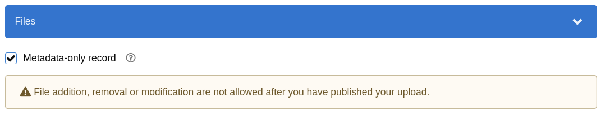

# Metadata-only records

A metadata-only record is a record that contains only descriptive metadata, and no associated files. These types of records can be useful in cases where the resource does not have a corresponding digital object or its files are hosted elsewhere.

The site administrator can choose to enable or disable the creation of metadata-only records. For more on that, see [this section](../../customize/metadata_only.md).

To mark a record as metadata-only, simply select the "Metadata-only record" checkbox when creating a new record:

