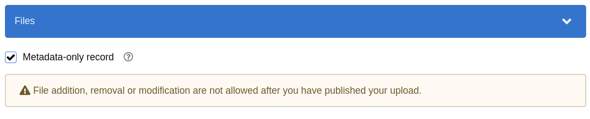

# Metadata-only records

A metadata-only record is a record that contains only descriptive metadata, without any associated files or content. These types of records can be useful in cases where you want to provide metadata for a resource that does not have a corresponding digital object or content file.

The site administrator can choose to enable and disable the creation of metadata-only records.

To mark a record as metadata-only, simply select "metadata-only" when creating a new record:
