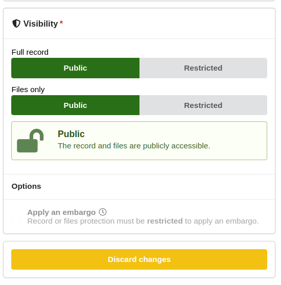

# Restricted records

A record can be marked as restricted in order to restrict its access to specific users. This is useful for example to share a record with a colleague or team before making it public.

## Setting a record to be restricted

When creating or editing a record, click the "Restricted" checkbox under "Full record" in the "Visibility" section of the form to make the entire record -metadata and files- restricted:

To **only** make the files restricted, click the "Restricted" checkbox under "Files only" in the "Visibility" section.
