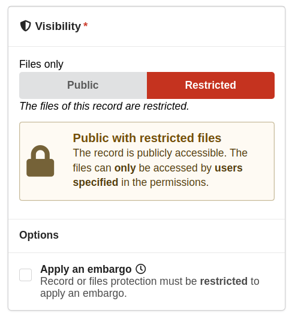
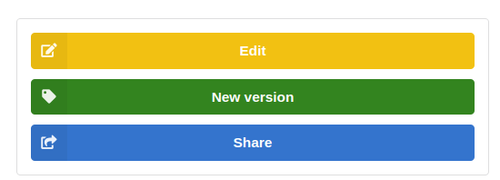
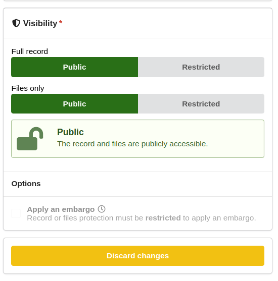

# Restricted records

A record can be marked as restricted in order to grant access to it only to a specific group of users or organisations. This is useful for example if you want to share a record with a colleague or team before making it public.

## Creating a restricted record

When creating a new record, you can mark it as restricted by clicking the "Restricted" checkbox in the "Visibility" section of the form:

## Modifying an existing record

You can also edit an existing record and mark it as restricted. To do this, go to the record's details page and click the "Edit" button in the top right corner:

Next, in the visibility section of the form, check the "Restricted" checkbox:

Note: You can either mark the **whole** record as restricted or **only** the files.

