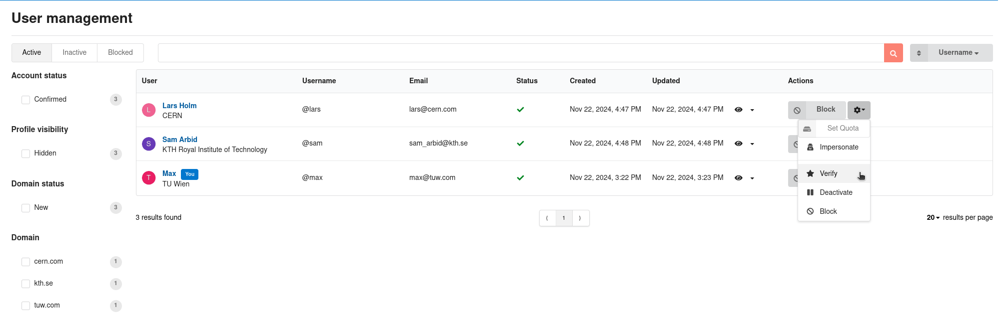

# Administration panel

The administration panel is a feature in InvenioRDM introduced in v10 that provides a graphical user interface for managing users and records. It is designed to be used by administrators and superusers to moderate the content of the repository.
For more technical details you can read the [developer guide to the InvenioRDM administration panel](../develop/topics/administration_panel.md), detailing its programmatic interface and usage.

## Moderation of users and records

{ loading=lazy }

_Introduced in InvenioRDM v12_

The administration panel now includes a "User management" section to deactivate, block and delete users, as well as undo all those actions. Deactivating a user temporarily prevents them from creating records, but lets them appeal their deactivation. Blocked users cannot sign in anymore and deleted users have their records removed from public view and replaced with a tombstone page indicating that the user has been blocked.

Records can also be deleted (with a grace period for appeal or undoing) which empowers administrators to enforce institutional policies and fight spam. This leaves a [tombstone page](../reference/metadata.md#tombstone) in place of the record landing page. See the [Concept DOIs section](../releases/v12/version-v12.0.0.md#dois-for-concept-records-and-no-dois-for-restricted-records) below for a screenshot.

Associated JSON APIs (e.g. `/api/domains`) have been added. Bulk versions of these are in the works.
