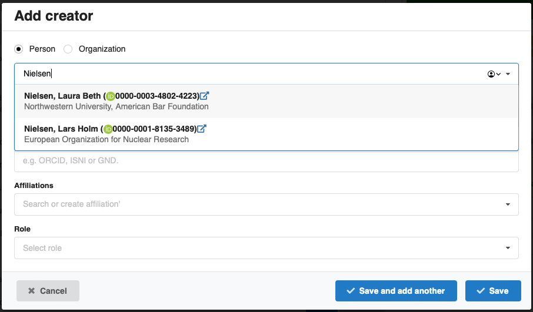
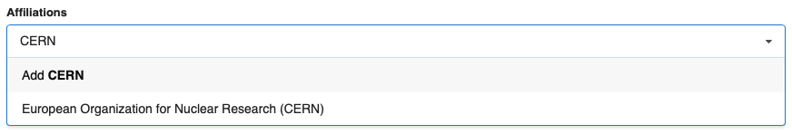
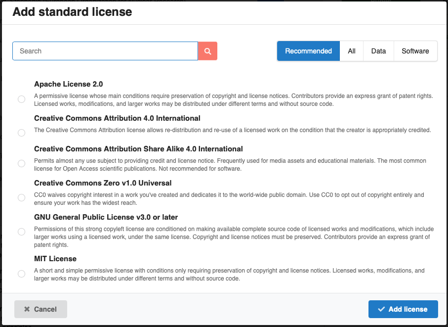

---
hide:
  - toc
template: features_sub.html
image: ../images/responsive.png
summary: "Finally a repository that your users will love! We have thought hard about user experience for everyone: end-users, curators, system administrators, and developers. Expect more of your repository!"
---

## Simple and intuitive

We work hard to make the user interface of InvenioRDM as self-explanatory as possible, and provide a simple and intuitive interface that's usable by all. Head over to our [demo site](https://inveniordm.web.cern.ch) and see for yourself.

## Auto-completion

Everybody wants complete metadata, but nobody wants to enter it!

Our upload form focuses on essentials and uses auto-completion to make it easy for users to enter metadata. We can link to authority records for names, affiliations, licenses and more.

**Names and affiliations**

Adding a creator/contributor auto-completes from our names vocabulary that can be fed from e.g. ORCID or your institutional directory service:

If a creator is not in the names vocabulary, we can still auto-complete the affiliations from e.g. [ROR](https://ror.org):

Our auto-completion makes it easier for users to deposit, but also ensures we obtain high-quality metadata. It can even be linked to authority records.

**Licenses**

Many users don't understand about licenses or open access, so we make it simple by preselecting the standard license of your choice, and presenting users with recommended licenses:

## Accessible and responsive design

Our interface works well on both desktop, tablet or mobile and is tested against Web Content Accessibility Guidelines (WCAG) according to the level AA compliance.

