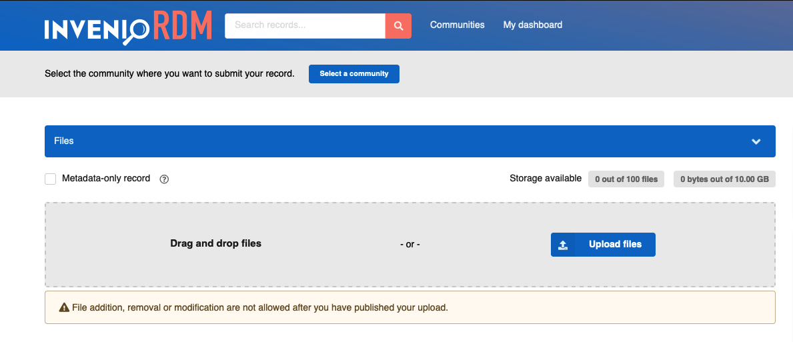
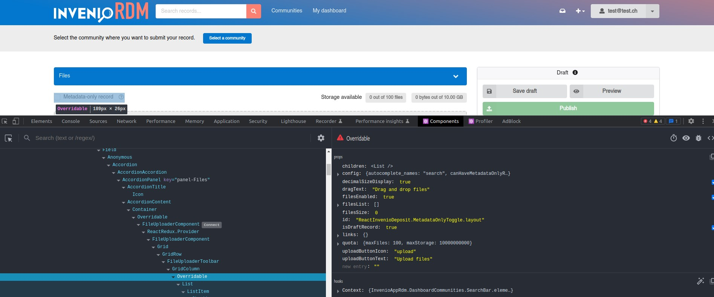

# How to override UI React components

*Introduced in InvenioRDM v11*

This documentation is targeted to developers who want to customize specific UI React components in an instance.
For this guide, we assume that you are familiar with React and JavaScript.

## Override React components

!!! warning "Experimental feature"

    You can now override React components following this guide. However, the overriding mechanism in InvenioRDM v11 is not finalized
    and it has a few limitations. Be aware that future releases of InvenioRDM might introduce breaking changes. We will document them
    as extensively as possible.

    **Use it at your own risk!**

The UI of InvenioRDM is composed of classic HTML web pages for mostly static content, and React web apps for very dynamic content to enhance the user experience.
While a [dedicated guide](../customize/look-and-feel/templates.md) describes how to override HTML web pages (Jinja templates), this guide focus on how to override React components.

InvenioRDM uses the React library [`react-overridable`](https://github.com/indico/react-overridable). The library provides a mechanism to mark React components as "overridable" by id.
Developers can define a map `{ id: Overridden React component }`, which is then applied when each React component is rendered: the overridden component is rendered instead of the default one.

As example for this guide, you will learn how to override the UI React component **in the upload form that marks a record as "Metadata only"**. More specifically, you will replace the "Metadata-only record" checkbox with a toggle, a "switch-like" component.



## Steps

### Identify how to override

At the moment, the easiest way to understand how to identify if the component that you want to override is a classic HTML component or a React component is to use the Developer Tools in your browser (e.g. [Chrome](https://developer.chrome.com/docs/devtools/) or [Firefox DevTools](https://firefox-source-docs.mozilla.org/devtools-user/)). You can inspect the code and take advantage of some useful [React browser extensions](https://beta.reactjs.org/learn/react-developer-tools) to select and inspect elements:



You can then find the component in the InvenioRDM modules source code, searching it in your local development environment or using the search feature in GitHub in the [inveniosoftware organization](https://github.com/search?q=org%3Ainveniosoftware+FileUploaderToolbar&type=code).

You can always [ask for help](../develop/getting-started/help.md)!

### Find the React Overridable ID

The React component's overridable id for the '`Metadata-only record`' checkbox component is `ReactInvenioDeposit.FileUploaderToolbar.MetadataOnlyToggle.container`. It can be found in the [react-invenio-deposit](https://github.com/inveniosoftware/react-invenio-deposit/blob/040b698967e7fee14ac7fe466e49f883efbe8c47/src/lib/components/FileUploader/FileUploaderToolbar.js#L55) module.

### The mapping file

In a new InvenioRDM v11 or above installations, an almost empty file named `mapping.js` is available at the following path in your `assets` folder:

```terminal
├── assets
|   ├── js
|   |   ├── invenio_app_rdm
|   |   |   ├── overridableRegistry
|   |   |   |   ├── mapping.js
```

For existing installations, you will have to create it. It is a very simple file:

```javascript
export const overriddenComponents = {};
```

The `const overriddenComponents` is the map that will contain all your future overridden components.

### New component creation

Let's create a new React component, very similar to the default `FileUploaderToolbar`, changing the UI component that will render. In the same file `mapping.js`, add the following code above the `const overriddenComponents`:

```javascript
  import React from "react";
  import { Checkbox } from "semantic-ui-react";
  import { useFormikContext } from "formik";
  import PropTypes from "prop-types";

  const MetadataToggle = (props) => {
    const { filesEnabled } = props;
    const { setFieldValue } = useFormikContext();

    const handleOnChangeMetadataOnly = () => {
      setFieldValue("files.enabled", !filesEnabled);
      setFieldValue("access.files", "public");
    };

    return (
      <Checkbox
        toggle
        label="Metadata-only record"
        onChange={handleOnChangeMetadataOnly}
      />
    );
  };

  export default MetadataToggle;

  MetadataToggle.propTypes = {
    filesEnabled: PropTypes.bool.isRequired,
  };
```

Now, change the map by adding your new component:

```javascript
...

export const overriddenComponents = {
  "ReactInvenioDeposit.FileUploaderToolbar.MetadataOnlyToggle.container": MetadataToggle,
};
```

Lastly, rebuild your assets and run the instance:

```terminal
cd my-site
invenio-cli assets build
invenio-cli run
```

When navigating to the upload form, you should now see your new React component instead of the default:


## Other examples

Let's hide completely the '`Metadata-only record`'checkbox from the upload form.

It is possible to remove a component using the overridable strategy. In the previous example, instead of declaring a target component `MetadataToggle` you can simply change the map to:

```javascript
export const overriddenComponents = {
  "ReactInvenioDeposit.FileUploaderToolbar.MetadataOnlyToggle.container": () => null,
};
```

The expression `() => null` above is defining an "empty" component, thus removing it from the upload form.

In order to see more examples in action, you can check the [zenodo-rdm](https://github.com/zenodo/zenodo-rdm) repository!
