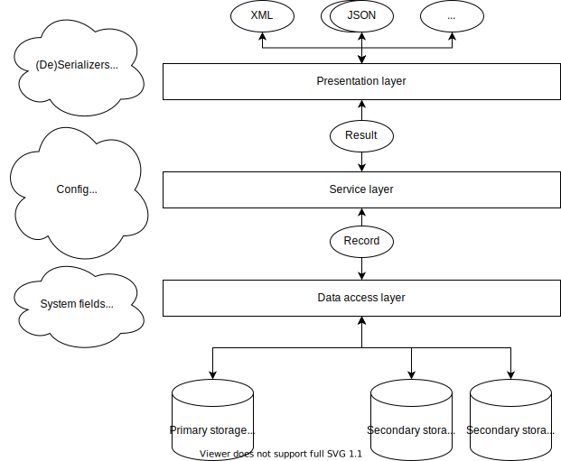

# Architecture

**Intended audience**

This guide is intended for maintainers and developers of InvenioRDM itself.

**Scope**

The guide provides a high-level architecture overview of the core part of InvenioRDM.

!!! warning "Work in progress"

    This section is under development.

## Layers

InvenioRDM has a layered architecture that consistent of three layers:

- Presentation layer
- Service layer
- Data access layer

There is a strict data flow between the layers, and each layer has very specific responsibilities. It's highly important that you as a developer know the basic principles for the  data flow and  each layer's responsibilities. Failure to understand the basic data flow, leads to using the wrong objects for the wrong things, which eventually turns into messy unmaintainable code.

**Data flow basics**

The diagram below shows a simplified view of the data flow in the architecture.

*The presentation layer* parses incoming requests and routes them to service layer. This involves sending and receiving data in multiple different formats and translating these into an internal representation, as well as e.g. parsing arguments from an HTTP request (e.g parsing the query string parameters).

*The service layer* is completely independent from the presentation layer and can be used by many different presentation interfaces such as REST APIs, CLIs, Celery tasks. The service layer contains the overall control flow and is responsible for e.g. checking permissions and performing semantic data validation.

*The data access layer* is responsible for ensuring data integrity, harmonizing data access to different storages as well as fetching and storing the data in the underlying systems.

The data flow between the layers is strictly limited to some few well-defined objects to ensure a clean separation of concerns. The presentation layer communicates with the service layer via a e.g. a record projection (i.e. a view of a record localised to a specific identity). The service layer communicates with the data access layer via e.g. a record entity that provides data abstraction, syntactic data validation, and a strong programmatic API.

!!! tip "Tip: Where do you belong?"

    A key question you should always ask yourself when designing or writing code is where you code belongs in the architecture:

    - Is it a presentation, service, or data access layer object?
    - Is the object crossing boundaries between layers?

    Answering where you code belongs helps identity and disentangle responsibilities.

### Data access layer

The data access layer is responsible for:

- Fetching and storing data on primary (the database) and secondary storage (Elasticsearch, cache, files, ...).
- Harmonizing data access to the same object on primary and secondary storages (e.g. a record in the database vs in the Elasticsearch index).
- Ensuring data integrity and managing relations among data objects.

The data access layer usually lives inside an Invenio module in a package named ``records``. It may consist of

- Record APIs (``/records/api.py``).
- JSONSchemas (``/records/jsonschemas/``).
- Elasticsearch mappings (``/records/mappings/``).
- SQLAlchemy models (``/records/models.py``).
- System fields (``/records/systemfields/``).
- Dumpers (``/records/dumpers/``).

**Purpose**

The data access layer serves two purposes:

- Provide a strong programmatic API that produce a clean, simple and reliable
  control flow in the service layer.
- Persist our business objects on data storage in an reliable and performant
  way.

!!! tip "Tip: Messy service layer?"

    If you service layer code looks messy, likely you need to work on your data
    access layer.

    A typical example is the service layer doing data-wrangling with
    dictionaries. For instance a conditional get on a dictionary key (e.g.
    ``data.get('...')``), or having to e.g. convert back and forth between
    data types (e.g. UUIDs to/from strings).

**Guiding principles**

The data layer is built around the following guiding principles:

- One data representation: The service layer should work with one an only one
  data representation of an entity independent of if the entity was retrieved
  from primary or secondary storage.

- One primary storage, many secondary storages: The primary version of a record
  exists in one and only one copy on the primary storage (the database),
  however multiple secondary copies may exist in the search index.

- Idempotence of dumping/loading: Dumping and loading to/from secondary storage
  (such as the search index) must produce the same record.

- Denormalization over normalization: If we have to choose, we usually prefer
  fast read speed over fast write speed.

- Data versioning: We version data and rely heavily on optimistic
  concurrency control for detecting conflicts and determining stale secondary
  copies.

**Record API**

The record API is the primary programmatic API that the service layer uses to
work with the data access layer. The record API ensures data integrity and manages
the life-cycle of the record itself and related objects such as persistent
identifiers and files.

The record is in charge of:

- define the structural schema that data is validated against (using
  JSONSchemas).
- define search index routing and indexing behaviour.
- managing the life-cycle of an associated persistent identifier.
- data versioning
- state management

A record is usually defined using a declarative API named system fields based
on Python data descriptors.

**JSONSchemas**

The JSONSchemas defines the structure of a JSON document we store in the database. The main responsibility is structural validation of the JSON document. The best analogy is that it is a database table schema. Most importantly, it is NOT responsible for business-level validation of the JSON document.

A good example of this, is making a field a required property. It's correct to require a property if you would e.g. have defined a database table column as ``NOT NULL``. It's wrong to require a property, if it's requirement that the user must enter a value in a certain field (because this is business-level validation, and you may want to store partially valid documents).

Modules:
- Invenio-Records: Defines the high-level APIs for the Record API, SQLAlchemy models, system fields and dumpers.
- Invenio-JSONSchemas: Provides a registry for JSONSchemas available to the application.

**Mappings**

The Elasticsearch mappings define how records are indexed and made searchable. Records are denormalised when indexed to provide high performance for searches over the records. The mapping MAY therefore define additional fields compared to the JSONSchema.

**Dumpers**

Dumpers are responsible for dumping and loading prior to storing/fetching records on secondary storage (e.g. the Elasticsearch index), and play a key role for harmonizing data access to records from primary and secondary storages.

Dumpers are specific to a secondary storage system (e.g. an Elasticsearch dumper, a file dumper, ...).

The dump and load of a dumper MUST be idempotent - i.e. ``record == Record.load(record.dump())``. This ensures that independently of if a record was retrieved from primary or secondary storage, it has the same data and works in the same manner.

For instance, the Extended Date Time Format dumper works in the following manner:

- The dump adds a start and end date range so that the EDTF can be queried by Elasticsearch.
- The load removes the two start and end date fields from the Elasticsearch document when loaded.

**System fields**

System fields are responsible for:

- providing *managed access* to a top-level property in a record
- manages relations with other objects
- hooking into the record life-cycle

System fields basically provides a declarative programmatic API that makes it easier to work with records and related objects. Under the hood, system fields are Python data descriptors.

A key design principle for system fields, is that an *instance* of a system field manages a single namespace of a record so that system fields do not conflict. For instance an access system field manages the top-level ``access`` key in a record ``{'access': ...}``.

System fields participate in the dumping/loading of records from secondary storage via being able to hook into the record life-cycle. The difference between system fields and dumpers, is that a dumpers produce a dump for a specific secondary storage system, while system fields produce the same dump for all secondary storage systems.

System fields may be used to manage relations to other objects, and can work similar to a foreign key.

Applications of system fields are vast, but some examples include:

- Added ``$schema`` to the record to ensure JSON schema validation.
- Created, update and delete persistent identifiers for records and serialize them into the record.
- Ensure a certain property on the JSON document is operated as a set.

System fields to a large degree avoids building inheritance among record APIs and instead provides a declarative way of composing a record API class.

**SQLAlchemy models**

SQLAlchemy record models are responsible for storing the master version of a record (i.e. the primary storage) and provide database independence. All record models share some few common properties:

- A JSON column for storing the JSON-encoded document of a record.
- An internal UUID identifier.
- Creation and modification timestamps.
- Version counter for optimistic concurrency control.

UUIDs are used because they are storage efficient (128 bits) and random so that an application server can generate an id with low chance of collision.

It's important to understand that there's two distinct representations of a record:
- Python dictionary
- JSON document

These two distinct representations of a record may often be very similar, but it's important to understand that the JSON document is constrained to the JSON object model, while the Python dictionary can hold more rich data types as long as they are JSON-serializable (e.g. a datetime object).

### Service Layer

The service layer contains the business logic of the application and is responsible for:

- Authorization (i.e. checking permissions)
- Business-level validation
- Control flow - e.g. transaction management,

**Guiding principles**

TODO

- Mimick the end-user interface

- Clean control flow

- Interface independent

- Independent of the Flask request context

- Data flow

- Components responsible for setting data on a record.

- Who creates a service

**Service**

TODO

**Service config**

TODO

Responsibility:
- Inject dependencies via a single object.

**Service schema**

TODO

Responsibility:
- data validation
- field-level permission checking
- dumping and loading record projections

**Search**

TODO

Faceting, query parsing, etc.

**Permissions**

TODO

- Policy
- Need generators

**Components**

TODO

Responsible for providing a specific feature in the service, and make the service customizable.

### Presentation Layer

The presentation layer

**Guiding principles**

TODO

**Celery tasks**

TODO

**Views**

TODO

**Resources**

TODO

- RESTful routing
- Dependency injection

**Resources request context**

TODO

- Contains only validated parsed data.
- HTTP request parsing: body, headers, query string, path
- Content negotiation

**Resource configs**

TODO

- Dependency injection

## How did we arrive here?

The overarching goal of the architecture is similar to any other software
system. We want a software system that's easily maintainable, scalable,
extendable, adaptable, resilient, and *...insert your favorite buzz words...*.

There's a lot of methodologies and patterns on how to build and architect
software systems. However, in practice, while methodologies are useful
it's often more about tradeoffs and finding the right balance rather than
strict application of a specific methodology. Most of the time you have to deal
with deadlines, requirements, design patterns, costs, legacy code, people,
projects, prior history and practices.

InvenioRDM is no different. The architecture is largely a by product our past
experiences and challenges we've faced. The architecture as described here, is
not meant to be final answer, but rather an evolving architecture that adapts
and improve over time.

TODO

Some of the challenges we faced:

- **High developer turn-over and many juniors**: Onboarding, documentation,
  boundaries, spaghetti code.
- **Spaghetti code**: data massaging all over the place, type conversions.
- **Bad design choices**: moving big files,
- **Recovering from failures**: massive database crashes, file loss on big
  distributed storage clusters, and eating our own dog food.

## Why not?

TODO

- Microservices: Is not a substitute for an architecture. It's just another way of tieing a system together. Running becomes harder especially for small institutions.
- NoSQL: SQL database have been around for the past 40 years, and are highly reliable systems. Most NoSQL systems have not been around for so long.
