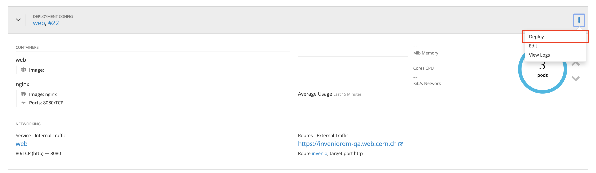
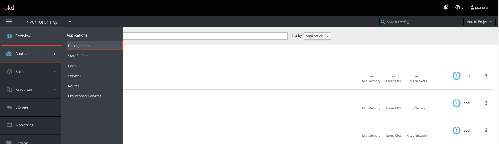
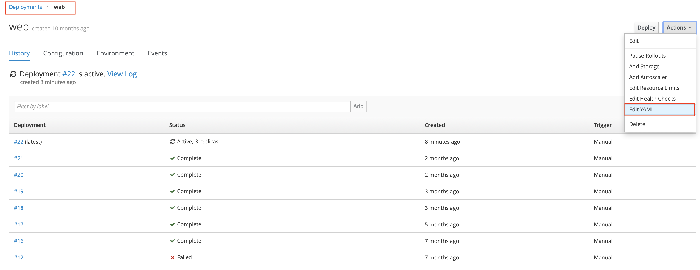

# InvenioRDM Demo site

The production demo site can be seen at [https://inveniordm.web.cern.ch](https://inveniordm.web.cern.ch).
The QA demo site is accessible at [https://inveniordm-qa.web.cern.ch](https://inveniordm-qa.web.cern.ch).

## Upgrade the instance

Both QA and production instance are located in [https://openshift.cern.ch](https://openshift.cern.ch),
in a project with it's name: `inveniordm` and `inveniordm-qa`. The steps
to upgrade any of the two instances to a newer version or release is the same:

**1. Upgrade the instance content**

This step includes updating the dependencies in the Pipfile, templates and any other
file that needs to be changed for the corresponding release. The contents of the site
are located in [GitHub](https://github.com/inveniosoftware/demo-inveniordm). The demo
site is an InvenioRDM instance and thus can be used in your local machine with the
*invenio-cli*, which is useful to test the changes.

Once the changes are correct, make a PR to the repository.

**2. Upgrade QA**

Merge the PR made in the step above. This will trigger a new Docker build, which will
be tagged as `latest`. This will trigger a rolling deployment of the web and worker pods.
If the deployment does not get triggered, you can manually re-deploy by clicking `deploy`.



**3. Upgrade site content**

Note that this step is only needed if the data model changed, and therefore database and
indexes need to be wiped out and re-populated. We will perform this steps by connecting to
OpenShift on our terminal. However, you can do the same steps with the `Terminal` provided
in the OpenShift web UI.

- Login in OpenShift and select the project:
```console
oc login https://openshift.cern.ch
oc project inveniordm-qa
```
- Select one of the web pods to connect to, for example `web-18-wlbqs`:
```console
oc get pods
oc exec web-18-wlbqs /bin/bash -c
```
- Then you need to wipe and re-create the content. All the `invenio` commands needed
are available in the `wipe-recreate.sh` script. You just need to run it. In case you
need to cross-check anything (e.g. assets creation) the instance path is `/opt/invenio/var/instance/`.

**4. Upgrade the production site**

Once you are sure that the QA site got migrated properly and there are no errors,
you have to migrate the production site. The first step is to create the docker image.
For that, you need to add a release commit and tag the contents of the [repository](https://github.com/inveniosoftware/demo-inveniordm).
Note that the tags follow the numeration of the `invenio-app-rdm` package they contain,
so for an image with `invenio-app-rdm==0.25.9` you would do:

```console
git commit --allow-empty -m "release: v0.25.9"
git tag v0.25.9
git push origin master v0.25.9
```

This will create another docker image with the version tag (`0.25.9`).

Once the tag is create you need to update said tag in the OpenShift project.
The easiest way to do it is manually on the web UI. For that go to *Applications->Deployment->Web->Edit YAML*.





Note that the image version needs to be changed also in the `worker` pods.

Finally, repeat step 3 to cleanup and re-create the content on the production site.