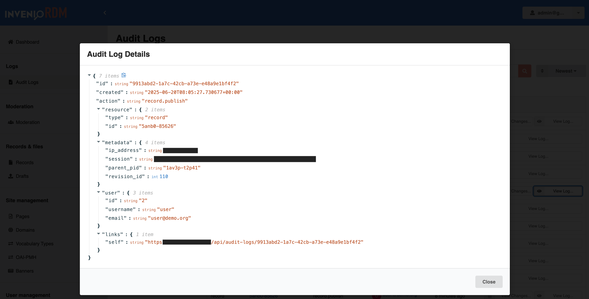

# Audit logs

_Introduced in v13_

## Summary

This document serves as a developer guide to the Audit logging feature, detailing its functionality.

## Intended Audience

This guide is designed for developers working with InvenioRDM.

## Overview

The Audit logging feature provides a mechanism to track actions performed within the InvenioRDM framework. It integrates with the existing service layers, ensuring that the relevant operations are logged.

For example, audit logs allow admins to track resource actions like creating/editing/deleting a draft and publishing a record.

## Implementation

InvenioRDM implements Audit logs as records, leveraging the framework's existing record management infrastructure. This approach ensures efficient querying, indexing, and management of log entries.

### Storage

The Unit of Work (UoW) pattern is used to maintain consistency across storage backends, such as the database and the configured search backend (e.g., OpenSearch). This ensures that all operations, including creation, updates, and indexing, are handled transactionally, keeping the database and search index synchronized.

### Service Layer

The service layer provides the core functionality for managing audit logs, including creating, searching, and retrieving log entries from the DB and Search backend.

### Permissions

Access to audit logs is controlled via the Invenio permissions system. Currently only the System User can create audit logs and administrators can read them. The permissions can be updated in the permission policy class to, for example, provide read access to other user roles.

### Resource layer

Additionally, the audit logs feature includes a resource layer that defines RESTful API endpoints. These endpoints allow users to search and retrieve audit log entries via URL routes, enabling seamless integration with external systems and user interfaces.

**Key Endpoints:**

- **Search Logs**: _GET_ `/api/audit-logs?q=abcd-1234`
  Allows users to perform a query over audit log entries.

- **Retrieve Log Entry**: _GET_ `/api/audit-logs/<id>`
  Enables retrieval of a specific audit log entry by its unique identifier.

## Administration Panel

The administration panel provides an interface for managing audit logs. Via the panel, Administrators can:

- Search and filter logs
- View log metadata
- View changes made to the record




## How to track more actions

To track more actions on resources in InvenioRDM using audit logs, follow these steps to add new actions:

1. **Define the action**: Create a new class that inherits from `AuditLogAction`.
   Specify the id (action name), message_template, and optionally, the context and resource_type.

```python
from invenio_audit_logs.services import AuditLogAction

class CustomActionAuditLog(AuditLogAction):
    """Audit log for a custom action."""

    id = "custom.action"
    message_template = "User {user_id} performed a custom action on {resource_id}."
    context = [
        CustomContext(),
    ]
    resource_type = "custom_resource"
```

2. **Add Context (Optional)**

If the action requires additional context, extend the context attribute with resolvers.

For example:

```python
class CustomContext(object):
    """Payload generator to update audit log data."""

    def __call__(self, data, **kwargs):
        ...
```

3. **Register the action**

Ensure the new action class is registered in the appropriate entry point.

```cfg
invenio_audit_logs.actions =
    custom.action = your_module.actions:CustomActionAuditLog

```

4. **Use the action in your module**

To log the action in your module, register it with the Unit of Work (UoW) using the `AuditLogOp` operation. This ensures the action is logged as part of the transactional workflow.

```python
from invenio_audit_logs.services import AuditLogOp
from your_module.actions import CustomActionAuditLog

uow.register(AuditLogOp(CustomActionAuditLog.build(identity, resource_id, ...)))
```

By following these steps, you can extend the audit logging system to include custom actions tailored to your instance's needs.
