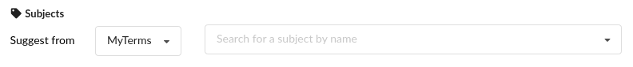

TODO: Adapt to new structure.

# Example Subjects Extension

A common type of extension is one that adds a controlled vocabulary to your instance. By following the instructions here,
you can create just such a type of extension that InvenioRDM will automatically recognize.

## Create your module

First, let's run the cookiecutter for an invenio module:

``` bash
cookiecutter https://github.com/inveniosoftware/cookiecutter-invenio-module
```

After filling out the prompts, you should see:

```
my-subjects-extension/
├── AUTHORS.rst
├── babel.ini
├── CHANGES.rst
├── CONTRIBUTING.rst
├── docs/
├── INSTALL.rst
├── LICENSE
├── MANIFEST.in
├── my_subjects_extension/
├── pytest.ini
├── README.rst
├── requirements-devel.txt
├── run-tests.sh
├── setup.cfg
├── setup.py
└── tests/
```

This extension will only be adding a list of subjects, so we will not touch most files. That doesn't prevent you from
editing them and making your extension do more.

## Add your controlled vocabulary

In our case, we will be adding a custom pool of subjects that depositors will be able to choose from when they deposit.



We save that list of subjects in `my_subjects_extension/vocabularies/subjects.yaml`. The location or name of this file is arbitrary. We will be explicitly referring to it; as long as you are consistent, you are good.

```yaml
# Example my_subjects_extension/vocabularies/subjects.yaml
- id: "https://example.com/my/scheme/1"
  scheme: MyTerms
  subject: "My term 1"
- id: "https://example.com/my/scheme/2"
  scheme: MyTerms
  subject: "My term 2"
```

Then, we need to tell InvenioRDM where this file is and what are the metadata related to this subject. When loading controlled vocabularies, InvenioRDM looks for a file called `vocabularies.yaml` that holds this information. In it, we refer to the file holding our subjects and provide the following additional metadata: `name` (the long form human readable name of the subject) and `uri` (the URL that points to the term). The location of `vocabularies.yaml` is arbitrary, but the name is important: InvenioRDM looks for `vocabularies.yaml` - beware of typos! For our part, we simply place it in the same directory as `subjects.yaml`.


```yaml
# Example my_subjects_extension/vocabularies/vocabularies.yaml
subjects:  # 1
  pid-type: sub
  schemes:
    - id: MyTerms  # 2
      name: My subject terms
      uri: "https://example.com/my/scheme"
      data-file: subjects.yaml
```

**1**: `subjects` and `pid-type: sub` is how we tell InvenioRDM that we are providing a controlled vocabulary for the subjects field. If we were replacing the controlled vocabulary of resource types or another similarly non-nested vocabulary, it would have been:

```yaml
resourcetypes:
  pid-type: rsrct
  data-file: subjects.yaml
```

**2**: `id: MyTerms` uniquely identifies this subject subtype and shows up on the deposit page. It must match the `scheme` fields in `subjects.yaml`. The `data-file` points to the subjects file path relative to the directory of `vocabularies.yaml`. If no `uri`, keep the `uri` key, but pass it an empty string.

Before we leave this directory, we will add an `__init__.py` file for good measure. It will allow us to refer to this directory
with Python's dot module notation in `setup.py`. Our final directory looks like:

```
my_subjects_extension/vocabularies/
├── __init__.py
├── vocabularies.yaml
└── subjects.yaml
```

To round things off, we add an `'invenio_rdm_records.fixtures'` entrypoint to the `setup.py` and point to our `vocabularies` directory. `'invenio_rdm_records.fixtures'` is how InvenioRDM knows to look in the pointed directory for the `vocabularies.yaml` that is then used to retrieve any controlled vocabularies provided by this extension.

``` python
# setup.py
# Other code ignored for clarity
setup(
    entry_points={
        'invenio_rdm_records.fixtures': [
            'my_subjects_extension = my_subjects_extension.vocabularies',
        ],
    },
)
```

## Integrate it in your InvenioRDM instance

Once you've taken care to address the auto-generated TODOs and made sure your extension is all good, it can be tested with your instance:

``` bash
cd path/to/your/instance
invenio-cli packages install path/to/your/extension
```

When you are ready to go in production, add the extension to your Pipfile e.g. `pipenv install my-subjects-extension` if you've open-sourced it. The command `invenio-cli packages install path/to/your/extension` doesn't add it to your Pipfile as of writing.

For controlled vocabulary extensions like ours, we need to load the terms in the database and Elasticsearch to see them. Run at the top-level of your instance directory:

```
pipenv run invenio rdm-records fixtures
```

This will load all new controlled vocabularies not already present in your database. This process actually queues the loading for
Celery to do it in the background.

## Run!

It's all set, run your instance with the cli and you will have your new subjects available!

``` bash
invenio-cli run
```
