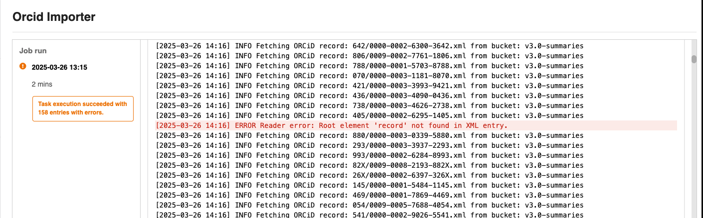

# Job System Design

_Added in v13.0.0_

The InvenioRDM job system introduces a robust, extensible mechanism for running and managing asynchronous background tasks. Built on top of Celery, it provides administrators with full visibility, auditability, and control over long-running or scheduled tasks via the admin UI or REST API.

---

## Why a Job System?

Traditionally, Celery tasks in InvenioRDM were launched programmatically or via CLI. This created challenges:

- No standardized logging or audit trail.
- Hard to expose jobs to administrators.
- No unified way to track execution history or outcomes.
- No parameterized job execution from the UI.

The job system addresses these problems by introducing two core concepts:

- **Jobs**: registered task definitions with metadata and optional schemas.
- **Job Runs**: execution instances of a job, which are persisted and tracked.

---

## Architecture Overview

### Core Components

- **JobType (Base Class)**:
  Defines the interface for a job: `id`, `title`, `description`, `task`, `arguments_schema`, and `build_task_arguments`.

- **Celery Tasks**:
  Implement the actual logic. Must be registered as entry points and referenced by the JobType.

- **Job Registry**:
  Discovers jobs via entry points (`invenio_jobs.jobs`).

- **Job Runs**:
  Persisted database entries that track execution, status, timestamps, logs, and arguments.

- **Admin UI**:
  Provides a scheduling form, status view, and log viewer for each job.

- **REST API**:
  Enables programmatic triggering, listing, and status inspection of jobs and runs.

---

### Scheduler Beat

Scheduled and on-demand job execution requires a **custom scheduler beat**, which is expected to be implemented and deployed by the user. This beat is responsible for dispatching job runs, whether triggered manually or on a schedule.

- This component is **not included by default**.
- You must **manually implement and configure** this scheduler as part of your Celery infrastructure.
- Without this beat running, **no job (manual or scheduled) will be executed**, even if created via the UI or API.

Ensure your deployment includes this scheduler beat logic if you intend to use the job system in production.

!!! note "Info"
    Guide to deploy a custom beat scheduler [here](../../../operate/ops/jobs/configure).

---

### Job and Run Data Examples

Below are realistic examples of how Jobs and Runs are stored in the system.

#### Job (Database Record)

```json
{
  "id": "4559172e-6194-4e75-a406-d7cdeb2c2ab1",
  "title": "inspire harvester",
  "task": "process_inspire",
  "default_queue": "celery",
  "active": true,
  "description": null,
  "schedule": null,
  "created": "2025-06-13T14:36:30.704051",
  "updated": "2025-06-18T14:23:29.055808"
}
```

#### Job Run (Database Record)

```json
{
  "id": "a61048dd-2237-4c90-b14d-2ab9b365f487",
  "job_id": "4559172e-6194-4e75-a406-d7cdeb2c2ab1",
  "started_by_id": 2,
  "start_time": "2025-06-13T14:46:11.306367",
  "end_time": "2025-06-13T14:46:11.580854",
  "status": "success",
  "task_id": "d21ee734-139c-4ff0-85f7-3b025a19772d",
  "args": {
    "config": {
      "readers": [{ "args": { "since": "2024-05-01" } }],
      "writers": [{ "type": "names-service", "args": { "overwrite": true } }]
    }
  },
  "queue": "celery"
}
```

---


## Job Execution Lifecycle

The job system lifecycle covers the flow from job definition to execution tracking:

1. A job is defined via the UI or API, specifying a task, optional arguments, and an optional schedule.
2. The custom scheduler beat polls the database and triggers job runs when due (or immediately for manual runs).
3. The job run launches a Celery task using the specified queue and arguments.
4. During execution, any output logged using `current_app.logger` is forwarded to OpenSearch for logging.
5. Once finished, the job run's status, message, and timestamps are saved for future audit and inspection.

---

## Logging & Auditability

If a Celery task logs via `current_app.logger`, and is invoked as a job, its logs are captured and stored with the run metadata. These logs are shown in the admin UI. All logs are stored in OpenSearch and displayed via the job run UI and API.

- Output can be inspected per run.
- Failures and warnings are clearly highlighted.



---

## Error Semantics

Jobs can complete with three outcomes:

- ✅ Success (task completes with no exceptions).
- ⚠️ Partial Success (`TaskExecutionError`).
- ❌ Failure (any other exception).

Use `TaskExecutionError` when the task completes but with non-fatal issues (e.g., partial data processed).

---

## Scheduling & Concurrency

Jobs can be:

- Run immediately from the UI.
- Scheduled with CRON or interval-based configurations via the admin panel.

**Note:** There is no built-in concurrency lock. If the same job is triggered twice in parallel, both will run. Developers must ensure idempotency in task logic if required.

---

## Security Model

- Only administrators (users with access to the admin panel) can view, configure, or run jobs.
- There is currently no per-tenant job isolation.

---

## Extensibility

Developers can:

- Define new jobs by subclassing `JobType` or using the `JobType.create()` factory.
- Customize input schemas via Marshmallow.
- Use standard Celery tooling for scaling, monitoring, and worker management.

---

## Known Limitations

- No native support for job dependencies or chaining.
- No retry strategy at the job system level (rely on Celery’s retry mechanism).
- No multi-tenant separation of job visibility or logs.
- No CLI utilities for job introspection (UI/API only).

---

## Summary

The InvenioRDM job system builds a maintainable foundation for robust background task orchestration. It offers developers powerful abstractions and gives administrators operational transparency and control, all integrated cleanly into the platform's UI and API.
