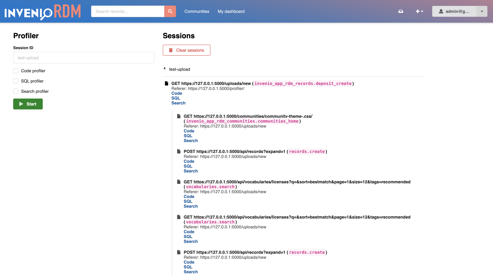
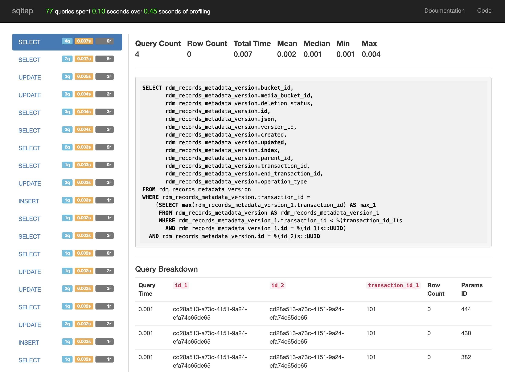

# Profiler

_Introduced in v14_

InvenioRDM integrates [Flask-MultiProfiler](https://github.com/inveniosoftware/Flask-MultiProfiler) for analyzing Python, SQL, and search performance.

## Features

- Start/stop profiling sessions from a web UI
- **Code profiling**: function-level profiling using [pyinstrument](https://pyinstrument.readthedocs.io/)
- **SQL profiling**: database query profiling using [sqltap](https://github.com/inconshreveable/sqltap)
- **Search profiling**: OpenSearch operation tracing via client trace logging
- Profiling data is saved per session as SQLite files in the configured storage directory
- Generated reports can be viewed (or downloaded) per request for each enabled profiler

## Installation

The profiler's dependencies are included in the `profiler` extra of `invenio-app-rdm`:

```shell
pip install invenio-app-rdm[profiler]
```

Or, if you are using `setup.cfg`, ensure the following:

```ini
[options.extras_require]
profiler =
    flask-multiprofiler>=0.1.0
```

Without this extra, a no-op extension is loaded instead and the profiler UI is not available.

## Enabling the profiler

The profiler is **not installed by default** in production instances. Install the `profiler` extra in development or staging environments where you need it.

Once installed, the extension is registered automatically via the `invenio_base.apps` and `invenio_base.api_apps` entry points. No additional enable flag is required.

## Customization

You can customize the profiler's behavior by setting Flask config variables in your instance's `invenio.cfg`:

- `MULTIPROFILER_STORAGE`: path object or string, directory for profiler databases (default: `$INSTANCE_PATH/profiler`)
- `MULTIPROFILER_ACTIVE_SESSION_LIFETIME`: `timedelta`, how long a session remains valid (default: 60 minutes)
- `MULTIPROFILER_ACTIVE_SESSION_REFRESH`: `timedelta`, session activity refresh window (default: 30 minutes)
- `MULTIPROFILER_IGNORED_ENDPOINTS`: list of endpoint regexes to skip (default includes `static`, `_debug_toolbar.static`, `profiler\..+`, and `invenio_formatter_badges.badge`)
- `MULTIPROFILER_PERMISSION`: callable returning `True` if the current user may access the profiler (default: administrators only via `administration_permission.can`)
- `MULTIPROFILER_SEARCH_TRACE_LOGGER`: logger name used for search trace logging (default: `opensearchpy.trace`)
- `MULTIPROFILER_BASE_TEMPLATE`: base template for the profiler page (default: `flask_multiprofiler/index.html`)

## Usage

With the profiler extra installed:

1. Sign in as a user allowed by `MULTIPROFILER_PERMISSION` (administrators by default).
2. Open the **Profiler** entry from the user profile admin menu, or visit `/profiler/` directly (e.g. `http://localhost:5000/profiler/`).
3. Start a profiling session by choosing:
    - a session ID,
    - whether to enable code profiling,
    - whether to enable SQL profiling,
    - whether to enable search profiling.
4. Interact with your site as usual. The profiler collects data for each request while the session is active.
5. Return to `/profiler/` to view and manage collected sessions and their reports.





## Search profiling

Search profiling intercepts trace logs from the OpenSearch Python client. InvenioRDM defaults to `opensearchpy.trace`.

Supported clients:

- OpenSearch
- Elasticsearch v7.x
## Troubleshooting

- If the profiler menu does not appear, confirm `invenio-app-rdm[profiler]` is installed and that `flask-multiprofiler` imported successfully.
- Ensure `MULTIPROFILER_PERMISSION` allows access for the signed-in user.
