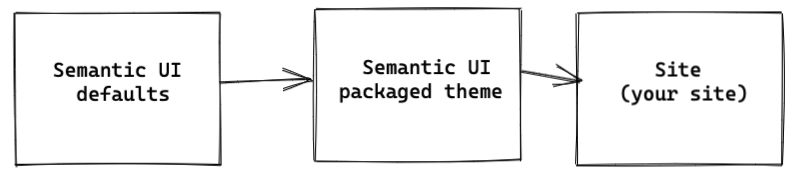
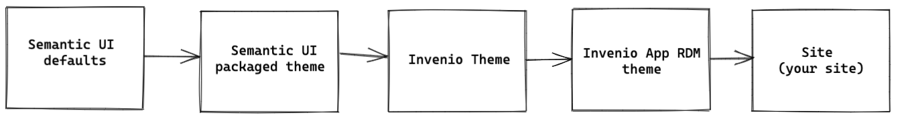

# Theming

This page will provide you with in-depth information about the InvenioRDM theme structure.

## Semantic UI

### Concepts

From Semantic UI docs:

> Semantic UI treats words and classes as exchangeable concepts.
Classes use syntax from natural languages like noun/modifier relationships, word order, and plurality to link concepts intuitively.

It basically refers to using the CSS classes to describe how the element looks like, not what it is:

```html
<div class="ui label right floated"></div>
```

tells us more about what to expect from the final view, rather than

```html
<div class="metadata-label"></div>
```

which has significant influence on the maintainability of the styling - and it is very important in large projects. It is easier for any developer to remember a few "behavioral" classes, rather than to remember that `metadata-label` will always be right floated.

### Variety of available components and elements

Semantic UI exists both in "clean" HTML/CSS as well as in React. To know more about best practices between the two, visit [Best practices](../../community/code/best-practices/react.md) page.

Semantic UI provides the developer with a plethora of ready to use React components and CSS classes. The important step in mastering Semantic UI development is consulting the documentation and experimenting with the outcome of using the provided elements. Custom CSS rules should be a last resort to achieve specific styling.

### Theme inheritance

The theming is based on the inheritance system created by Semantic UI, which needed to be adapted for InvenioRDM to allow picking up and merging themes from multiple sources.

The default structure from `semantic-ui-less` is designed as follows:



For `invenio-app-rdm`, we extended the theming structure with the following inheritance chain:



The theme structure was defined by providing our custom (overriding Semantic UI defaults) InvenioRDM theme inheritance rules, available in our [custom `theme.less`](https://github.com/inveniosoftware/invenio-app-rdm/blob/6249106ba962514338f8e313ff033f8f1bbd3fce/invenio_app_rdm/theme/assets/semantic-ui/less/invenio_app_rdm/theme/theme.less).

### Themes vs. styling

By **theme** we understand a common implementation of styling, which can be installed and used in instances.
The *default theme* for InvenioRDM instances is `rdm` (provided by `invenio-app-rdm`), colloquially also known as the "InvenioRDM theme".

InvenioRDM instances can provide their own custom set of CSS rules to tweak their chosen theme.
We refer to this as **instance styling**.
Since this is inherently tied to a specific InvenioRDM instance (e.g. `my-site`), this is not considered shareable.

### Tweaking your instance's styling

As hinted above, InvenioRDM provides mechanisms to make tweaking your own instance's styling relatively easy out of the box.
All you need to do is edit some files in your instance's directory, as described in the [Change styling section](../../operate/customize/look-and-feel/theme.md).

### Providing your own theme

There are a number of scenarios where having your own reusable base theme is useful.
For example, if you are running a few instances that should look or feel very similar.
In such cases, you can create your own theme and provide it to the community as part of an Invenio module.

!!! info "If you're just starting out, try out instance styling before creating themes"

    Creating Invenio modules for themes is much more involved than just tweaking your instance's styling, so we don't recommend this for beginners.
    It's also not required for styling individual instances; for simple use cases, we strongly recommend **instance styling** (see [above](#tweaking-your-instances-styling)).

    This section assumes some familiarity with the creation of Invenio modules.

#### Necessary files

Your Invenio module will need to define the appropriate `*.{variables,overrides}` files in the structure that is expected by `semantic-ui-less`.
See [the file structure in `invenio-app-rdm`](https://github.com/inveniosoftware/invenio-app-rdm/tree/master/invenio_app_rdm/theme/assets/semantic-ui/less/invenio_app_rdm/theme) for an example.

For the theme to become available to the frontend build under the desired name, you'll need to specify an appropriate *alias* in a `WebpackThemeBundle`, typically in `webpack.py`.
Just like the alias [`themes/rdm` in `invenio-app-rdm`](https://github.com/inveniosoftware/invenio-app-rdm/blob/master/invenio_app_rdm/theme/webpack.py).

Don't forget to register this `WebpackThemeBundle` for the `invenio_assets.webpack` entrypoint group, so that the assets build process can discover your new files.

If you want to adapt your theme's inheritance hierarchy (e.g. add your own theme between the `Invenio App RDM theme` and `Site (your site)` in the [hierarchy described above](#theme-inheritance)), you'll also need to provide your own `theme.less` file (once again, see [`invenio-app-rdm` for an example](https://github.com/inveniosoftware/invenio-app-rdm/blob/master/invenio_app_rdm/theme/assets/semantic-ui/less/invenio_app_rdm/theme/theme.less)).
While this is not strictly speaking necessary and may increase the resulting assets' sizes with a few unnecessary CSS rules, doing so will automatically pick up new CSS rules from `invenio-app-rdm` and thus might make your life a bit easier.

#### How a Semantic UI theme gets loaded

To build a Semantic UI theme for InvenioRDM, it can be very helpful to have a rough understanding of how a theme gets loaded in InvenioRDM.

The starting point for loading Semantic UI themes is `~semantic-ui-less/semantic.less`, which will start loading its component definitions (the files in `~semantic-ui-less/definitions/*`).
This is used by `invenio-theme` in Jinja templates via `{{ webpack['theme.js'] }}`, if you have `APP_THEME = ["semantic-ui"]` configured.

!!! info "The tilde (`~`) in front means that we're talking about the JS package's directory in `node_modules`"

Each of the loaded component definitions sets the `@type` and `@element` variables for itself (e.g. `@type: 'collections'` and `@element: 'menu'`), imports the InvenioRDM instance's `theme.config`, and finally executes the `.loadUIOverrides()` mixin (defined by `theme.less`, see below).

The instance's `theme.config` imports the `theme.less` file for the configured base theme (e.g. `themes/rdm/theme.less`), forwarding the `@type` and `@element` variables set prior by the current component definition.
The loaded `theme.less` file in turn is then responsible for determining and loading All the relevant `*.{variables,overrides}` files for the current component (including the site's styling overrides), and defining the `.loadUIOverrides()` mixin.

The completion of this import chain results in the finalized definition of the theme, including the site's styling.

##### Summary of the relevant files

* `~semantic-ui-less/semantic.less`: The starting point for loading themes; provided by `semantic-ui-less`
* `~semantic-ui-less/definitions/*`: Component definitions loaded by `semantic.less`; provided by `semantic-ui-less`
* `theme.config`: Instance theme configuration, loaded by each component definition; provided by the InvenioRDM instance (included in the cookiecutter)
* `theme.less`: Theme definition, loaded by `theme.config`; provided by your theme's Invenio module
* `*.{variables,overrides}`: Variable definitions and custom CSS rules for each component; provided by your theme's Invenio module and possibly overridden by the InvenioRDM instance (see the [Change styling section](../../operate/customize/look-and-feel/theme.md))
