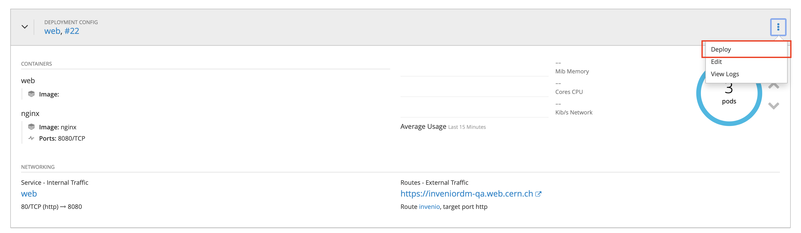

# InvenioRDM Demo site

The production demo site is accessible at [https://inveniordm.web.cern.ch](https://inveniordm.web.cern.ch).
The QA demo site is accessible at [https://inveniordm-qa.web.cern.ch](https://inveniordm-qa.web.cern.ch).

## Upgrade the instance

Both QA and production infrastructure (OpenShift) projects are located on
[https://paas.cern.ch](https://paas.cern.ch):

* [inveniordm-qa](https://paas.cern.ch/console/project/inveniordm-qa/)
* [inveniordm-prod](https://paas.cern.ch/console/project/inveniordm-prod/)
* [Sentry Error tracking](https://inveniordm-sentry.web.cern.ch/sentry/demo-inveniordm). The QA environment tracks the errors of inveniordm-qa and the Prod environment those of the inveniordm site.

The steps to upgrade any of the two instances to a newer version or release are the same.

**1. Upgrade code**

Overall, you need to perform an upgrade so follow the upgrade guide released.
For example, if transitioning from InvenioRDM v6 to v7, then you would follow the [v6 to v7 upgrade guide](../../releases/v7/upgrade-v7.0.md).

Code is on GitHub: [demo-inveniordm](https://github.com/inveniosoftware/demo-inveniordm).

1. Clone and make a local install of the code
   ```
   cd ~/src
   git clone https://github.com/inveniosoftware/demo-inveniordm.git
   cd demo-inveniordm
   invenio-cli install
   ```

2. Create a PR with the needed changes. If you change Python dependencies, make sure that you also add the
   new lock file. To do so, locally in your machine, delete the previous .lock file and run
   `uv lock`. Note: This PR should not be the release PR as this would create a tag, the release PR
   is only created when upgrading the production site.
3. You can test such changes locally: the demo site is an InvenioRDM instance and thus can be used in your
   local machine with the usual *invenio-cli* commands.
4. Merge the PR: this will trigger a new Docker build (on GitHub actions) and push the new
   image to the GitHub Docker registry, tagged as `latest`. A notification will be sent to the **OpenShift QA** project
   which will trigger a new rolling deployment of the web and worker pods to deploy the new image. You can
   eventually deploy the new image by yourself by clicking on `Deploy` on OpenShift.



**2. Upgrade data**

!!! note
    This step is only needed if the data model changed, and therefore database and
    indexes need to be wiped out and re-populated.

You can perform the following steps by connecting to OpenShift on your terminal. However, you can do
the same steps with the `Terminal` provided in the OpenShift web UI.

- Login in OpenShift and select the project:
```console
oc login https://paas.cern.ch
oc project inveniordm-qa
```
- Select one of the web pods to connect to, for example `web-18-wlbqs`:
```console
oc get pods
oc exec web-18-wlbqs /bin/bash -c
```
- Then you need to wipe and re-create the content. All the `invenio` commands needed
are available in the `wipe_recreate.sh` script. You just need to run it. In case you
need to cross-check anything (e.g. assets creation) the instance path is `/opt/invenio/var/instance/`.

The script loads the vocabularies eagerly, which is the slow part of the run and
takes around 10 minutes. It queues the demo records instead, and the worker
creates them afterwards, so search stays empty for a while.

**3. Upgrade the production site**

Once you are sure that the QA site is correctly upgraded and there are no errors,
you have to upgrade the production site. The first step is to create the docker image.

Create a new release commit and tag for the latest version in the
[repository](https://github.com/inveniosoftware/demo-inveniordm).

!!! note
    The tags naming convention follow the numeration of the `invenio-app-rdm` package. For example, if you're
    deploying `invenio-app-rdm==14.0.0`, then the new release tag of the demo site will be `v14.0.0`.

```console
git commit --allow-empty -m "release: v14.0.0"
git tag v14.0.0
git push origin v14.0.0
```

This will trigger a new docker image build, that will be pushed to the GitHub Docker registry with tag `14.0.0`.

Once the GitHub action succeeds and the Docker image is ready to be deployed, you need to update
the references to the images' tags on the OpenShift project:

```console
oc project inveniordm-prod
IMG=ghcr.io/inveniosoftware/demo-inveniordm/demo-inveniordm:14.0.0
oc set image dc/web web=$IMG
oc set image dc/worker worker=$IMG
oc set image dc/worker-beat worker-beat=$IMG worker-beat-jobs-scheduler=$IMG
```

Finally, repeat step 2 to re-create the data on the production site.
