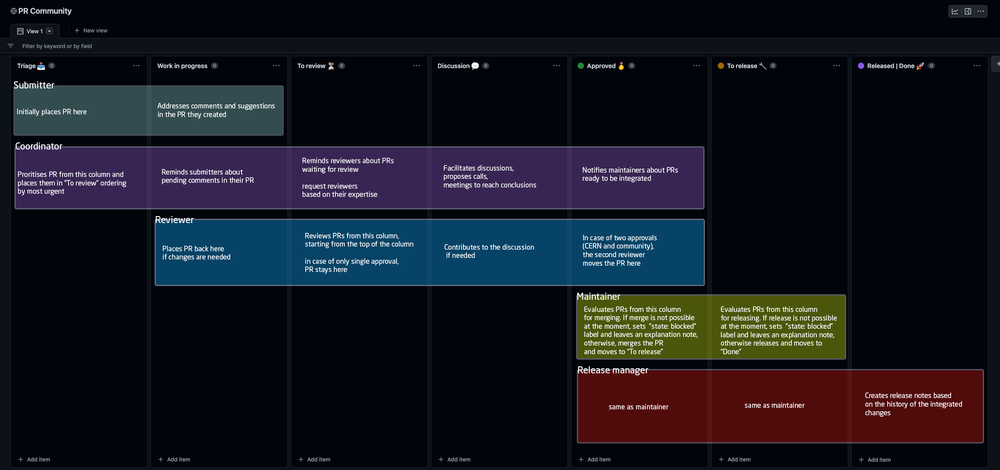

# Community pull requests board workflow and guidelines

**Intended audience**

This guide is intended for contributors, coordinators and developers of InvenioRDM.

**Scope**

This guide covers the recommended way of coordinating community pull requests integration within InvenioRDM. The goal of the project is to respond to the community's need for a facilitated review and integration process of the **pull requests which are not part of the main sprint**.

## Board

You'll find the board [here](https://github.com/orgs/inveniosoftware/projects/109/views/1).

## Roles

- **Coordinator**: Person who coordinates the integration process, has an overview of the current pull requests and is in charge of the communication between contributors, reviewers, maintainers, and release manager.
- **Contributor/submitter**: Person who contributes by creating pull requests.
- **Reviewer**: Person who contributes by reviewing contributors' work.  
- **Maintainer**: Person who has merging rights in the InvenioRDM repositories, responsible for integrating the pull requests into the product.
- **Release manager**: Person in charge of the current main invenio-app-rdm release.

## Columns

- **Triage**: **Submitters** place the PRs in this column. PR is ready to be prioritised by the **coordinator**. 
- **Work in progress**: Changes/suggestions were requested by the reviewers, the submitter is addressing them.
- **To review**: PR is ready to be reviewed by the reviewers.
- **Discussion**:  PR needs to be re-discussed in terms of solutions - e.g., there are different opinions on the implementation.
- **Approved**: PR was approved, two reviewers agree on integrating it. Ready to be merged.
- **To release**: PR is ready to be released. **Maintainers** or **release manager** decides on when it should happen. PRs might be merged or not merged yet.
- **Released/done**: Archive of recently integrated PRs - useful for tracking the latest changes and release notes. Column is cleaned by release manager after the major release.

## Workflow

### Pull request statuses

In order to understand the state of the PR by the icons displayed in the interface, check this [documentation](https://primer.style/design/components/icon#specific-use-cases)
