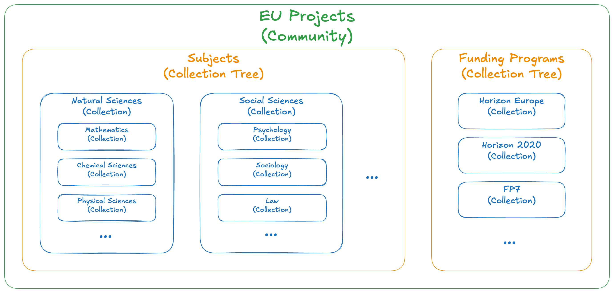
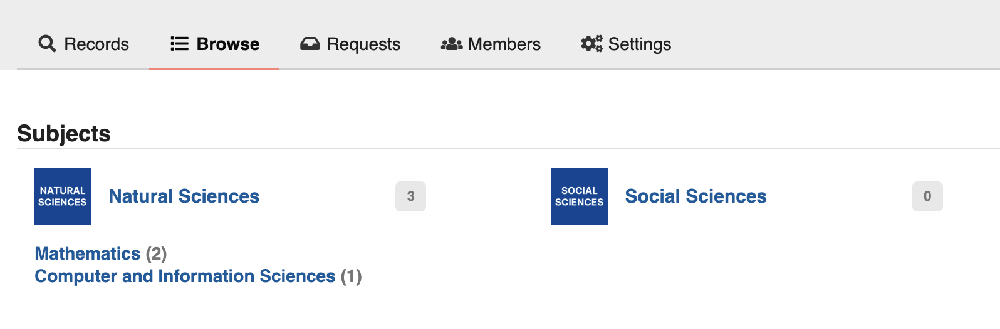
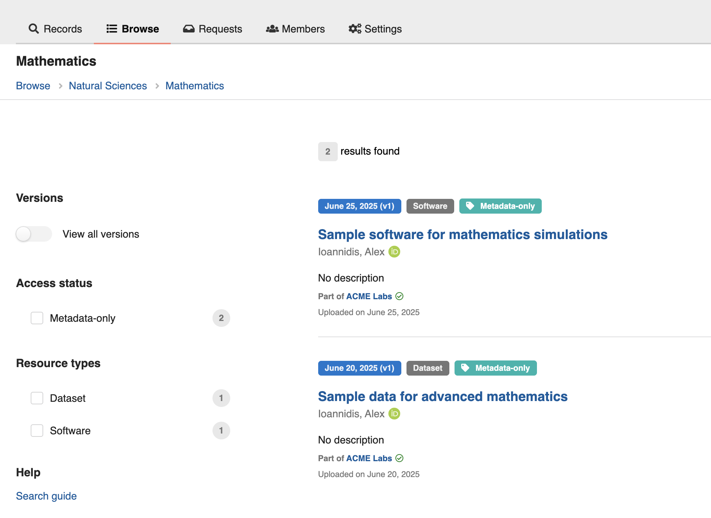

_Introduced in v13_

Collections provide a powerful way to curate and organize records within your InvenioRDM instance. They define sets of records based on search filters and can be organized hierarchically to create meaningful groupings of content.

!!! warning
    This features currently lacks a user-friendly interface for easy configuration and require manual setup.

## Overview

Collections are dynamic query-based groupings of records that automatically include all records matching a specified search filter. They enable you to:

- **Organize records thematically** - Group records by subject, resource type, funding program, or any metadata field
- **Create hierarchical structures** - Build nested collections to guide users in browsing records
- **Display curated content** - Present collections on dedicated pages within communities or globally

Each collection is stored in the database with a search query string that dynamically fetches matching records. This approach ensures collections stay current as new records are added to your repository.

Collections **cannot** be used to apply access restrictions or permission-based control over their contained records. Instead, use [Communities](../../use/communities.md) for managing access and edit permissions over records.

## Configuration

To enable displaying the communities "Browse" menu entry in your InvenioRDM instance, add to your `invenio.cfg`:

```python
COMMUNITIES_SHOW_BROWSE_MENU_ENTRY = True
```

Additionally, for any communities that you want to setup collections, you need to configure them to allow subcommunities via the `children.allow` setting.

!!! bug "Requirement on enabled subcommunities"
    Having a community with `children.allow: true` is a limitation of the current "Browse" menu entry implementation in InvenioRDM v13. This will be patched to allow communities that might only have collections (and not subcommunities enabled) to still display the "Browse" menu entry.

## Managing Collections

Collections are organized within **Collection Trees** - hierarchical structures that allow you to create logical groupings and nested relationships. Collection trees serve as the root containers for your collections and can be:

- **Community-specific** - Scoped to records of a particular community
- **Global** - Scoped across records of your entire instance

!!! info "Global collections"
    Global collections display is not yet implemented in InvenioRDM v13.

Before creating collections, you need:

1. **Access to Python shell** - Collections are currently managed via `invenio shell`
2. **A community with subcommunities enabled** - At present, collections are scoped to communities, so you need at least one community. Additionally, to display the "Browse" tab, that community must have `children.allow: true` set.

!!! warning "Administration UI for Collections"
    The administration UI for managing collections is not yet available in InvenioRDM v13. Collections are currently managed programmatically via the Python shell.

### Create a Collection Tree

First, create a collection tree to serve as the root container:

```python
from invenio_collections.api import CollectionTree

COMMUNITY_ID = "<community_id>"  # Replace with your community's UUID

# Create a collection tree for a subjects-based hiearchy
ctree = CollectionTree.create(
    title="Subjects",
    slug="subjects",  # Used in URLs
    community_id=COMMUNITY_ID,  # `None` for global trees
    order=10  # Controls display order (lower numbers appear first)
)
```

### Create top-level Collections

Create your first collections within the tree:

```python
from invenio_collections.proxies import current_collections
from invenio_access.permissions import system_identity

collections_service = current_collections.service

# Create a collection for records classified under the "Natural sciences" subject
natural_sciences_col = collections_service.create(
    system_identity,
    COMMUNITY_ID,
    tree_slug="subjects",
    slug="natural-sciences",  # URL slug for the collection
    title="Natural Sciences",  # Displayed title
    query='metadata.subjects.subject:"Natural Sciences"',  # Search filter
    order=10,  # Display order within the tree (lower numbers appear first)
)
# Create another collection under the same tree for the "Social Sciences" subject
social_sciences_col = collections_service.create(
    system_identity,
    COMMUNITY_ID,
    tree_slug="subjects",
    slug="social-sciences",
    title="Social Sciences",
    query='metadata.subjects.subject:"Social Sciences"',
    order=20,
)
```

### Create nested Collections

Add two sub-collections to the "Natural Sciences" top-level collection:

```python
math_col = collections_service.add(
    system_identity,
    collection=natural_sciences_col._collection,
    slug="mathematics",  # URL slug for the sub-collection
    title="Mathematics",  # Displayed title
    query='metadata.subjects.subject:"Mathematics"',  # Search filter (will be combined with the parent collection's)
    order=10,  # Display order within the parent collection (lower numbers appear first)
)
compsci_col = collections_service.add(
    system_identity,
    collection=natural_sciences_col._collection,
    slug="computer-science",
    title="Computer and Information Sciences",
    query='metadata.subjects.subject:"Computer and Information Sciences"',
    order=20,
)
```

You now have a Collection Tree inside the community with the following structure:

- Subjects (tree)
    - Natural Sciences (query: `metadata.subjects.subject:"Natural Sciences"`)
        - Mathematics (query: `metadata.subjects.subject:"Mathematics"`)
        - Computer and Information Sciences (query: `metadata.subjects.subject:"Computer and Information Sciences"`)
    - Social Sciences (query: `metadata.subjects.subject:"Social Sciences"`)

### Collections hierarchy

Communities can hold multiple Collection Trees, where each of them can hold collections of different levels of nesting.

There is no limitation in the number of nesting levels for collections. We recommend though that you make reasonable use of them to organize your content effectively, keeping in mind the user experience of navigating and discovering content.

Here is an example diagram, of what a community with two collection trees might look like:


/// caption
Communities can hold multiple Collection Trees, each of them organizing collections of different nesting levels.
///

### Collections query inheritance

Community-scoped collections include records that are part of the community.

Nested collections automatically inherit their parent's search criteria, combining queries with the `AND` boolean operator. Child collections show only records that match both their own query and all parent queries. This means that as you go down the hierarchy, the search criteria for record results become more narrow.

!!! example "Example query inheritance in a "Subjects" hierarchy"

    Given the following collection hierarchy inside a tree:

    - Research Fields
        - Natural Sciences (query: `metadata.subjects.subject:"Natural sciences"`)
            - Mathematics (query: `metadata.subjects.subject:"Mathematics"`)
            - Physical Sciences (query: `metadata.subjects.subject:"Physical sciences"`)
        - Social Sciences (query: `metadata.subjects.subject:"Social sciences"`)
            - Psychology (query: `metadata.subjects.subject:"Psychology"`)

    The effective queries for each collection would be:

    - **Natural Sciences**: `metadata.subjects.subject:"Natural sciences"`
    - **Mathematics**: `metadata.subjects.subject:"Natural sciences" AND metadata.subjects.subject:"Mathematics"`
    - **Physical Sciences**: `metadata.subjects.subject:"Natural sciences" AND metadata.subjects.subject:"Physical sciences"`
    - **Psychology**: `metadata.subjects.subject:"Social sciences" AND metadata.subjects.subject:"Psychology"`

    If the "Subjects" collection tree is part of a community, then the effective queries also contain a filter for including records that are part of the community (i.e. `parent.communities.ids:<community_id>`).

!!! info "Architecture Details"
    For more technical implementation details, see [RFC0079](https://github.com/inveniosoftware/rfcs/blob/master/rfcs/rdm-0079-collections.md).

## Accessing Collections

!!! note "TODO: Move to Use > Communities section of docs"
    This section is aimed mostly at end-users, but we don't have currently the
    "Communities" section in the docs.

Once created, individual collections are accessible through dedicated pages that display all records matching the collection's search criteria. Communities have a "Browse" page that provides an overview of all available collections.

### Community "Browse" page

Communities with configured collections, feature a browse page that provides an overview of all available Collection Trees and their contained Collections hierarchy, along with the total number of records contained within each collection level. This serves as the main entry point for users to discover and navigate collections within a community.


/// caption
The collection "Browse" page gives users an overview of all available collections organized by collection trees.
///

The community "Browse" page is accessible at `/communities/<community_slug>/browse`.

The record totals for each collection level are updated automatically every 1 hour by the `invenio_collections.tasks.update_collections_size` Celery tasks.

### Collection pages

Each Collection has a dedicated page showing its hierarchy and a standard record search page, pre-filtered based on the collection search criteria.


/// caption
A collection page displays all records matching the search criteria, with breadcrumb navigation showing the collection hierarchy.
///

Collection pages are accessible at `/communities/<community_slug>/collections/<collection_tree>/<collection_slug>`.
