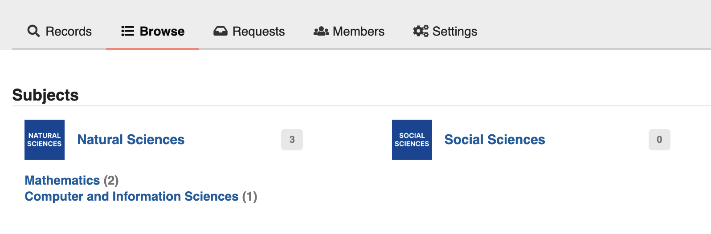
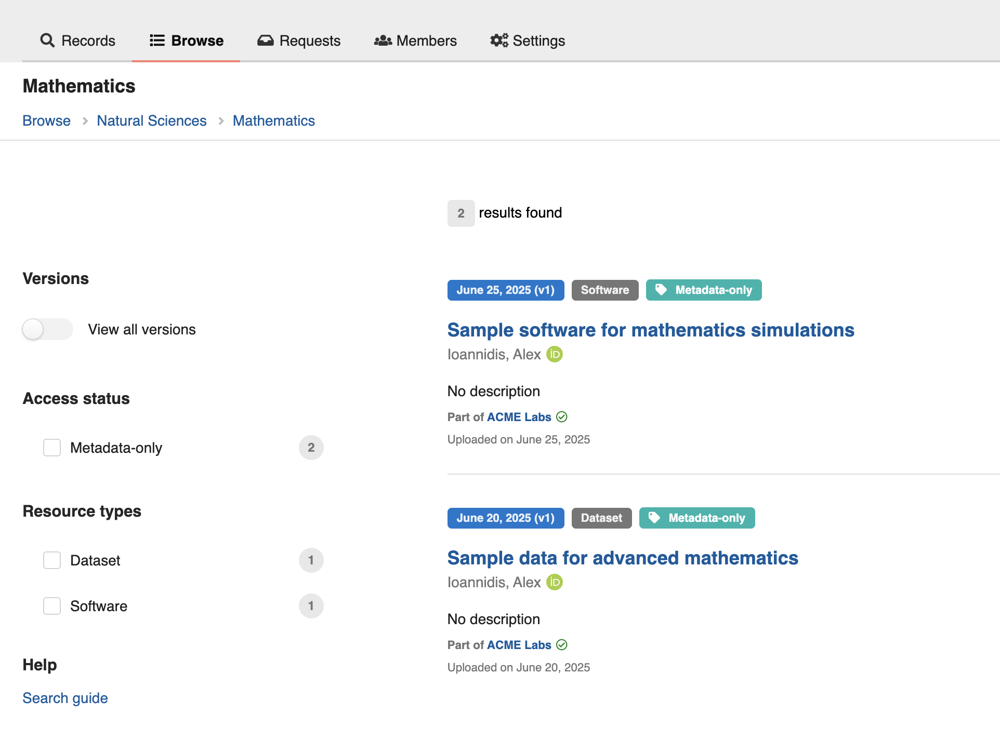

_Introduced in v13_

Collections provide a powerful way to curate and organize records within your InvenioRDM instance. They define sets of records based on search filters and can be organized hierarchically to create meaningful groupings of content.

_Updated in v14: Added user interface for collections management in community settings._

## Overview

Collections are dynamic query-based groupings of records that automatically include all records matching a specified search filter. They enable you to:

- **Organize records thematically** - Group records by subject, resource type, funding program, or any metadata field
- **Create hierarchical structures** - Build nested collections to guide users in browsing records
- **Display curated content** - Present collections on dedicated pages within communities or globally

Each collection is stored in the database with a search query string that dynamically fetches matching records. This approach ensures collections stay current as new records are added to your repository.

Collections **cannot** be used to apply access restrictions or permission-based control over their contained records. Instead, use [Communities](../../use/communities.md) for managing access and edit permissions over records.

Collections are organized within **Collection Trees** (also called **Sections**) - hierarchical structures that allow you to create logical groupings and nested relationships. Collection trees serve as the root containers for your collections and can be:

- **Community-specific** - Scoped to records of a particular community
- **Global** - Scoped across records of your entire instance

!!! info "Global collections"
    Global collections display is not yet implemented in InvenioRDM.

## Configuration

### Display settings

To enable on communities the "Browse" menu entry and the "Settins > Collections" section, add to your `invenio.cfg`:

```python
COMMUNITIES_COLLECTIONS_ENABLED = True
```

### Collection hierarchy limits

You can configure limits for collection hierarchies to maintain good user experience and system performance:

```python
# Maximum depth for collection hierarchies (default: 1)
# Depth 0 = root collections
# Depth 1 = children of root
# Depth 2 = grandchildren
# Setting this to 1 allows 2 levels: root + children only
COLLECTIONS_MAX_DEPTH = 1

# Maximum number of collection trees per community (default: 10)
# Set to 0 for unlimited trees
COLLECTIONS_MAX_TREES = 10

# Maximum number of collections per tree (default: 100)
# This counts all collections in a tree, regardless of depth
# Set to 0 for unlimited collections
COLLECTIONS_MAX_COLLECTIONS_PER_TREE = 100
```

### Access control

By default, collections can be managed by **community owners** in the settings tab of the community.

#### Permission customization

You can customize who can manage collections by overriding the permission policy in your instance.

Create or update your custom permission policy (e.g., `my_site/permissions.py`):

```python
from invenio_communities.permissions import CommunityPermissionPolicy
from invenio_communities.generators import CommunityOwners
from invenio_records_permissions.generators import SystemProcess

class MyCommunitiesPermissionPolicy(CommunityPermissionPolicy):
    """Custom communities permission policy."""

    # Override collections management permissions
    can_manage_collections = [
        CommunityOwners(),
        SystemProcess()
    ]
```

Then configure your instance to use the custom policy in `invenio.cfg`:

```python
from my_site.permissions import MyCommunitiesPermissionPolicy

COMMUNITIES_PERMISSION_POLICY = MyCommunitiesPermissionPolicy
```

#### Customizing permissions for a specific community

You can use the `IfCommunitySlug` generator to apply a different collection management permission to specific communities across your instance based on a community's slug. For example, to block collections management for a community with slug `physics`:

```python
from invenio_communities.permissions import CommunityPermissionPolicy
from invenio_communities.generators import (
    CommunityOwners,
    IfCommunitySlug,
)
from invenio_records_permissions.generators import Disable, SystemProcess

class MyCommunitiesPermissionPolicy(CommunityPermissionPolicy):
    """Custom communities permission policy."""

    can_manage_collections = [
        # Block collections for 'physics' community, allow for others
        IfCommunitySlug(
            slugs=['physics'],  # Community slugs to match
            then_=[Disable()],  # Block everyone for 'physics'
            else_=[CommunityOwners()],  # Allow for others
        ),
        SystemProcess(),  # System always has access
    ]
```

Then configure your instance to use the custom policy in `invenio.cfg`:

```python
from my_site.permissions import MyCommunitiesPermissionPolicy

COMMUNITIES_PERMISSION_POLICY = MyCommunitiesPermissionPolicy
```

## Managing collections programmatically

You can also manage collections programmatically via the Python shell or custom scripts. This is useful for bulk operations or automated setup.

### Create a collection tree

First, create a collection tree to serve as the root container:

```python
from invenio_rdm_records.proxies import current_community_collections_service

COMMUNITY_ID = "<community_id>"  # Replace with your community's UUID

# Create a collection tree for a subjects-based hiearchy
tree = current_community_collections_service.create_tree(
    system_identity,
    namespace_id=COMMUNITY_ID,
    data={
        "title": "Subjects",  # Displayed on the UI
        "slug": "subjects",  # Used in URLs
        "order": 10,  # Ordering across trees (lower numbers appear first)
    },
)
```

### Create top-level collections

Create your first collections within the tree:

```python
from invenio_rdm_records.proxies import current_community_collections_service
from invenio_access.permissions import system_identity

# Create a collection for records classified under the "Natural sciences" subject
collection_a = current_community_collections_service.create(
    system_identity,
    namespace_id=COMMUNITY_ID,
    tree_slug="subjects",  # could also use tree_id=tree.id instead
    data={
        "title": "Natural Sciences",  # Displayed on the UI
        "slug": "natural-sciences",  # Used in URLs for the collection
        "search_query": 'metadata.subjects.subject:"Natural Sciences"',  # Search filter
        "order": 10,  # Order within the tree (lower numbers appear first)
    },
)
# Create another collection under the same tree for the "Social Sciences" subject
collection_b = current_community_collections_service.create(
    system_identity,
    namespace_id=COMMUNITY_ID,
    tree_slug="subjects",
    data={
        "title": "Social Sciences",
        "slug": "social-sciences",
        "search_query": 'metadata.subjects.subject:"Social Sciences"',
        "order": 20,
    },
)
```

### Create nested collections

Add two sub-collections to the "Natural Sciences" top-level collection:

```python
# Subjects > Natural Sciences > Mathematics
subcollection_a_a = current_community_collections_service.add(
    system_identity,
    namespace_id=COMMUNITY_ID,
    tree_slug="subjects",
    slug="natural-sciences",  # slug of the *parent* collection
    data={
        title: "Mathematics",  # Displayed on the UI
        slug: "mathematics",  # Used in URLs for the sub-collection
        search_query: 'metadata.subjects.subject:"Mathematics"',  # Search filter (will be combined with the parent collection's)
        order: 10,  # Order within the parent collection (lower numbers appear first)
    },
)

# Subjects > Natural Sciences > Computer and Information Sciences
subcollection_a_b = current_community_collections_service.add(
    system_identity,
    namespace_id=COMMUNITY_ID,
    tree_slug="subjects",
    slug="natural-sciences",
    data={
        title: "Computer and Information Sciences",
        slug: "computer-science",
        search_query: 'metadata.subjects.subject:"Computer and Information Sciences"',
        order: 20,
    },
)
```

You now have a Collection Tree inside the community with the following structure:

- Subjects (tree)
    - Natural Sciences (query: `metadata.subjects.subject:"Natural Sciences"`)
        - Mathematics (query: `metadata.subjects.subject:"Mathematics"`)
        - Computer and Information Sciences (query: `metadata.subjects.subject:"Computer and Information Sciences"`)
    - Social Sciences (query: `metadata.subjects.subject:"Social Sciences"`)

### Collections query inheritance

Community-scoped collections include records that are part of the community.

Nested collections automatically inherit their parent's search criteria, combining queries with the `AND` boolean operator. Child collections show only records that match both their own query and all parent queries. This means that as you go down the hierarchy, the search criteria for record results become narrower and narrower.

!!! example "Example query inheritance in a "Subjects" hierarchy"

    Given the following collection hierarchy:

    - Subjects (tree)
        - Natural Sciences (query: `metadata.subjects.subject:"Natural sciences"`)
            - Mathematics (query: `metadata.subjects.subject:"Mathematics"`)
            - Physical Sciences (query: `metadata.subjects.subject:"Physical sciences"`)
        - Social Sciences (query: `metadata.subjects.subject:"Social sciences"`)
            - Psychology (query: `metadata.subjects.subject:"Psychology"`)

    The effective queries for each collection would be:

    - **Natural Sciences**: `metadata.subjects.subject:"Natural sciences"`
    - **Mathematics**: `metadata.subjects.subject:"Natural sciences" AND metadata.subjects.subject:"Mathematics"`
    - **Physical Sciences**: `metadata.subjects.subject:"Natural sciences" AND metadata.subjects.subject:"Physical sciences"`
    - **Psychology**: `metadata.subjects.subject:"Social sciences" AND metadata.subjects.subject:"Psychology"`

    If the "Subjects" collection tree is part of a community, then the effective queries also contain a filter for including records that are part of the community (i.e. `parent.communities.ids:<community_id>`).

!!! info "Architecture Details"
    For more technical implementation details, see [RFC0079](https://github.com/inveniosoftware/rfcs/blob/master/rfcs/rdm-0079-collections.md).

### Community "Browse" page

Communities with configured collections, feature a browse page that provides an overview of all available Collection Trees and their contained Collections hierarchy, along with the total number of records contained within each collection level. This serves as the main entry point for users to discover and navigate collections within a community.


/// caption
The collection "Browse" page gives users an overview of all available collections organized by collection trees.
///

The community "Browse" page is accessible at `/communities/<community_slug>/browse`.

The record totals for each collection level are updated automatically every 1 hour by the `invenio_collections.tasks.update_collections_size` Celery tasks.

### Collection pages

Each Collection has a dedicated page showing its hierarchy and a standard record search page, pre-filtered based on the collection search criteria.


/// caption
A collection page displays all records matching the search criteria, with breadcrumb navigation showing the collection hierarchy.
///

Collection pages are accessible at `/communities/<community_slug>/collections/<collection_tree>/<collection_slug>`.
