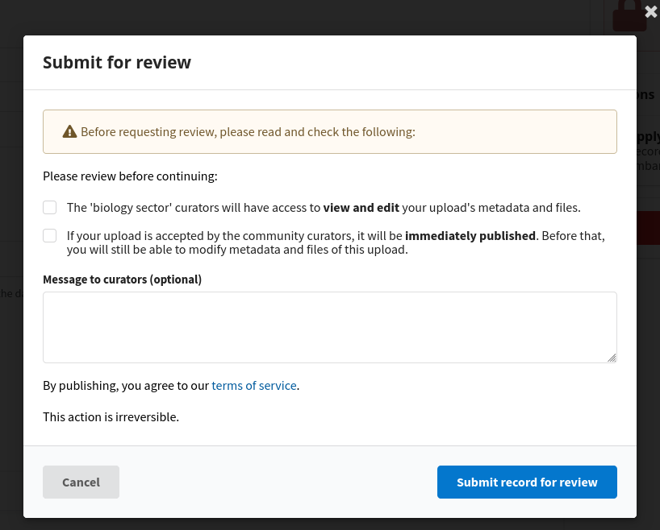

# Compliance information when publishing

_Introduced in v13_

InvenioRDM lets you customize the confirmation information shown to users when publishing records, such as terms of service, data policy, or other compliance requirements. This flexibility supports custom publishing workflows and helps ensure users acknowledge your organization's policies.

## Configure checkboxes
InvenioRDM requires users to confirm compliance both when submitting a record for review and when publishing directly. Each interface can be configured independently, allowing you to tailor the compliance workflow to your organization's needs.

In your `mapping.js`, parametrize the your UI components by adding a new `extraCheckboxes` parameter in the following format:

```javascript
import { PublishModal } from "@js/invenio_rdm_records";
import { parametrize } from "react-overridable";

const parameters = {
  extraCheckboxes: [
    {
      fieldPath: "acceptTermsOfService",  // give it an unique name
      text: i18next.t(
        "I confirm that this record complies with the data policy and terms of service."
      ),  // define the text to show
    },
  ],
};

const PublishModalComponent = parametrize(PublishModal, parameters);

export const overriddenComponents = {
  "InvenioRdmRecords.PublishModal.container": PublishModalComponent,  // applied only to the confirmation box when publishing directly
};
```


### Configure extra messages
You can also show information messages before and after the compliance checkboxes section. In your `mapping.js`, define:

```javascript
import { i18next } from "@translations/invenio_rdm_records/i18next";
import { SubmitReviewModal } from "@js/invenio_rdm_records";
import { parametrize } from "react-overridable";

const LegalDisclaimer = () => (
  <>
    <p className="text-xs">
      By publishing, you agree to our <a href="/terms" className="underline">terms of service</a>.
    </p>
    <p className="text-xs mt-1">This action is irreversible.</p>
  </>
);

const parameters = {
  beforeContent: <p className="text-sm mb-2">Please review before continuing:</p>,
  afterContent: <LegalDisclaimer />,
};

const SubmitReviewModalComponent = parametrize(SubmitReviewModal, parameters);

export const overriddenComponents = {
  "InvenioRdmRecords.SubmitReviewModal.container": SubmitReviewModalComponent,  // applied only to the confirmation box when submitting for review
};
```



Don't forget to re-build the assets for the changes to take effect.

```sh
invenio-cli assets build
```

