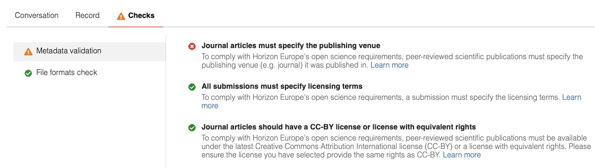
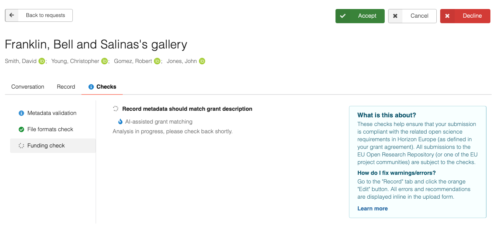
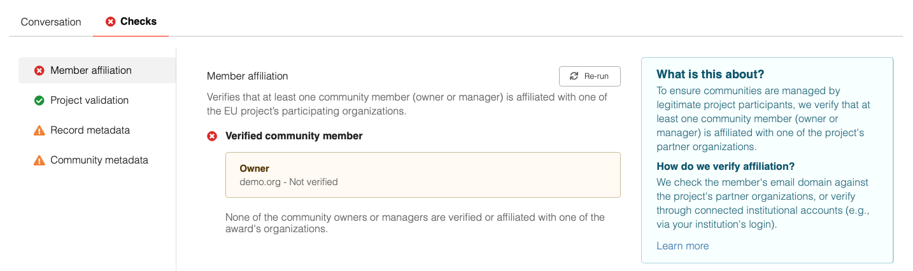

# Curation checks

_Introduced in v13. Async and community checks introduced in v15._

!!! warning
    This feature currently lacks a user-friendly interface for easy configuration and requires manual setup.

> For the mental model of how checks are structured conceptually, refer to the [Maintain and Develop](../../maintenance/architecture/curation.md) documentation.

This is an example of the curation checks enabled in Zenodo:


/// caption
Curation checks in Zenodo's EU Open Research Repository
///

## Enabling checks

To enable record-level curation checks, set the following in your `invenio.cfg`:

```python
# Hook into community request actions
from invenio_rdm_records.checks import requests as checks_requests
RDM_COMMUNITY_SUBMISSION_REQUEST_CLS = checks_requests.CommunitySubmission
RDM_COMMUNITY_INCLUSION_REQUEST_CLS = checks_requests.CommunityInclusion

# Enable the feature flag
CHECKS_ENABLED = True
```

To enable checks on subcommunity requests, set:

```python
CHECKS_SUBCOMMUNITY_ENABLED = True
```

## Configuring checks

Checks are attached to a community by creating a `CheckConfig` row. The `check_id` must match a registered check class (see [built-in checks](#built-in-checks) and [writing your own](#writing-custom-checks)).

```python
from invenio_checks.models import CheckConfig, Severity

check_config = CheckConfig(
    community_id=<community-uuid>,
    check_id="metadata",
    target_type="record",
    params={ ... },
    severity=Severity.INFO,
    enabled=True,
)
db.session.add(check_config)
db.session.commit()
```

Setting `community_id=None` creates a **global** check that runs on all record submissions across the instance, regardless of community.

To run the checks, submit a draft or record to a community and open the corresponding request.

### target_type

The `target_type` field controls what kind of object the check runs against:

| `target_type` | Description |
|---|---|
| `"record"` | Runs against draft and published records (default for record checks). |
| `"community"` | Runs against a community (used for subcommunity checks). |


## Built-in checks

### Metadata check (`check_id="metadata"`)

Validates record or community metadata against a set of configurable rules. See the [architecture guide](../../maintenance/architecture/curation.md#metadata-checks-configuration-schema) for the full configuration schema.

### File formats check (`check_id="file_formats"`)

Verifies that the file extensions of a record's files conform to open or scientific standards.

## Asynchronous checks

By default, checks run synchronously during the HTTP request cycle. For checks that call external services or involve significant computation, you can run them asynchronously via Celery.

### How async execution works

When a check class has `sync = False`, calling `run_check()` does the following instead of executing the check inline:

1. A `CheckRun` row is created with `status=PENDING`, storing the result of `pending_result()` so the UI can show something immediately.
2. After the database transaction commits, a Celery task (`run_check_async`) is dispatched with the `check_run_id`.
3. The worker sets the run to `RUNNING`, then calls the check synchronously inside the task context.
4. On completion the run is updated to `COMPLETED` (or `ERROR` on failure, after up to 3 retries with 10 s / 20 s / 30 s backoff).

The request UI shows a spinning indicator for both `PENDING` and `RUNNING` statuses, keeping submitters informed without hanging the page.



### Tracking state

The `state` JSON column on `CheckRun` is a free-form dict. 

It can be used to store a hash of the inputs the check was run on, avoiding unnecessary check runs if the inputs have not changed. To do so, implement `should_rerun()` on your check, comparing the input hash of the last run against the current inputs.

State can also be used to store relevant information about external jobs dispatched by the check.

There is no enforced schema for `state`, so you can store whatever your check needs.

### Manual re-run

A check can opt in to manual re-runs by setting `allow_rerun = True` on the check class and implementing `can_rerun(cls, identity, record_id)` to control who is permitted to trigger it.



## Community checks

Community checks run against a subcommunity when it submits a join request to a parent community. They are controlled by the `CHECKS_SUBCOMMUNITY_ENABLED` config flag.

### When community checks run

| Event | Triggered by |
|---|---|
| Subcommunity submits a join request | `CommunityChecksComponent` |
| Community metadata is updated | `CommunityChecksComponent` (re-runs on open join requests) |
| A member is added, changes role, or is removed | `CommunityMemberChecksComponent` |

### Example: subcommunity metadata check

```python
from invenio_checks.models import CheckConfig, Severity

CheckConfig(
    community_id=<parent-community-uuid>,   # parent that receives the request
    check_id="metadata",
    target_type="community",
    params={
        "id": "subcommunity-metadata",
        "title": "Subcommunity metadata",
        "description": "Validates required community fields",
        "rules": [
            {
                "id": "description:exists",
                "level": "error",
                "title": "Short description",
                "message": "A short description is required.",
                "checks": [
                    {"path": "metadata.description", "type": "field"}
                ]
            }
        ]
    },
    severity=Severity.FAIL,
    enabled=True,
)
```

## Writing custom checks

Subclass `invenio_checks.base.Check` and register the class via the `invenio_checks` entry point group.

```python
from flask_principal import Permission
from invenio_checks.base import Check, CheckResult

class MyExternalCheck(Check):
    id = "my_external_check"
    title = "External validation"
    description = "Validates the record against an external service."
    sync = False          # run asynchronously
    allow_rerun = True    # allow manual re-runs
    target_type = "record"

    def _input_hash(self, record):
        ...  # hash the relevant record's metadata, for example
    
    def run(self, record, config, previous_run=None, **kwargs):
        """Execute the check and return (CheckResult, state_dict)."""
        result = CheckResult(
            id=self.id,
            title=self.title,
            description=self.description,
        )
        input_hash = self._input_hash(record)

        # Call your external service here.
        response = call_external_service(record)
        if not response.ok:
            result.success = False
            result.add_errors([{
                "field": "metadata.title",
                "messages": ["External validation failed."],
                "severity": config.severity.error_value,
            }])
            return result, {"input_hash": input_hash} 

        return result, {
            "input_hash": input_hash,
            "workflow_id": response.get("workflow_id"),
        }

    @classmethod
    def can_rerun(cls, identity, record_id):
        """Allow managers to re-run."""
        return Permission("manage").can()

```

Register it in `pyproject.toml`:

```toml
[project.entry-points."invenio_checks"]
my_external_check = "mymodule.checks:MyExternalCheck"
```