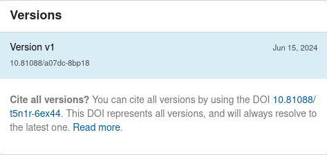

# DOI registration

!!! info

    The DOI registration feature requires that you have a contract with [DataCite](https://datacite.org/feemodel.html). In addition, you will also need a [DataCite test account](https://support.datacite.org/docs/getting-a-test-account) to test the feature.

## Configure

#### Enable DOI registration

You enable the DOI minting feature in your ``invenio.cfg`` file:

```python
DATACITE_ENABLED = True
```

You need set this to `True` if you want to use the InvenioRDM DOI field in any
way, such as using external DOIs from CrossRef. If you will not be using
DataCite to mint DOIs, you can remove `datacite` from
RDM_PERSISTENT_IDENTIFIERS.

#### DataCite credentials and prefix

Before you continue, make sure you first have a [DataCite test account](https://support.datacite.org/docs/getting-a-test-account).

You need to provide the account credentials and the DOI prefix for the DataCite repository account in your ``invenio.cfg`` file:

```python
DATACITE_USERNAME = "..." # Your username
DATACITE_PASSWORD = "..."  # Your password
DATACITE_PREFIX = "10.1234"  # Your prefix
```

!!! tip

    Never commit or store credentials in a source code repository.

#### Mode: Test or production

InvenioRDM by default uses the [DataCite Test Environment](https://support.datacite.org/docs/testing-guide) to avoid accidentally
registering DOIs during test. In test mode InvenioRDM will use the following DataCite test systems:

- DOI Fabrica (https://doi.test.datacite.org).
- REST API (https://api.test.datacite.org).

To enable production mode, set the following configuration variable in ``invenio.cfg``:

```python
DATACITE_TEST_MODE = False
```

In production mode, InvenioRDM will use the following DataCite systems:

- DOI Fabrica (https://doi.datacite.org).
- REST API (https://api.datacite.org).


!!! tip "Did you know?"

    You can write your own persistent identifier plugin in InvenioRDM to support other types of persistent identifiers.

#### Generated DOI

By default, InvenioRDM generates a DOI using the prefix and internal persistent
identifier. You can change the generated DOI string by editing your ``invenio.cfg``.

```python
DATACITE_FORMAT = "{prefix}/inveniordm.{id}"
```

!!! tip

    Before branding your DOIs, please read about
    [Cool DOIs](https://doi.org/10.5438/55e5-t5c0) and why it might not be a
    good idea.

#### OAI-PMH

The OAI-PMH server's metadata format ``oai_datacite`` that allows your records
to be harvested in DataCite XML needs to be configured with your DataCite data 
center symbol. This is only required if you want your records to be harvestable in DataCite XML format.

```python
DATACITE_DATACENTER_SYMBOL = "CERN.INVENIORDM"
```

### Versioning and externally managed DOI

By default, InvenioRDM allows versioning for any DOI type - internally or externally managed. 
Internally managed DOIs are DOIs registered by your instance and minted on Datacite. 
External DOIs are DOIs already minted and simply passed to your instance. 
As such, having an internally managed DOI for the next version of a record with an external DOI may not be desired. 
To disable versioning for external DOIs you need to set

```python
RDM_ALLOW_EXTERNAL_DOI_VERSIONING = False

#### Parent or Concept DOIs

_Introduced in v12_

By default InvenioRDM will create two DOIs when an initial record is
published, and create one DOI each time a new version of the record is
published. The first DOI is the version DOI, which represents the specific
record that is published. The second DOI is the parent DOI, which represents
the concept of the record and will always resolve to the latest version.
This feature has been implemented in Zenodo for many years, and the concept DOI enables
researchers to cite something that won't change when they make changes to their
records.



The parent DOI is optional and can be disabled by setting the following in
invenio.cfg:

```python
RDM_PARENT_PERSISTENT_IDENTIFIERS={}
```

You will also need to make DOIs optional by following the configutation
instructions below.

### Configuring DOI behavior

You can change how DOIs work in InvenioRDM by adding to your `invenio.cfg`:

```python
from idutils import is_doi, normalize_doi
from invenio_rdm_records.services.pids import providers

RDM_PERSISTENT_IDENTIFIERS = {
    # DOI automatically removed if DATACITE_ENABLED is False.
    "doi": {
        "providers": ["datacite", "external"],
        "required": False,
        "label": _("DOI"),
        "validator": idutils.is_doi,
        "normalizer": idutils.normalize_doi,
        "is_enabled": providers.DataCitePIDProvider.is_enabled,
        "ui": {"default_selected": "yes"},  # "yes", "no" or "not_needed"
    },
    "oai": {
        "providers": ["oai"],
        "required": True,
        "label": _("OAI"),
        "is_enabled": providers.OAIPIDProvider.is_enabled,
    },
}
```
You [can view the default configuration for `RDM_PERSISTENT_IDENTIFIERS` in invenio-rdm-records](https://github.com/inveniosoftware/invenio-rdm-records/blob/master/invenio_rdm_records/config.py)

### Optional DOI User Interface and Advanced Configuration

_Introduced in v13_

InvenioRDM now includes a user interface to allow users to choose whether or not to register a DOI when uploading a record.


This will display when both main and parent DOIs are configured as
optional. You can also set the default button selection with the
"doi" "ui" "default_selected" option, which can be "yes", "no" or "not_needed"

With this option enabled, users can decide whether or not to request a DOI for their record. However, managing different versions of a record with and without DOIs can introduce complexities. Ideally, once a DOI is registered for a record, all subsequent versions should also have a DOI to avoid resolving to a version with a DOI, and creating confusion.

The default behavior in InvenioRDM enforces this principle. Nevertheless, you can customize the behavior in two ways.

**1. Basic**

Provide your rules between records' versions by setting the config variable `INVENIO_OPTIONAL_DOI_TRANSITIONS`. The rules are evaluated each time a draft is saved, or on publish. This config expect rules defined in the format *from*/*to* states: given the DOI state in the previous record's version (*from*), it defines what are the allowed states for the current draft (*to*).

```
{
    <from>: {
        "allowed_providers": [<to>, <to>, ...],
        "message": invalid state msg
    }

}
```

*from*/*to* possible values:

    - `datacite` (or other provider): in the current draft, the user selected to register a DOI with the provider. The provider name must be configured in the DOI configuration above in this documentation.
    - `external`: in the current draft, the user selected an external DOI.
    - `not_needed`: in the current draft, the user selected that a DOI is not needed.

As an example, in your `invenio.cfg`, you can define that when the previous record version has a DOI registered with DataCite, then the current draft must have the same. The user cannot input an external DOI or select that it is not needed.

```python
OPTIONAL_DOI_TRANSITIONS = {
    "datacite": {
        "allowed_providers": ["datacite"],
        "message": "<error message if the user selected a DOI option that is not in the allowed_providers field above>",
    },
    ...
}
```

**2. Advanced**

Assign your custom function to `RDM_OPTIONAL_DOI_VALIDATOR = my_function`. The custom function will be called on each save or publish of a draft.

```python
def validate_optional_doi(draft, previous_published_record, errors=None, transitions_config=None):
    ...
```

You can find an example [here](https://github.com/CERNDocumentServer/cds-rdm/blob/4d7400111dd29d6d38f29534c5044d0b57f0bd20/site/cds_rdm/pids.py#L15) on how to develop a custom validation.

## Limitations

- **Restricted records:** Once a DOI is created, it cannot be fully removed from DataCite. Starting with v12, InvenioRDM will not register DOIs for restricted records. It will also hide a DOI from the DataCite Search if a record is changed from public to restricted. However that DOI will still resolve and metadata may be available to DataCite members.
