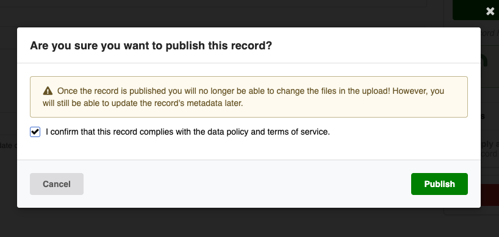
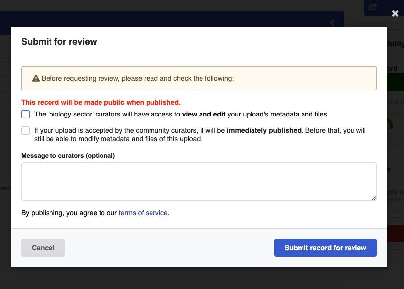

# Add extra checkboxes when publishing or submitting to community

InvenioRDM allows you to customize the publish modal by adding extra checkboxes for user confirmation (e.g., terms of service, data policy). This is useful for compliance and custom workflows.

## Define parameters to override

You can override the default behavior of modals by customizing their parameters or injecting additional elements.

### Define the extra checkbox fields (a list) using the extraCheckboxes parameter

```javascript
import { i18next } from "@translations/invenio_rdm_records/i18next";
import { PublishModal } from "@js/invenio_rdm_records";
import { parametrize } from "react-overridable";

export const parameters = {
  extraCheckboxes: [
    {
      fieldPath: "acceptTermsOfService",
      text: i18next.t(
        "I confirm that this record complies with the data policy and terms of service."
      ),
    },
  ],
};

export const PublishModalComponent = parametrize(PublishModal, parameters);
```



### You can also inject extra UI elements before or after the checkboxes

```javascript
import { i18next } from "@translations/invenio_rdm_records/i18next";
import { SubmitReviewModal } from "@js/invenio_rdm_records";
import { parametrize } from "react-overridable";

const LegalDisclaimer = () => (
  <>
    <p className="text-xs">
      By publishing, you agree to our <a href="/terms" className="underline">terms of service</a>.
    </p>
    <p className="text-xs mt-1">This action is irreversible.</p>
  </>
);

export const parameters = {
  beforeContent: <p className="text-sm mb-2">Please review before continuing:</p>,
  afterContent: <LegalDisclaimer />,
};

export const SubmitReviewModalComponent = parametrize(SubmitReviewModal, parameters);
```



#### Override the components in the overridableRegistry mapping

```javascript
export const overriddenComponents = {
  "InvenioRdmRecords.PublishModal.container": PublishModalComponent,
  "InvenioRdmRecords.SubmitReviewModal.container": SubmitReviewModalComponent,
};
```

And then re-build the assets for the changes to take effect.

```sh
invenio-cli assets build
```

