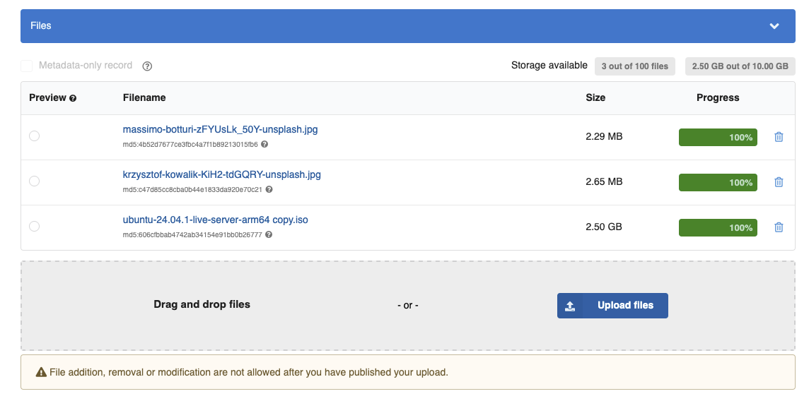
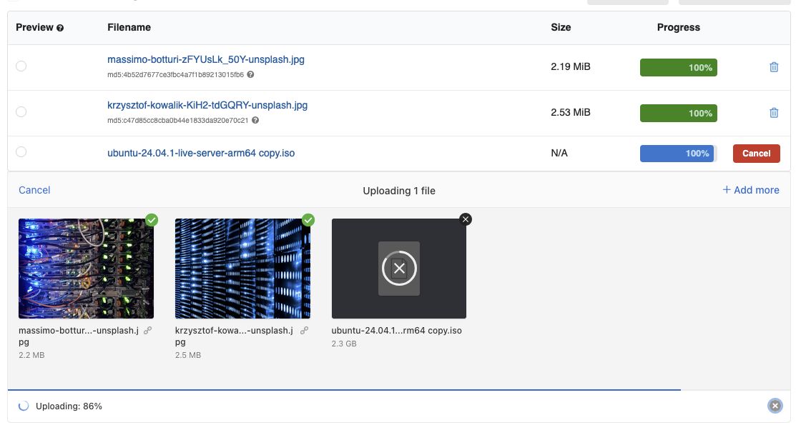

# Files uploaders

In InvenioRDM, records can have file uploads attached to it. The file uploader interface is
available from the [**upload form**](../../../use/records.md#create-a-record).

## Default file uploader



By default, the system provides a simple and robust file upload interface that:

- Allows uploading one or more files using the file picker or drag-and-drop.
- Displays a list of uploaded files with filename, size, and delete option.
- Progress indicators show the status of ongoing uploads.
- Ensures that all files are successfully uploaded before publishing the record.

This interface is stable and well-integrated with all InvenioRDM workflows. Its look
and feel can to a certain point be customized using the [React-Overridable](../look-and-feel/override_components.md)
mechanism.

---

## Enhanced File Uploader (Uppy)

_Introduced in v13_



!!! warning "Experimental feature"

    The Uppy-based uploader is currently an experimental feature.
    While it offers many improvements over the default uploader, it may still
    lack support for some advanced customization scenarios or edge cases.
    Use in production systems with caution and report issues or feedback.

    **Use it at your own risk!**

You can enable a more advanced uploader UI based on the [Uppy](https://uppy.io/) JavaScript library. This uploader UI
offers a more modern user experience and powerful features—especially when working with large files or unreliable
network conditions, and media files.

See below [how to enable it](#switching-between-uploaders). Once enabled, the Uppy uploader UI completely replaces the default File Uploader implementation for users of your site.

### Key features

- **Modern drag-and-drop interface**: Easily drag files into the upload area, with real-time visual feedback and responsive layout.
- **Per-file progress tracking and error handling**: See progress, success, or failure for each file individually, with the ability to retry uploads selectively.
- **Folder uploads**: Entire directories can be selected and uploaded at once. This is especially useful for datasets with nested files or structured media. It uses the browsers' [webkitdirectory](https://developer.mozilla.org/en-US/docs/Web/API/HTMLInputElement/webkitdirectory) API.
- **Multipart upload support for large files**: When using a multipart-transfer compatible storage backend (e.g. S3):

      - Files can be split into chunks, which are uploaded in parallel, making very large file uploads much faster.

      - If a chunk fails to upload due to a random network issue, only that part is automatically retried—not the entire file—ideal for uploading multi-gigabyte research datasets, especially over unreliable networks.
      - **Per-part checksum validation** Uppy computes MD5 checksum for every chunk it uploads. Storage backend, where supported, can verify this checksum to detect any errors during transmission.

- **🌐 Resilience on unstable networks**: Uppy handles random disconnects or slow connections gracefully by retrying failed chunks or uploads and allowing
  recovery without starting over.

- **🖼️ Enhanced media file support**: Especially useful for researchers working with image data:

      - **Automatic image previews** directly in the UI before uploading
      - **Basic image editing** (e.g., crop, rotate, resize)
      - Support for extensible plugins for additional media handling or metadata entry
- **File metadata support**: Users can add file metadata (e.g. title, description, custom fields) directly in the upload interface, with support for validation and required fields. See the [Uppy file metadata configuration](#uppy-file-metadata-configuration) section below for details on how to configure this.

- **Extensible plugin system**: Add features like file validation, custom metadata fields, external file sources (e.g Google Drive, Dropbox).

- **Mobile and accessibility-friendly**: The interface adapts to small screens and includes keyboard navigation and screen-reader support where applicable.

## Switching between uploaders

You can choose which uploader to use by toggling the `APP_RDM_DEPOSIT_NG_FILES_UI_ENABLED` flag in your `invenio.cfg`:

| Uploader            | Configuration                                              |
| ------------------- | ---------------------------------------------------------- |
| Default (legacy)    | `APP_RDM_DEPOSIT_NG_FILES_UI_ENABLED = False` _(or unset)_ |
| Uppy (experimental) | `APP_RDM_DEPOSIT_NG_FILES_UI_ENABLED = True`               |

!!! warning

    When enabling Uppy, make sure that the Content Security Policy (CSP) rules are updated accordingly in your `invenio.cfg`:

    ```diff
    APP_DEFAULT_SECURE_HEADERS = {
      ...
    + 'script-src': [
    +     "'self'", "blob:", "'wasm-unsafe-eval'"
    + ],
      ...
    }
    ```

Restart your site after changing the configuration to ensure the new UI is properly loaded.

## Uppy file metadata configuration

When using the Uppy uploader, you can configure custom metadata fields that users can fill out for each file before uploading (e.g., descriptions, captions, etc.). These fields are rendered directly in the Uppy Dashboard's file editor and saved to the file's metadata dictionary.

### Defining metadata fields

Metadata fields are defined as an array of configuration objects. Each object dictates how a specific metadata field is handled and rendered. The supported properties are:

- `id` (string, required): The unique identifier of the metadata field. Used as the key in the file's metadata dictionary.
- `name` (string, optional): The display name of the field in the UI. If provided without a `render` function, a standard text input will be rendered. If omitted entirely, the field won't be editable in the UI (useful for hidden or computed default values).
- `defaultValue` (any | function, optional): A static default value or a function `(file: UppyFile) => any` that evaluates to a default based on the [Uppy file](https://uppy.io/docs/uppy/#working-with-uppy-files) object's properties.
- `placeholder` (string, optional): Placeholder text for the standard text input.
- `render` (function, optional): A custom render function for advanced UI rendering using the Preact `h` function. If omitted, it falls back to a standard text input. For more details, see the [Uppy Dashboard metaFields documentation](https://uppy.io/docs/dashboard/#metafields).
- `condition` (function, optional): A function `(file: UppyFile) => boolean` to conditionally attach or render the field based on file properties (e.g., evaluating `file.type`).

### Example configuration

Here is an example demonstrating different types of metadata fields (a standard input, a custom rendered checkbox, and a hidden dynamic field):

```javascript
const customAllowedMetaFields = [
  // Standard text input
  { 
    id: "caption", 
    defaultValue: "", 
    name: i18next.t("Caption"),
    placeholder: i18next.t("Set the image caption here"),
    condition: (file) => file.type && file.type.startsWith("image/") 
  },
  // Custom rendered checkbox
  { 
    id: "featured", 
    defaultValue: false, 
    name: i18next.t("Feature Image"),
    render: ({ value, onChange, required, form }, h) => {
      return h("input", {
        type: "checkbox",
        onChange: (ev) => onChange(ev.target.checked),
        checked: value,
        defaultChecked: value,
        required,
        form,
      });
    },
    condition: (file) => file.type && file.type.startsWith("image/") 
  },
  // Hidden, dynamically computed field (no "name" or UI provided)
  { 
    id: "fileType", 
    defaultValue: (file) => {
      if (file.type && file.type.startsWith("image/")) {
        return "image";
      }
      return "other";
    },
  },
];
```

### Applying the configuration

To use your custom metadata fields, you have two options depending on your setup:

**Option 1: Passing as a prop to UppyUploader**
If you are already wrapping or importing the uploader component, you can pass the array directly to the `allowedMetaFields` prop:

```jsx
<UppyUploader
  allowedMetaFields={customAllowedMetaFields}
/>
```

**Option 2: Extending the default configurations**
Alternatively, you can override or extend the existing `defaultAllowedMetaFields` array exported from (`@js/invenio_rdm_records/src/deposit/fields/UppyUploader`). This array acts as the global default for the uploader metadata configuration. You can use standard build/webpack aliasing techniques or React-Overridable to inject your extended module in place of the [default implementation](https://github.com/oarepo/invenio-rdm-records/blob/2d78c9188c2513d20184fce121c8716c6d33ade1/invenio_rdm_records/assets/semantic-ui/js/invenio_rdm_records/src/deposit/fields/UppyUploader/metaFields.js#L60-L61).

